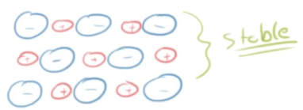
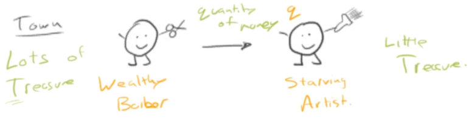
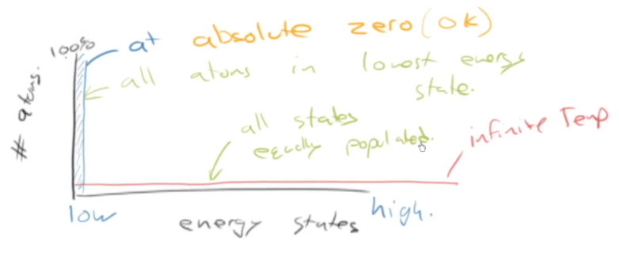
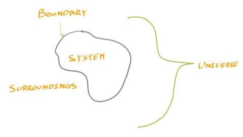
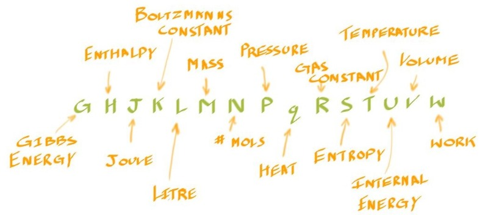
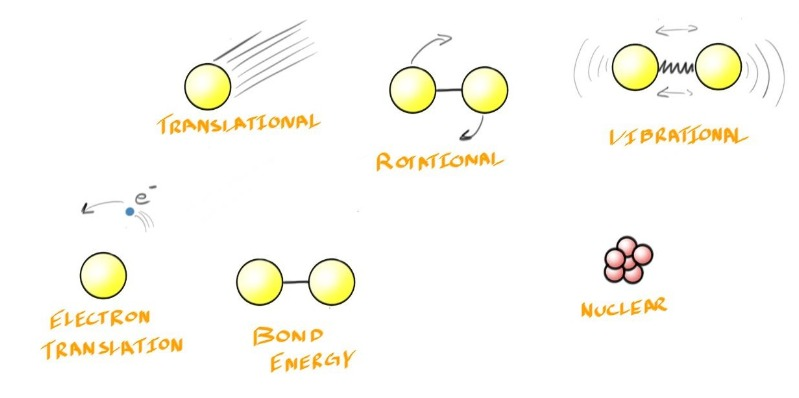
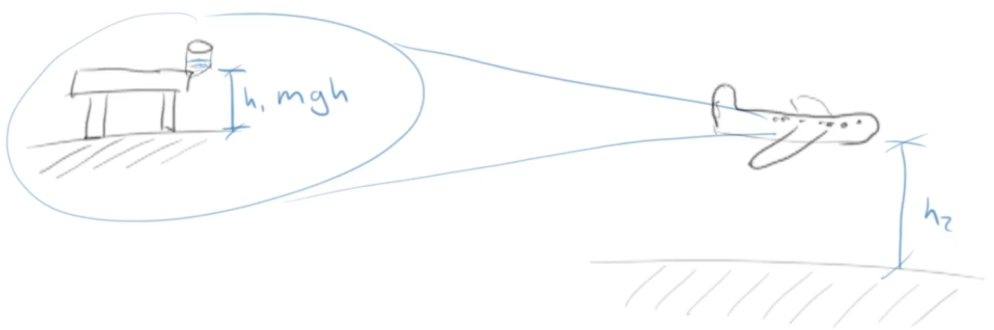
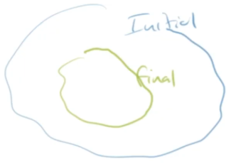
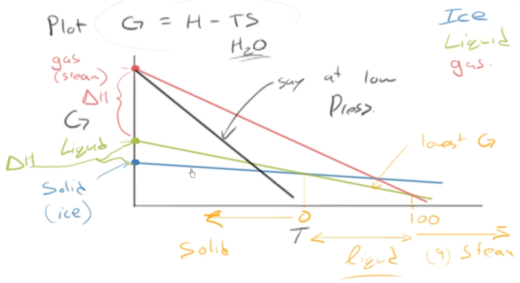
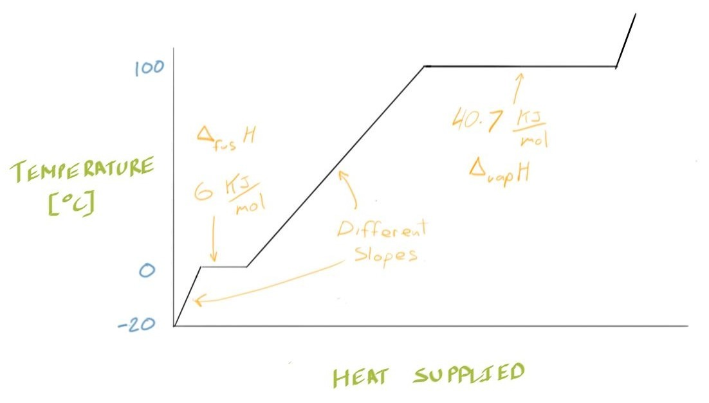

# C11 - Thermodynamics

$$
\newcommand{\DHf}{\Delta_f H^\circ}
\newcommand{\DHr}{\Delta_r H^\circ}
$$

## Thermodynamics and Spontaneity

Examples of chemcial reactions:

formation of salt:

$$
\ce{Na(s) + 1/2Cl2(g) -> NaCl(s)}
$$

burning of paper, skeletal equation:

$$
\ce{paper + O2(g) ->[heat] CO2(g) + H2O(g) + soot}
$$

graphite turning into diamond at room temp.

$$
\ce{C(graphite) <=>[does not occur][very slowly] C(diamond)}
$$

- first two are spontaneous, last is spontaneous in reverse
- **spontaneous:** reaction that proceeds without continued input of energy
	- *in common English:* spontaneous &mdash; quick, fast, w/o obvious reason
	- common English def. misleading and inaccurate
- 2 laws of thermodynamics
	- 1st law about energy
	- 2nd law is why things don't fly up on their own
	- the *finger of time* &mdash; things don't happen the other way

### Formation of Table Salt: Exothermic Reaction

Stable form of table salt:

Formation of *NaCl* step by step

*See:* [[c9-atom-props-etc#Why Does Salt Form a Crystal?|Chapter 9 - Why does salt form a crystal?]]

- Total energy change: $\Delta E = -414\text{ kJ/mol}$
- Overall, *making crystal **reduces energy** *
	- reaction is **exothermic**

> However, spontaneous reactions **can be endothermic**

## Second Law of Thermodynamics

### Analogy: Isolated Town w/ Barbers and Artists

Let's say you encounter an isolated town with only wealthy barbers and starving artists:

*Depiction also shows **q**uantity of money transferred from barber to artist*

**2 observations:**

1. Town does not print new money &rarr; "1st law of thermodynamics"
2. Artist will never spontaneously give money to barber &rarr; "2nd law of ..."

**Propose:** Special something $S = \dfrac q T = \dfrac{\text{qty. of money}}{\text{amount of treasure}}$

The 2nd law:

$$
\Delta S_\text{town} = \Delta S_B + \Delta S_A > 0
$$

let *B* be barber, *A* be artist, "delta" &Delta; is change in

**Following scenarios possible?**

1. Barber gives money to artist &mdash; *YES!* because...

$$
\Delta S_\text{town} = \frac{-q_B}{T_B} + \frac{q_A}{T_A} = \text{small } (-) + \text{large } (+) > 0
$$

2. Artist gives money to barber &mdash; *NO!* because...

$$
\Delta S_\text{town} = \frac{q_B}{T_B} + \frac{-q_A}{T_A} = \text{small } (+) + \text{large } (-) < 0
$$

3. Artist pays for a haircut &mdash; *YES!*

### Entropy, Energy States and Reversibility

> **entropy:** a measure of the disorder of a system
>
> *more accurate def:* a measure of the uncertainty in knowing precisely the energy that an atom/molecule will have

**Mathematical definition of entropy:**

$$
\Delta S = \frac{q_\text{rev.}} T
$$

- $S$ &mdash; entropy (J/K)
- $\Delta$ &mdash; "change in"
- $q_\text{rev.}$ &mdash; heat transferred (J)
- $T$ &mdash; thermodynamic temperature (K, kelvin)

**Graph of Energy States v. # of atoms:**

- at absolute zero, all atoms in lowest energy state
- at infinite temp., all energy states are equally populated by atoms
- *both theoretical scenarios not possible* 

**Analogy of Entropy:**

From: *The Laws of Thermodynamics: A Very Short Introduction* by Peter Atkins

- sneezing in quiet library (low entropy &rarr; sudden disruption in order)
- vs. busy street (high entropy &rarr; change in entropy negligible)
 
#### Reversibility

- **reversibility** &mdash; indicates heat is transferred reversibly
	- subscript: rev.
- not achievable in any real process
- sets theoretical limit only achieved in process run
	- in infinitesimally small steps
	- that system in equilibrium at *all* times

### Formal Def. of 2nd Law of Thermodynamics

**System, surroundings, and universe:**

- **system:** something specific we will study and understand
- **surroundings:** everything other than the system
- **universe:** the system and the surroundings

**Defining the 2nd Law of Thermodynamics:**

> The entropy of the universe increases during any *spontaneous* process.

*Mathematically:*

$$
\Delta S_\text{universe} = \Delta S_\text{system} + \Delta S_\text{surroundings} > 0
$$

where $\Delta S$ is the change in entropy

### The Thermodynamic Alphabet

The alphabet:

*S* used for entropy since it's in the vicinity of all the other thermodynamic alphabet

## First Law of Thermodynamics

### Internal Energy

**Microscopic forms of internal energy:**

translational, rotational, vibrational, electron translation, bond energy, nuclear

- 1st law yields *internal energy* ($U$)
- thermodynamics interested in changes in energy

### Analogy: Bottle on the Edge of a Table

Glass of water sitting on edge of table in an airplane, drawing:

- to calculate potential energy of glass falling to ground
	- we only consider height of glass to plane floor
- height of plane in the sky is *irrelevant* to problem
- *reference point:* floor of plane
- NEED reference point in thermodynamics to measure changes against

### Standard State: Convenient, Logical Ref. Point

- **standard state** &mdash; a convenient, logical reference point for thermodynamic calcs.
- what state will the basic elements be in?

> **standard state:** the most stable form of a pure substance at 105 Pa and a given temperature *or*
> 
> most stable form of an element at 25 &deg;C (298.15 K) and 1 atm

### State and Path Functions

- **state function:** a function / variable where the way gotten to the final state is irrelevant
- **path function:** a function / variable where the path from the initial to final state is important

**Examples of state functions:**

*Combustion of gasoline*

$$
\ce{2C8H18(\ell) + 25O2(g) -> 18CO2(g) + 16H2O(g)}
$$

- Potential energy of glass-of-water
	- where the glass was before table is irrelevant...
	- ... in calc. potential energy during fall from table 
- Enthalpy
	- $\Delta H$ &mdash; enthalpy **only depends on current condition**

**Ex. of path functions:**

- *Work*
	- more difficult to put glass up high shelf, then bring back down to table
	- easier to just put glass on table

### Closed v. Isolated Systems &mdash; The 1st Law

- **closed system:** system where matter *shall not* pass but energy *can*
- **isolated system:** system where matter and energy *shall not pass* through
- **open system:** system where matter and energy *can* pass through

> **First Law:** Energy is conserved. Energy is never created nor destroyed.

**First Law, mathematical:**

$$
\begin{gather*}
\Delta U = 0 \tag{isolated sys.} \\
\Delta U = q + w \tag{closed sys.}
\end{gather*}
$$

- $\Delta U$ &mdash; change in internal energy of system (J)
- $q$ &mdash; heat transferring into system (J)
	- heat in (+) / heat out (-)
- $w$ &mdash; work done on system (J)
	- work done on sys. = (+)

## Enthalpy

### Analogy: Buying a Gnome using Credit Union

- Account balance (\$) at credit $U$nion
- balance: $\Delta U = q - \text{fees}$, $q$ is money in sys.
- Bought gnome
	- cost: $25, shipping fees: $8
	- change in balance: $\Delta U = -25 - 8 = -\$33$
- How much did gnome cost?
	- $\text{cost} = -q = -(\Delta U + \text{fees})$
	- $\text{cost} = -q = -(-33 + 8) = \$25$

### Defining the Enthalpy

**Deriving the enthalpy:**

From first law:

- only work is P-V (pressure-volume) work
- pressure is constant

Show that $P\Delta V = (-)$, final v. initial volume:

$$
\begin{gather*}
\Delta V = V_f -V_i = (-) \\
\Rightarrow w = P\Delta V = (-)
\end{gather*}
$$

substitute $w = -P\Delta V$ in 1st law

$$
\begin{gather*}
\Delta U = q + w \tag{sub} \\ 
\Delta U = q - P\Delta V \\
\Delta H = q = \Delta U + P\Delta V
\end{gather*}
$$

**Enthalpy definition, $H$**

$$
H = U + PV
$$

- $H$ &mdash; enthalpy (J)
- $U$ &mdash; internal energy (J)
- $P$ &mdash; pressure (Pa = J/cb. m)
- $V$ &mdash; volume (cb. m)

**Change in enthalpy:**

$$
\Delta H = \Delta U + P\Delta V
$$

### Calculating Reaction Enthalpies

**Types of reaction enthalpies:**

- $^\circ$ &mdash; under standard conditions
- $\Delta_r H$ or $\Delta_r H^\circ$ &mdash; reaction enthalpy
- $\Delta_\text{comb} H$ &mdash; combustion enthalpy
- $\Delta_f H$ &mdash; formation enthalphy
- enthalphies for changes in state
	- $\Delta_\text{fus} H$ &mdash; fusion (melting)
		- $= \Delta_\text{fr} H$ &mdash; freezing
	- $\Delta_\text{vap} H$ &mdash; vaporization (boiling)
		- $= \Delta_\text{cond} H$ &mdash; condensation
	- $\Delta_\text{sub} H$ &mdash; sublimation
		- $= \Delta_\text{dep} H$ &mdash; deposition
- *more common format:* $\Delta H_r$
- units: joules / mole *or* kJ/mol

**Formula for calc. reaction enthalpy:**

$$
\Delta_r H = \sum \Delta_f H\ (\text{products}) - \sum\Delta_f H\ (\text{reactants})
$$

reaction enthalpy = sum of formation enthalpies (SFE) for products - SFE for reactants

**Notes on elements:**

Formation enthalpy of elements (incl. element molecules) in standard state is zero

since: $\ce{O2(g) -> O2(g)}, \Delta H = 0$

#### Ex: combustion of 2 mol octane

note: coefficients have units kJ/mol, not written to save space

$$
\begin{gather*}
\text{Reaction: } \ce{2C8H18(l) + 25O2(g) -> 16CO2(g) + 18H2O(g)} \\ \\
\Rightarrow \DHr = 16 \cdot \DHf(\ce{CO2(g)}) + 18 \cdot \DHf(\ce{H2O(g)})
\\ - 2 \cdot \DHf\ce{C8H18(l)}) - \cancel{2 \cdot \DHf(\ce{O2(g)})} \\
\DHr = (16\text{ mol})(-394\text{ kJ/mol}) + 18(-242) - 2(-250) \tag{sub} \\
\therefore \DHr = -10,160\text{ kJ}
\end{gather*}
$$

values of $\DHf$ found in standard enthalpies table

**Difference between $U$ and $H$:**

- moles changed in gases: $\Delta n = 34 - 25 = +9\text{ mol}$
- $\Delta U = \Delta H - P\Delta V$
- *ideal gas law:* $P\Delta V = nRT$

PV term for comb:

$$
P\Delta V = (9\text{ mol})\left(8.314\ \frac{\text J}{\text{mol}\cdot\text K}\right)(298\ \text K) \doteq 22\text{ kJ}
$$

Thus, the internal energy change is:

$$
\Delta U \doteq -10,160 - 22 = -10,182\text{ kJ}
$$

A small fee for "pushing" atm. is taken

### How Solid State People Talk

- *solid state person:* " " physicist or materials scientist
- *enthalpy* and *energy* used interchangeably
- safe since volume change in solid state processes miniscule
- difference btwn. enthalpy and internal energy *negligible*

## The Gibbs Energy, $G$

### Defining Gibbs Energy and the 2nd Law, again

**Defining Gibbs Energy, $G$:**

$$
G = H - TS
$$

- $G$ &mdash; Gibbs energy (J)
- $H$ &mdash; enthalpy (J)
- $T$ &mdash; temp. (in kelvin, K)
- $S$ &mdash; entropy (J/K)

**Change in Gibbs energy, 2nd law:**

$$
\Delta G = \Delta H_\text{sys.} - T\Delta S_\text{sys.} < 0
$$

- sys. = system
- surr. = surroundings
- *constraints:* process occur at
	- constant temperature
	- constant pressure

**Deriving change in Gibbs energy, 2nd law:**

Start with 2nd law:

$$
\begin{gather}
\Delta S_\text{sys.} + \Delta S_\text{surr.} > 0 \tag 1\\
\text{sub } \Delta S_\text{surr.} = \frac{q_\text{surr.}}{T} = \frac{-q_\text{sys.}} T \tag 2 \\
\Delta S_\text{sys.} - \frac{q_\text{sys.}} T > 0 \tag 3 \\
\text{multiply eq. (3) by } T \\
T\Delta S_\text{sys.} - q_\text{sys.} > 0 \tag 4 \\
\because P\text{ is constant} \to\text{sub } q_\text{sys.} = \Delta H_\text{sys.} \tag 5 \\
T\Delta S_\text{sys.} - \Delta H_\text{sys.} > 0 \tag 6 \\
\text{multiply eq. (6) by }{-1} \to \Delta G \\
\therefore \Delta G = \Delta H_\text{sys.} - T\Delta S_\text{sys.} < 0 \tag 7
\end{gather}
$$

When Gibbs energy decreases, entropy overall increases, so...

$$
\Delta G = -T\Delta S_\text{universe}
$$

### 4 Types of Reaction from Gibbs

- *Note:* $\Delta H = \Delta H - T\Delta S$ for const. temp and pressure
- $\Delta G < 0$ means $\Delta S_\text{universe} > 0$

**4 scenario:**

|No.|$\Delta H$|$\Delta S_\text{sys.}$|Reaction type|Is spontaneous?|Ex.|
|-|-|-|-|-|-|
|1|$(-)$|$(+)$|exothermic|always|burning fuel|
|2|$(-)$|$(-)$|exothermic|at low temp.|freezing water|
|3|$(+)$|$(+)$|endothermic|at high temp.|melting ice|
|4|$(+)$|$(-)$|endothermic|never|-|

### Absolute Entropy and 3rd Law of Thermodynamics

> **3rd law:** entropy of any perfect crystal approaches zero as temperature approaches absolute zero (0 K)

- entropy has an absolute value
- in tables, entropy not desc. as change &mdash; $S^\circ$

## Heat & Phase Transformations

### Plotting Gibbs Energy for Water

*Goal:* Plot $G = -ST + H$ (in $y = mx + b$ form) for water

Plot of Gibbs energy v. temperature for water:

- at any given temperature, the state with the lowest Gibbs energy is the most preferred
- entropy of solid, liquid, gas: $S_s < S_\ell < S_g$
- *sublimation* occurs when pressure causes gas $G$ to drop before liquid $G$ intersects solid $G$

### Enthalpy of Fusion and Vaporization + Heat Capacity

Plot of temperature v. heat for a given qty. of water:

- at certain points, slope is flat for *phase changes*
	- **enthalpy of fusion ($\Delta_\text{fus} H$):** heat needed to melt (or freeze) the substance
	- **enthalpy of vaporization ($\Delta_\text{vap} H$):** heat needed to boil (or condense) the substance
- mostly, heat supplied to raise temperature of water

**Formulas to calculate phase change:**

$$
\begin{gather*}
q = n\Delta_\text{fus} H \tag{melt/freeze} \\
q = n\Delta_\text{vap} H \tag{boil/condense} \\
\end{gather*}
$$

*q* is (+) when heat is added / (-) when removed

**What does slope tell us?**

$$
\begin{gather*}
\text{slope} = \frac{\Delta T} q\ [=]\ \frac{\text K}{\text{J/mol}} \\
q = \frac 1{\text{slope}} \Delta T \\
q = nC_P\Delta T
\end{gather*}
$$

- slope gives change in temp. for particular amount of heat supplied
- **molar heat capacity ($C_P$):** heat needed to raise 1 mol of sub. by 1 K
	- $C_P = n \cdot 1/\text{slope}$
	- units: J/(mol &middot; K)
- **specific heat capacity ($c$):** heat needed to raise 1 g (or kg) of sub. by 1 K
	- units: J/(g &middot; K)
	- or g can be repl. w/ kg
- *can* replace K w/ &deg;C since they are proportional

**Final heat - temperature change equations:**

$$
\begin{gather*}
q = nC_P\Delta T \\
q = mc\Delta T
\end{gather*}
$$

- $q$ &mdash; heat added (+) or removed (-) / in J
- $n$ &mdash; moles of substance
- $m$ &mdash; mass of substance (g / kg)
- $C_P$ / $c$ &mdash; defined above
- $\Delta T$ &mdash; change in temperature (K or &deg;C)

## Sources

- Ramsay, Scott. (2026). *Introductory Chemistry of Solids*. Top Hat.
- Dr. Scott Ramsay's YouTube videos on chemistry