# C12 - Phase Equilibrium & Diagrams

## First Look at Phase Diagrams

Pressure v. temperature phase diagram of water:

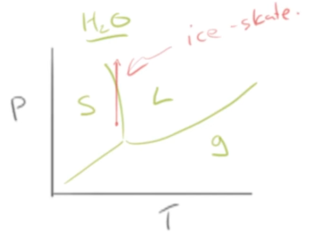

- when ice skating, increase of pressure (and heat) causes ice to melt

**Phase diagram of Slurpee&reg;** / sugar + water solution:

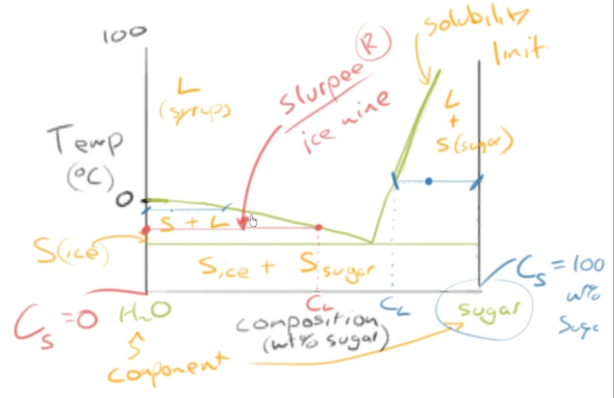

*Key features:*

- water and sugar are *components*
- different regions have different *phases* (some may have both)
- plot of composition of solute (wt %) v. temperature (&deg;C)
- the bars in the graph give comp. of solid (left side)
	- and liquid (right side) for each phase *region*
- elaborated on later

## Building Blocks of a Phase Diagram

### The Axes

**The Temperature Axis**

Phase diagram for only pure water (w/ temperature):

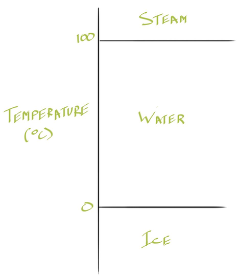

- *y-axis:* temperature (&deg; C)
- phase diagrams show phases in *equilibrium*
	- after changes come to a "rest"

**The Composition Axis and The Solubility Limit**

Phase diagram of water and sugar, with solubility limit, temps. restricted to liquid water only

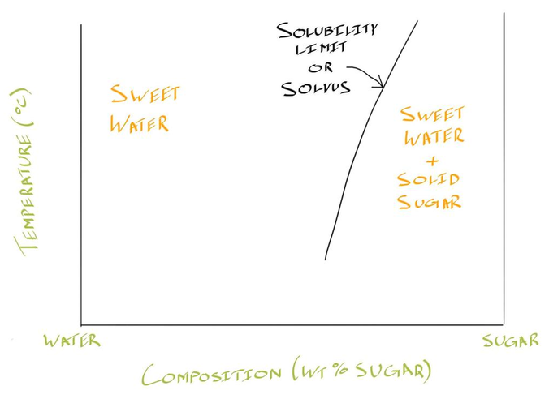

- *x-axis:* composition of solute (% weight / % wt.)
- **solubility limit (solvus):** maximum amount of solute that can be dissolved in a solvent
	- shown as line in phase diagram

### The Terminology

- **component:** the parts that "compose" a solution
- **equilibrium phase diagram:** a phase diagram showing phases at equilibrium state
	- phases indicated &mdash; ones if reaction allowed to run for as long as needed to reach equilibrium
- **phase:** part of system that looks and behaves the same way
	- i.e. sugar dissolved in water = sweet water (one phase)
	- i.e. sand in water = sand + water (2 phases)
- **region / field:** areas of a phase diagram
- **phase boundary:** combination of temperature and composition that have same phase(s) as stable phase
- **"coordiantes"** &mdash; useful to describe a possible combination of temperature and composition

## Binary Phase Diagrams

- **binary phase diagram:** a phase diagram with 2 components
	- *unary " ":* &mdash; 1 component
	- *ternary " ":* &mdash; 3 components
	- common to fix comp. of one component to create *pseudo-binary system*

ex. creating phase diagram with 2 components A and B, *isomorphous system:*

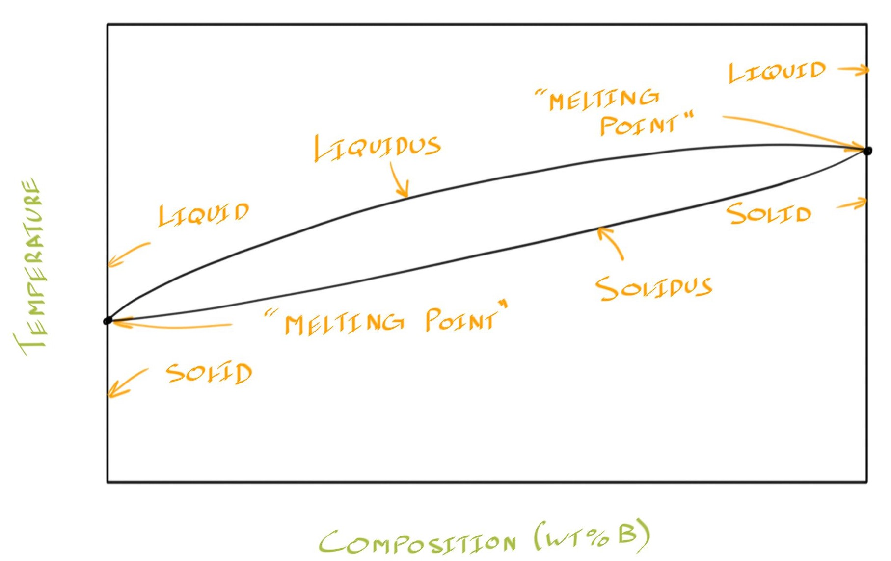

- **isomorphous system:** system where both components are completely soluble in each other
- **liquidus** and **solidus** are phase boundaries

**The 2-phase region**

Isomorphous phase diagram with color coding:

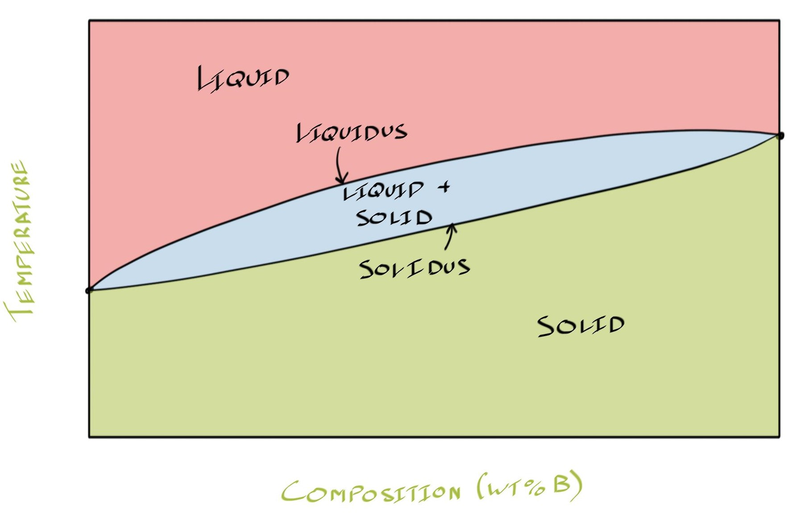

- in middle, there is a **2-phase region**
- at *2-phase region* &mdash; both liquid and solid exist at equilibrium

**Identifying compositions using coordinates:**

Draw lines and intersection to determine specific point on phase diagram:

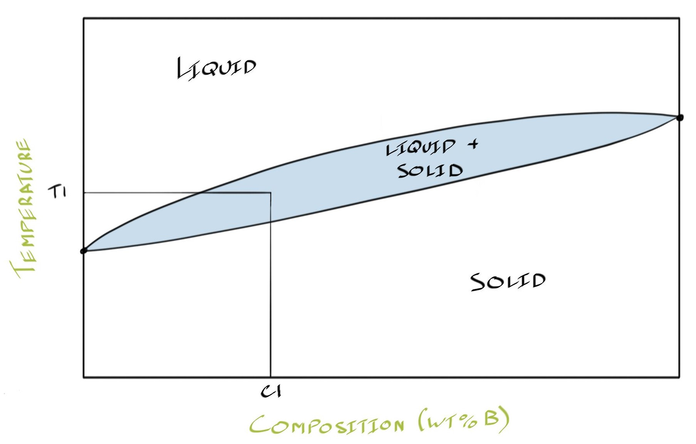

$(C_1,\ T_1)$ shows possible temp. and composition needed to achieve liquid + solid state

### The Tie-Line

**tie-line:** horizontal line on phase diagram that spans two-phase region one phase boundary (one side) to another (other side)

*Tie-lie at given coordinate tells us:*

1. ... what phases are in 2-phase region
2. ... how much of each component is in ea. of 2 phases (composition)
3. ... forms basis for lever rule calculation

Phase diagram with tie-line:

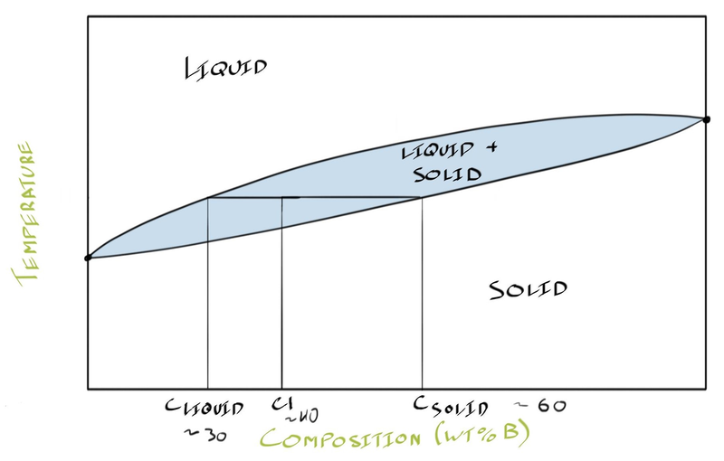

- after drawing tie-line across $(C_1\ T_1)$...
- draw vertical lines at ends of tie-line down to composition axis
	- tells us composition of each of 2 phases

## Lever Rule

### Concept of Lever Rule

Phase diagram of A and B, tie-line, and lever calculations:

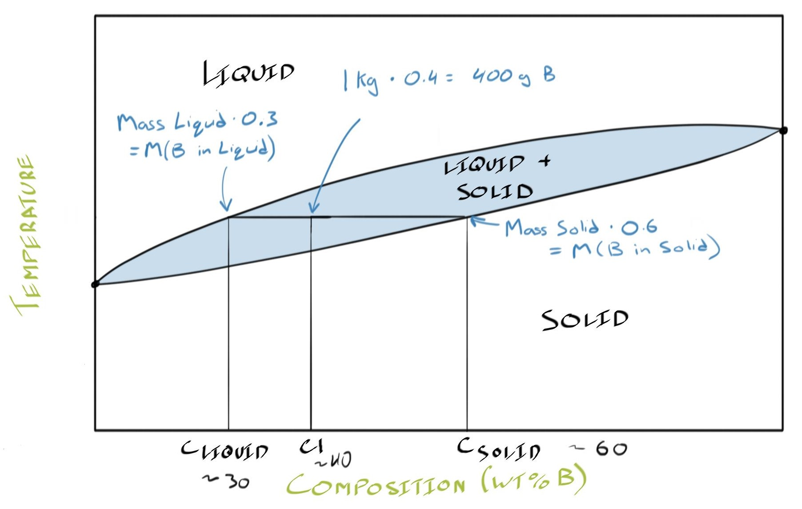

- *basis:* 1 kg of solution
- values, $C_1 \approx 40\%,\ C_\text{liquid} \approx 30\%,\ C_\text{solid} \approx 60\%$
- How much component B? &mdash; 1 kg &times; 0.4 = 400 g B
	- 0.4 = 4%/100% (will see in future)
- How much B in liquid? &mdash; mass liquid &times; 0.3 = m(B in liquid)
- How much B in solid? &mdash; mass solid &times; 0.6 = m(B in solid)

**Extreme cases:**

- below are *overall compositions*
- $C_2$ is close to the liquidus &mdash; mostly liquid
- $C_3$ is close to the solidus &mdash; mostly solid

Phase diagrams of extreme scenarios:

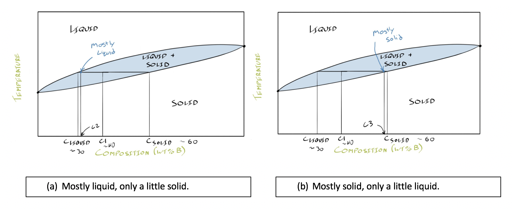

**Scenario 2: Heating up to the liquidus:**

Phase diagram of heating $C_1$ up to liquidus at $T_2$:

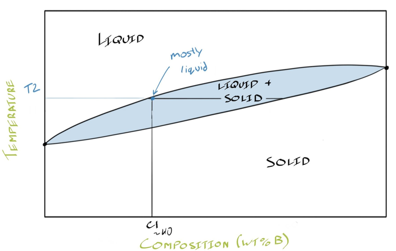

*Result:* $(C_1,\ T_2)$ is mostly liquid

### Deriving the Lever Rule

Overall composition ($C_0$) formula:

$$
C_0 = \frac{M_{B,\text{total}}}{M_\text{total}}
$$

Example: we calc. 400 g of component B in 1kg system of 40 wt% B sample

1. Write total mass ($M$ is mass) of component B:

$$
M_{B,\text{total}} = M_{B\text{ in liquid}} + M_{B\text{ in solid}}
$$

2. Mass of B in each phase is just mass of phase &times; composition of phase

$$
M_{B,\text{total}} = M_LC_L + M_SC_S
$$

- $C$ is composition / $M$ is mass
- $L$ &mdash; liquid / $S$ &mdash; solid

3. Divide equation by total mass, $M_\text{total}$

$$
\frac{M_{B,\text{total}}}{M_\text{total}} = \frac{M_L}{M_\text{total}} C_L + \frac{M_S}{M_\text{total}} C_S
$$

4. Develop weight fractions for liquid ($W_L$) and solid ($W_S$)

$$
\begin{gather*}
W_L = \frac{M_L}{M_\text{total}} \\
W_S = \frac{M_S}{M_\text{total}}
\end{gather*}
$$

5. Sub weight fractions and $C_0$ into equation (from step 3)

$$
C_0 = W_LC_L + W_SC_S
$$

6. Weight fractions add to one, prepare to sub $W_S$ term

$$
\begin{gather*}
W_L + W_S = 1 \\
W_S = 1 - W_L \tag{sub this}
\end{gather*}
$$

7. Sub $W_S$ term into equation from step 5, then isolate $W_L$

$$
\begin{gather}
C_0 = W_LC_L + (1-W_L)C_S \tag 1 \\
C_0 = W_LC_L + C_S - W_LC_S \tag 2 \\
C_0 = W_L(C_L + C_S) + C_S \\
W_L = \frac{C_0 - C_S}{C_L - C_S}
\end{gather}
$$

**Lever rule equation for liquid (and solid):**

*Note:* top and bottom of fraction mult. by -1

$$
\begin{gather*}
\therefore W_L = \frac{C_S - C_0}{C_S - C_L} \tag{liquid} \\
W_S = \frac{C_L - C_0}{C_L - C_S} \tag{solid}
\end{gather*}
$$

Solid weight fraction can be derived by subbing $W_L$ term in step 6 instead

**Generalized lever rule equation and corresponding diagram:**

Weight fraction of a phase, $W_\text{phase}$

$$
W_\text{phase} = \frac{\text{opposite side of lever}}{\text{total length of lever}}
$$

Depiction of lever on phase diagram:

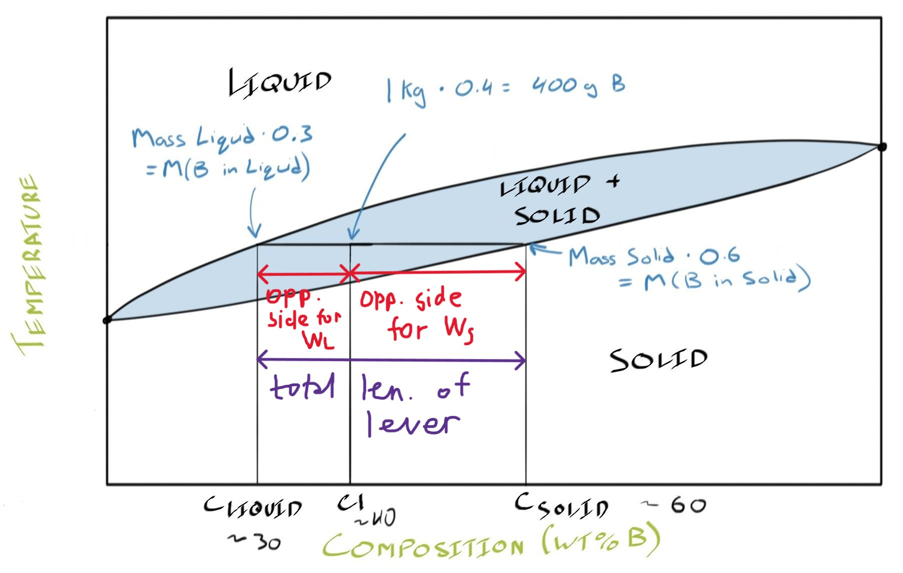

## Slurpies&reg;, Iced Capps&reg; &mdash; Sugar-Water Binary Eutectic Systems

**Making a sugar water solution**

Adding 80 g of water and 20 g of sugar "salt" to solution

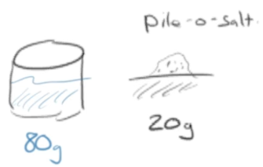

Phase diagram of the Slurpie&reg;

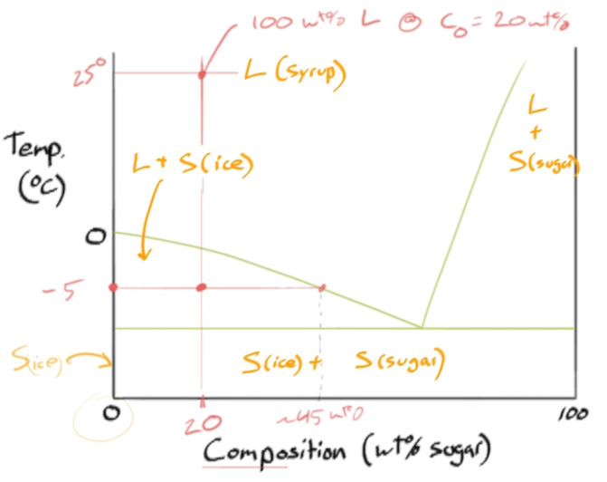

- at 25 &deg;C, 100 wt% liquid 

Overall composition and after cooling:

$$
C_0 = \frac{W_L}{W_S + W_L} = \frac{20}{80 + 20} = 20\text{ wt\%}
$$

*after cooling to -5 &deg;C*

- $L\ @\ C_L \doteq 45\text{ wt\%}$
- $S\ @\ C_S \doteq 0\text{ wt\%}$
- indicated by bottom red bar

**Break down of Slurpie&reg; Phase Diagram**

*Focus on the sugary part*

Partial phase diagram of sugar-water sol'n., focus on syrup and sugar phase:

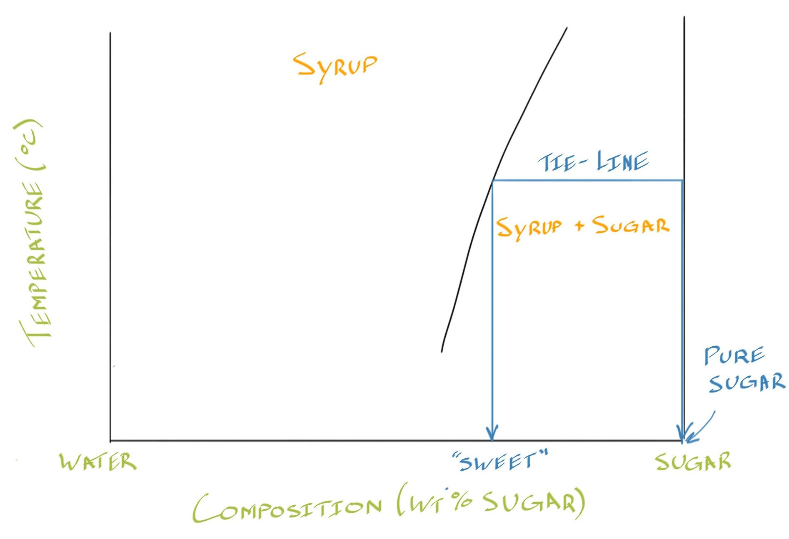

- curved line indicates *solubility limit* &mdash; can't dissolve any more solute
- once that happens, composition of sugar settles to bottom of glass
	- at that phases, it's just sugar!
	- solid sugar = 100 wt% sugar

*Focus on the watery / icy part*

Phase diagram of sugar-water sol'n., focus on ice + syrup phase:

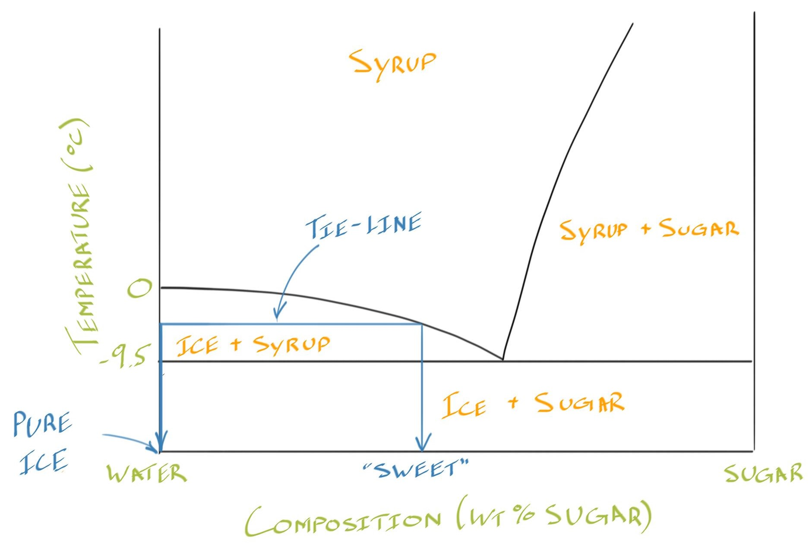

- most of time, Iced Capps&reg; or Slurpies&reg; in ice + syrup region
- when drinking Iced Capp&reg; too quickly
	- ... that not all of ice melts before finished drinking
	- left with ice / not sweet
	- ice is 100% water and 0 wt% sugar
- **isotherm:** horizontal line w/ constant temp.
- iced drink tastes good since drinking liquid (syrup) phase
- below -9.5 &deg;C, cold drink reaches solid ice + solid sugar phase

## What is eutectic?

- **binary eutectic phase diagram:** phase diagram for system that has one specific melting point ...
	- ... below melting pt. for each of the components
	- i.e. lead-tin systems (low melt temp., near eutectic)
- **isotherm:** horizontal line w/ constant temp.

*Generalized binary eutectic phase diagram:*

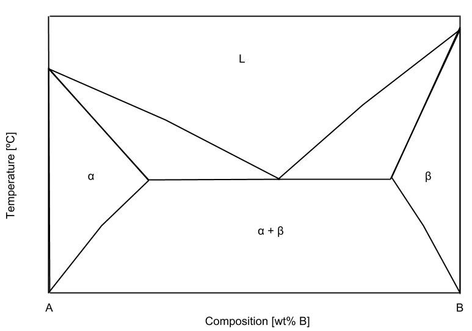

Phases:

- $\alpha,\ \beta$ &mdash; solid states
- $L$ &mdash; liquid state

### The Iron-Carbon System (important)

Iron-carbon phase diagram (important for prod. steel):

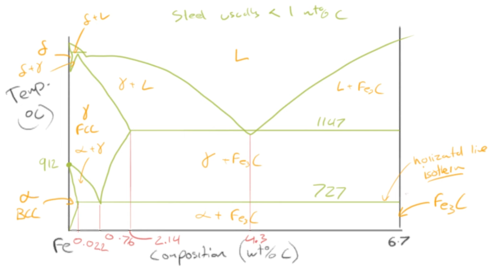

- steel usually <1 wt% C
- **major phases:**
	- $\alpha$ &mdash; ferrite
	- $\ce{Fe3C}$ &mdash; cementite
		- high carbon comp. yields a compound
	- $\gamma$ &mdash; austentite
	- $\delta$ &mdash; "delta" phase
- *major compositions at boundaries:*
	- 0.022 wt% C at 727 &deg;C
	- 0.76 wt% C at 727 &deg;C &mdash; **eutectoid** reaction
	- 2.14 wt% C at 1,147 &deg;C
	- 4.3 wt% C at 1,147 &deg;C
	- see diagram for other special values

**Example phase / composition calculations:**

ex. Phases and weight compositions of phases for 0.76 wt% C at 726 &deg;C (eutectoid)

- *Phases:* $\alpha$ and $\ce{Fe3C}$
- where: $C_\alpha = 0.022$ and $C_\ce{Fe3C} = 6.7$
- target: $C_0 = 0.76$

*Calculate weight composition of $\alpha$ and $\ce{Fe3C}$*

Diagram of levers for system:

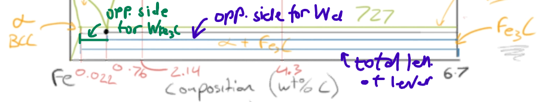

$$
\begin{gather*}
W_\alpha = \frac{C_\ce{Fe3C} - C_0}{C_\ce{Fe3C} - C_\alpha} = \frac{6.7 - 0.76}{6.7 - 0.022} \doteq 0.8895 \\ \\
W_\ce{Fe3C} = \frac{C_0 - C_\alpha}{C_\alpha - C_\ce{Fe3C}} = \frac{0.76 - 0.022}{6.7 - 0.022} \doteq 0.1105 \\ \\
\text{or } W_\ce{Fe3C} = 1 - W_\alpha
\end{gather*}
$$

## Sources

- Ramsay, Scott. (2026). *Introductory Chemistry of Solids*. Top Hat.
- Dr. Scott Ramsay's YouTube videos on chemistry
- Thorat, S. (n.d.). *What is Ferrite, Cementite, Pearlite, Martensite, Austenite.* LearnMech.com. https://learnmech.com/what-is-ferrite-cementite-pearlite-martensite-austenite/