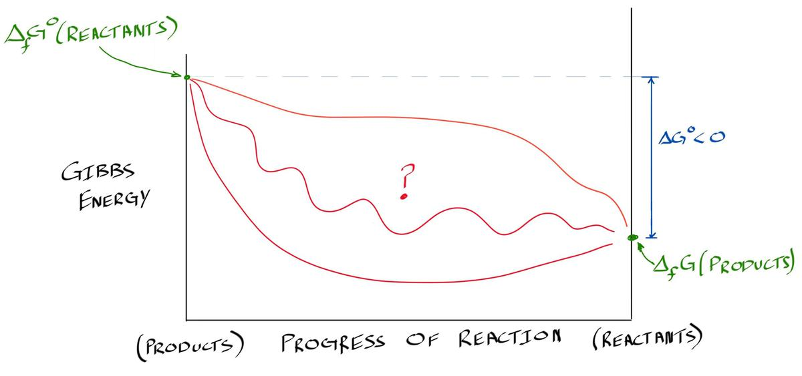
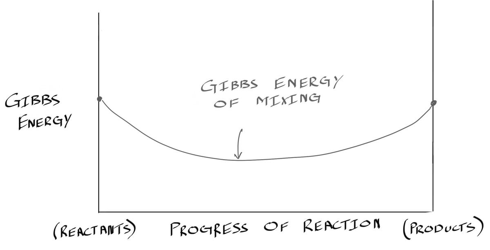
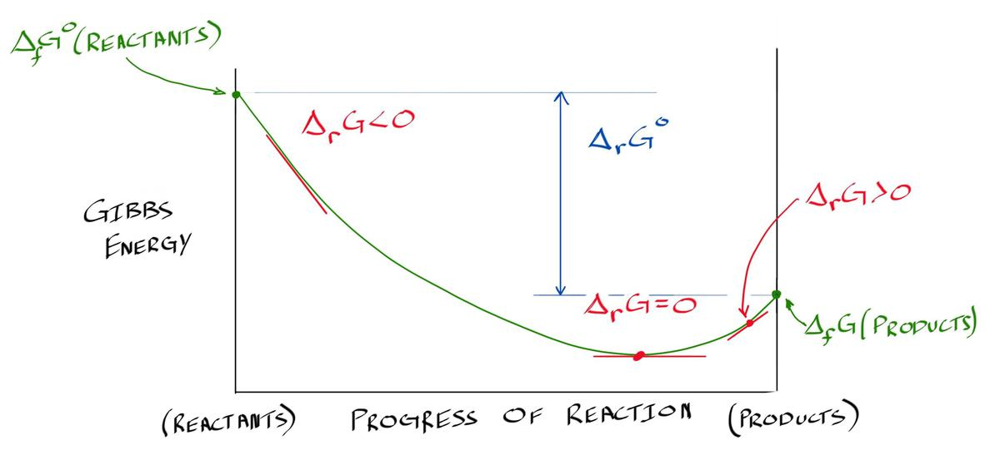
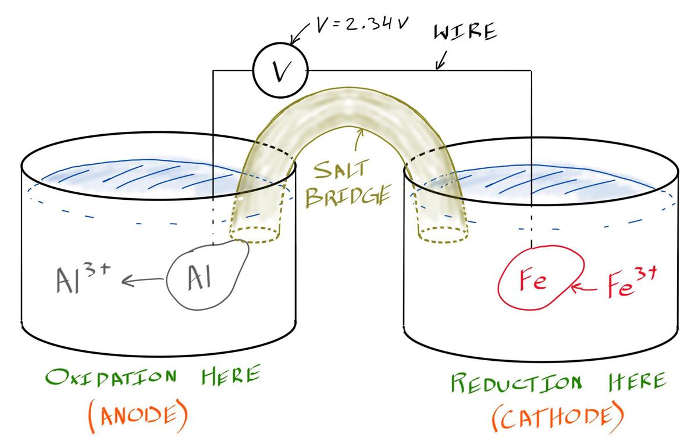
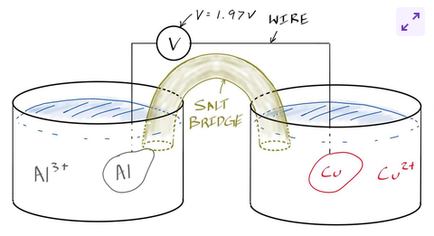
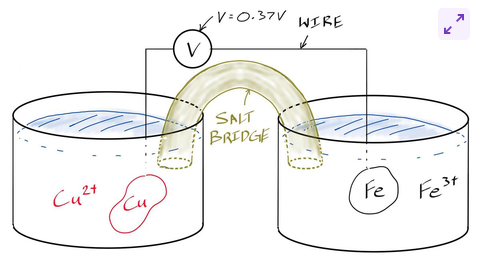

# C13 - Electrochemistry

## Equilibrium

### Chemical Reactions

*Example:* Chemical "reaction" of sugar-water system:

$$
\begin{gather*}
\ce{sugar(s) -> [sugar](in ice)} \\
\ce{water(s) -> [water](in sugar)}
\end{gather*}
$$

- *essentially* no solid solub. of sugar in ice nor of water in solid sugar
	- *in reality:* tiny amount of each dissolved in each other
- in practice
	- ice: $C_\text{ice} = 0\text{ wt\% sugar}$
	- sugar: $C_\text{sugar} = 100\text{ wt\% sugar}$

*General reaction:*

$$
\ce{Reactants -> Products}
$$

if $\Delta G^\circ < 0$, reaction is spontaneous as written

### Progress of Reaction

Graph of Gibbs energy v. Progress of Reaction:

- Gibbs energy must dec. from products to reactants
- *What happens in between?*

### Gibbs Energy of Mixing

Graph of G v. react. prog., Gibbs Energy of Mixing:

- mixing between reactants and products
	- causes increase in entropy
- mixing leads to **decrease** in **Gibbs energy of mixing**

### Reaction Gibbs Energy

Graph of G v. react. prog., Reaction Gibbs Energy:

- **reaction Gibbs energy** &mdash; when accounting for Gibbs energy of mixing and overall Gibbs energy change
- can det. direction that reaction will proceed spontaneously from slope of reaction Gibbs energy curve
	- (-) slope &rarr; products at lower reaction G
	- (+) slope &rarr; products at higher reaction G
	- at equilibrium, slope of react. G curve = 0

---

**Reaction Gibbs Energy, Math:**

$$
\Delta_r G = \Delta G^\circ + RT \ln Q
$$

- $\Delta_r G$ &mdash; reaction Gibbs energy (base: J/mol)
- $\Delta G^\circ$ &mdash; change in Gibbs energy (base: J/mol)
- $R$ &mdash; gas constant
	- $R \doteq 8.314\text{ J/(mol} \cdot\text{K)}$
- $T$ &mdash; temperature (K)
- $Q$ &mdash; reaction quotient (no units)

### Reaction Quotient, $Q$

**General Reaction:**

$$
\ce{aA + bB -> cC + dD}
$$

- where we have $a$ mol of species $\text{A}$
- $b$ mol of species $\text{B}$
- and so on...

**Defining the Reaction Quotient, $Q$:**

$$
Q = \frac{a_\text C^c\ a_\text D^d}{a_\text A^a\ a_\text B^b}
$$

- for $a_\text{I}^i$, $a_\text{I}$ raised to power of $i$, mol. of species $\text I$
- where $a_\text{I}$ is activity of species $\text I$
	- can either be concentration or...
	- partial pressure of gas ($P$)
- $Q$ should be dimensionless (no units)
	- divide conc. by 1 M
	- or pressure by 1 atm

### At Equilibrium; Equilibrium Constant $K$

- at equilibrium, reaction Gibbs energy, $\Delta_r G = 0$
	- reaction proceeds neither towards reactants or products
- at equilibrium: fwd. and rev. reactions occur at same rate
- **equilibrium constant ($K$):** the reactant quotient, $Q$ at equilibrium
	- math: $K = Q \text{ if } \Delta_r G = 0$
- *Product or Reaction Favouring*
	- fav. product $\to \Delta G^\circ < 0\ \land\ K > 1$
	- fav. reactant $\to \Delta G^\circ > 0\ \land\ K < 1$

**Deriving equation for Gibbs energy at equilibrium:**

$$
\begin{gather*}
\Delta_r G = \Delta G^\circ + RT\ln Q \\
\text{sub } \Delta_r G = 0,\ Q=K \\
0 = \Delta G^\circ + RT \ln K \\ \\
\therefore \Delta G^\circ = -RT \ln K
\end{gather*}
$$

see *Reaction Gibbs Energy* above for var. defs., and $K$ is eq. const.

## Ex: Reducing Aluminum is Hard (wants to oxidize)

- aluminum is great since it don't rust &rarr; misleading
- aluminum is highly reactive &rarr; quickly reacts with oxygen
	- forms aluminum oxide layer on surface
	- layer doesn't continue to grow and acts like protective layer to prevent aluminum from further oxidizing
	- important in refining aluminum

**Determining the Pressure needed to Oxidize Aluminum:**

1. Chemical reaction of *oxidization* (next section) of aluminum:

$$
\ce{2Al(s) + 3/2O2(g) -> Al2O3(s)}
\newcommand{\DrG}{\Delta_r G^\circ}
\newcommand{\DfG}{\Delta_f G^\circ}
\newcommand{\DfH}{\Delta_f H^\circ}
\newcommand{\DfS}{\Delta_f S^\circ}
\newcommand{\S}{S^\circ}
$$

2. Standard reaction Gibbs energy change for reaction

$$
\DrG = \DfG(\ce{Al2O3(s)}) - 2\DfG(\ce{Al(s)}) - \frac 3 2\DfG(\ce{O2(g)})
$$

3. Reaction enthalpy for $\ce{Al2O3(s)}$ = form. enthalpy (Al, O gas most stable at 298.15 K and 1 atm)

$$
\begin{gather*}
\DfH(\ce{Al2O3(s)}) = -1,675\text{ kJ/mol and...} \\
\DfH(\ce{Al(s)}) = \DfH(\ce{O2(g)}) = 0
\end{gather*}
$$

4. Get standard entropies for all components of reaction

$$
\begin{gather*}
\S(\ce{Al2O3(s)}) = 50.92\ \frac{\text J}{\text{mol}\cdot\text K} \\
\S(\ce{Al(s)}) = 28.3\ \frac{\text J}{\text{mol}\cdot\text K} \\
\S(\ce{O2(g)}) = 205.1\ \frac{\text J}{\text{mol}\cdot\text K}
\end{gather*}
$$

5. Formation entropy of $\ce{Al2O3(s)}$ using eq. stoichiometry

$$
\begin{align*}
\DfS(\ce{Al2O3(s)}) &= \S(\ce{Al2O3(s)}) - 2\S(\ce{Al(s)}) - \frac 3 2\S(\ce{O2(g)}) \\
&= 50.92 - 2(28.3) - \frac 3 2(205.1) \\
&= -313\ \frac{\text J}{\text{mol}\cdot\text K}
\end{align*}
$$

6. Formation Gibbs Energy (in joules), where $T = 298.15\ \text K$:

$$
\begin{align*}
\DfG(\ce{Al2O3(s)}) &= \Delta H^\circ - T\Delta\S \\
&= -1,675(10^3) - 298.15(-313) \\
&= -1.581(10^6)\ \text J
\end{align*}
$$

7. Derive $K$ in terms of partial pressure of oxygen

$$
\begin{gather*}
\Delta G^\circ = -RT \ln K \\
\text{where } K = \frac{a_\ce{Al2O3(s)}}{a_\ce{Al(s)}^2 \cdot P_\ce{O2(g)}^{3/2}} \\
\text{and } a_\ce{Al2O3(s)} = a_\ce{Al(s)} = 1
\end{gather*}
$$

- because aluminum oxide and aluminum considered phases
	- *phase* &mdash; liquid or solid
	- concentrations do not change

$$
\Rightarrow K = \frac{1}{P_\ce{O2}^{3/2}}
$$

8. Sub. K in Gibbs energy eq. to get partial pressure of oxygen

$$
\begin{align*}
\Delta G^\circ &= -RT \ln K \\
&= -RT \ln \frac 1{P_\ce{O2}^{3/2}} \\
&= RT \ln P_\ce{O2}^{3/2}
\end{align*}
$$

*Now isolate $P_\ce{O2}^{3/2}$*

$$
\begin{align*}
\frac{\Delta G^\circ}{RT} &= \ln(P_\ce{O2}^{3/2}) \\
P_\ce{O2}^{3/2} &= \left(\exp \frac{\Delta G^\circ}{RT} \right)^{2/3} \\
&= \left(\exp\frac{-1.581(10^6)}{8.314(298.15)}\right)^{2/3} \\
&\doteq 1.8(10^{-185})\text{ atm}
\end{align*}
$$

- result: tiny partial pressure for oxygen
- any partial pressure of oxygen above what was found will favour $\ce{Al2O3}$
	- why aluminum refining is challenging; energy intensive

**Thermite reaction:**

$$
\ce{Fe2O3(s) + 2Al(s) -> Al2O3(s) + 2Fe(s)}
$$

- app. of thermodynamic desire of Al to oxidize
	- use aluminum to reduce another metal oxide
- **thermite reaction:** reducing iron oxide using aluminum
	- a.k.a. *aluminothermic reduction of iron*
	- reaction extremely exothermic
	- melts iron produced
	- can be used to weld where impractical to carry welding torches

## Oxidation and Reduction

- **oxidation:** reaction where electrons are lost
- **reduction:** reaction where electrons are gained
- *LEO GER* (LEO the lion says GER)
	- *L*ose *E*lectrons in *O*xidation
	- *G*ain *E*lectrons in *R*eduction
- or *OIL RIG* (Oxidation is Lose, Reduction is Gain)

Ex. aluminothermic reduction of iron, half-reactions:

$$
\begin{gather*}
\ce{Fe^3+ + 3e- -> Fe} \tag{reduction} \\
\ce{Al -> Al^3+ + 3e-} \tag{oxidation}
\end{gather*}
$$

- **redox reaction:** reaction involving oxidation and reduction
	- **redox** from **red**uction-**ox**idation
- **half-reaction:** individual oxidation or reduction reaction
	- they don't happen on their own
	- electrons need to come from somewhere
	- electrons need place to go (destination)
- *Fun Nugget*
	- Al has e. config: $1s^2\ 2s^2\ 2p^6\ 3s^2\ 3p^1$
	- when Al lose 3 e., it loses $3s^2\ 3p^1$
	- thus $\ce{Al^3+}$ has config: $1s^2\ 2s^2\ 2p^6 = \ce{[Ne]}$

## Galvanic / Volatic Cell

> **Galvanic / Voltaic cell:** cell composed of 2 *electrolyte* solutions where ions flow through a bridge and electrons flow thru. wire

Diagram of complete Galvanic cell, aluminum-iron (Al-Fe):

- only wire and no salt bridge &mdash; only establishes **cell potential**
- **cell potential:** voltage difference between cells
- **salt bridge:** tube of gelled electrolyte that allows ions to pass from one solution to the other
- **electrode:** a strip of metal (or solution) where reduction / oxidation occurs
	- **anode:** electrode where oxidation occurs
	- **cathode:** electrode where reduction occurs
- wire + salt bridge gives electrons and ions places to go
	- e. and ions not crowded around each *electrode*
- can measure voltage &mdash; no absolute value

### Measuring Cell Voltages

**Analogy:**

- imagine you only knew distance from hotel to fruit market
- want to go to bakery &mdash; but only know distance from library to bakery
- cannnot estimate time to walk from home to bakery
- *need:*
	- list of distances from hotel to bakery,
	- library, fruit market, and hardware store, etc.
- *then:* can work out time to get from bakery to hardware store
	- assuming route is straight and linear

**Reality:**

Using aluminum-copper and copper-iron cells to det. voltage of Al-Fe cell

*Aluminum-Copper (Al-Cu) cell:*

*Copper-Iron (Cu-Fe) cell:*

- reference point is copper (hotel from analogy)
- aluminum &larr; bakery
- iron &larr; hardware store
- thus $V_\ce{Al-Fe} = V_\ce{Al-Cu} + V_\ce{Cu-Fe}$
	- where $V$ is voltage

**Shorthand notation for writing cells:**

$$
\ce{anode | anode electrolyte || cathode electrolyte | cathode}
$$

where || describes the salt bridge

*Al-Cu cell:*

$$
\ce{Al | Al^3+ || Cu^2+ | Cu: 1.97 V}
$$

*Cu-Fe cell:*

$$
\ce{Cu | Cu^2+ || Fe^3+ | Fe: 0.37 V}
$$

*Al-Fe cell:*

$$
\ce{Al | Al^3+ || Fe^3+ | Fe: 2.34 V}
$$

*and...*

$$
V_\ce{Al-Fe} = 1.97\ \text V + 0.37\ \text V = 2.34\ \text V
$$

### The Standard Hydrogen Electrode (SHE)

> **standard hydrogen electrode (SHE):** the reference electrode used to tabulate std. red. potentials

*SHE reduction reaction:*

$$
\ce{2H+(aq) + 2e- -> H2(g)}
$$

*SHE half-cell shorthand:*

$$
\ce{Pt(s) | H2(g, 1\ atm) | H+(1 M)}
$$

#### Tabulating Potentials

- **reduction potential ($E$):** voltage difference of half-cell
	- standard reduction (or cell) potential &mdash; $E^\circ$
	- std. based on SHE

*Table columns and ex.*

|Reduction Reaction|$E^\circ$ (V)|
|-|-|
|$\ce{Li+(aq) + e- -> Li(s)}$|-3.045|

## Work Done by Electrochemical Cell

**Work done by cell, equation:**

$$
W = neN_A(-E^\circ)
$$

- $W$ &mdash; work done on cell [J/mol]
- $n$ &mdash; no. of electrons tranferred [# e-]
- $e$ &mdash; fundamental charge
	- $e \doteq 1.602 \times 10^{-19} \text{C/\# e}^-$
- $N_A$ &mdash; Avogadro's number
	- $N_A \doteq 6.022 \times 10^{23} \text{ mol}^{-1}$
- $E^\circ$ &mdash; cell potential [V = J/C]
	- neg. sign due to sign convention for polarity of electrode

**Derive Gibbs Energy or Work:**

$$
\begin{gather*}
\Delta G = W \tag{sub $W$} \\
\Delta G = -neN_AE \\
\text{let } eN_A = F \\ \\
\therefore \Delta G^\circ = -nFE^\circ
\end{gather*}
$$

- where $F$ is the Faraday constant, $F \doteq 96,485\  \dfrac{\text J}{\text V\cdot\text{mol}}$
- *eq. tells us:*
	- half-cells w/ more (+) $E^\circ$ and more (-) $\Delta G$
		- will be reduced more readily
		- more **cathodic**
	- half-cells with more (-) $E^\circ$ and more (+) $\Delta G$
		- will be oxidized more readily
		- more **anodic**
- ex. galvanized steel coated with zinc
	- zinc corrodes over iron since
	- $E^\circ_\ce{Zn}$ is more (-) than $E^\circ_\ce{Fe}$

## Nernst Equation

- *recall:* $\Delta_r G  = \Delta G^\circ + RT \ln Q$
- *sub:* $\Delta_r G = \Delta G = -nFE$

$$
\begin{gather*}
-nFE = -nFE^\circ + RT \ln Q \tag{div. by $-nF$} \\
\therefore E = E^\circ - \frac{RT}{nF} \ln Q \tag{Nerst eq.}
\end{gather*}
$$

- above eq. is *Nernst equation*
- shows us that we can apply voltage to drive non-spontaneous reaction
	- basis for aluminum refining

## Sources

- Ramsay, Scott. (2026). *Introductory Chemistry of Solids*. Top Hat.
- Dr. Scott Ramsay's YouTube videos on chemistry
- What I recall from Gr. 12 chemistry