# C2 - Elastic Behaviour

## Hooke's Law

- "Stretching" a spring (giving stress) causes string to elongate 
	- At small "bending" values, stretching is temporary and spring returns to o.g. length
- **elongation:** the change of length of an object

*Spring Elongation*

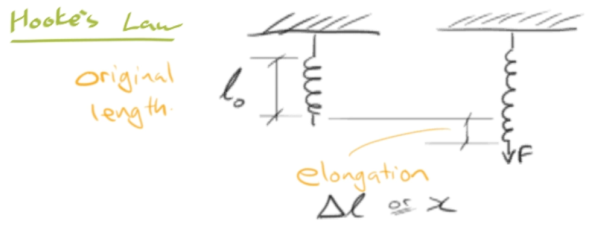

Graph of force v. elongation of spring:

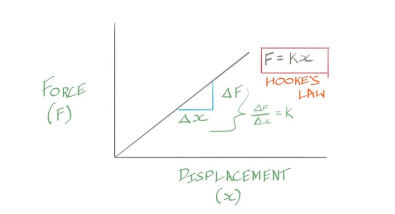

*Image shows Hooke's Law for springs*

Linear relation: $y = mx + b$

> **Hooke's Law:**
>
> $F = kx$
>
> - $F$ &mdash; force (N)
> - $k$ &mdash; spring constant (N/m)
> - $x$ &mdash; spring displacement (m)

### Problem with Hooke's Law

- two objects of the same material but with different sizes make different force-displacement graphs

*2 cylindrical samples of same material:*

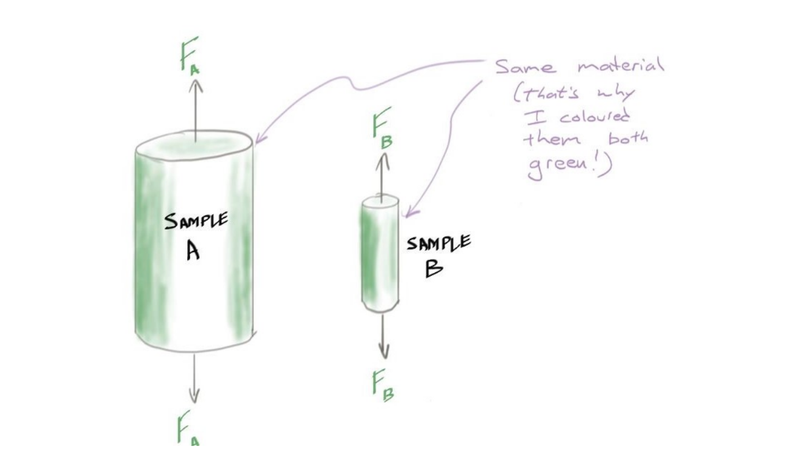

*Resultant force-displacement graphs:*

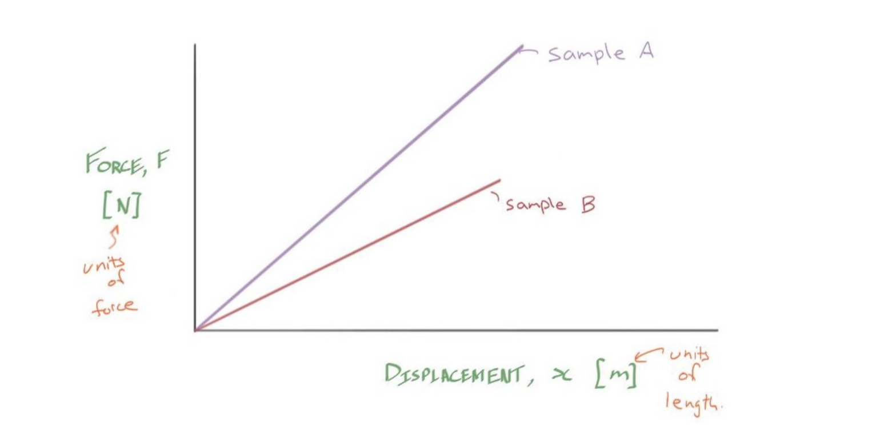

- *above:* sample A needs more force to elongate than sample B, since it's bigger
	- but sample A is not stronger than B (same material)

## Stress and Strain

*Solution:* normalize by area where force is being distributed

**(Engineering) Stress ($\sigma$):**

$$
\sigma = \frac{F}{A_0}
$$

- *in words:* "internal pressure" caused by force
- *SI unit:* Pascal (Pa) = N/m2
- $F$ &mdash; force applied to load (perp. to area being applied)
	- SI unit: Newton (N)
- $A_0$ &mdash; initial (unloaded) cross-sectional area
	- SI unit: square meter (m2)

For circular area: $A = \pi r^2$

**(Engineering) Strain ($\epsilon$):**

$$
\epsilon = \frac{\Delta l}{l_0}
$$

- *in words:* "the ratio of elongation"
- unitless measure
- $\Delta l$ &mdash; displacement / elongation
- $l_0$ &mdash; original length
- keep units of length the same for $\Delta l,\ l_0$

*Illustration of changes caused by load on cylinder:*

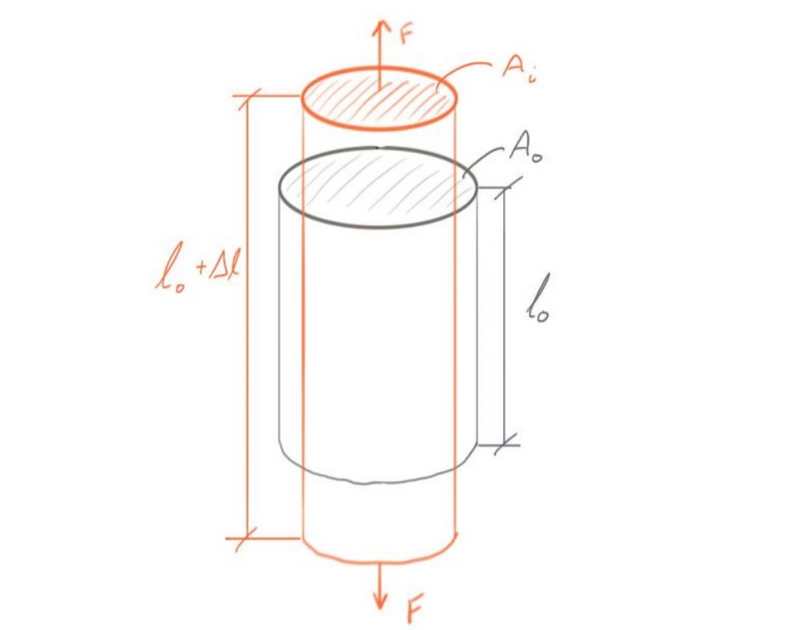

- *Note:* orange is cylinder "stretched" under load
- $A_i$ is newer smaller cross-sectional area

Relation between stress and strain:

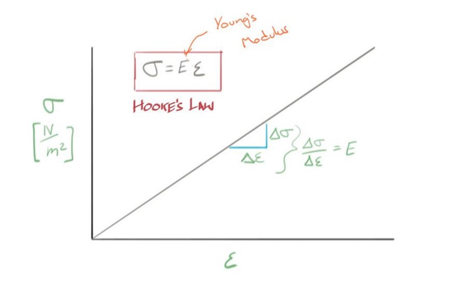

*Note:* The samples A and B prev. would now produce same stress-strain line

> **Hooke's Law using Stress & Strain:**
>
> $\sigma = E\epsilon$
>
> $E$ &mdash; Young's modulus (constant of prop. / in Pa)

## Defining Elastic Deformation

**Elastic deformation,** *possible definitions:*

1. Sample returns to original dimensions upon unloading
	1. *difficult to accurately measure dimensions*
2. Strain is recoverable
3. Atoms return to their original positions upoin uploading
	1. *relies on ability to visualize individual atoms*

### Atomic Visualization of Elasticity

*Visual of atoms as "hard spheres":*

When "stretch" load is applied to atoms, atoms must move away from each other due to elongation:

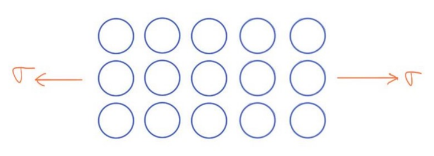

Pair of atoms can be modelled as spheres connected by spring:

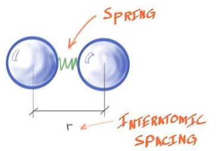

Attractive force pulls atoms together, but as atoms get closer, repulsive force become significant

- spring models net force between atoms
- $r$ &mdash; interatomic spacing
	- not radius
- $F$ &mdash; interatomic force
	- sum of attractive and repulsive forces

*Plot of net interatomic force and interatomic separation:*

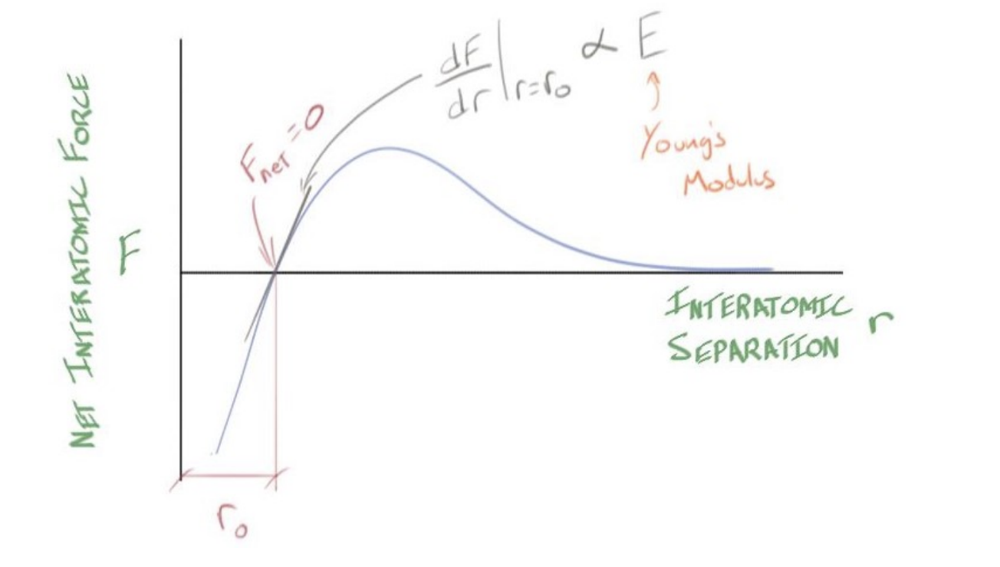

- $r_0$ &mdash; equilibrium interatomic force
	- At $r=r_0 \to F = 0$
- slope of this curve is proportional to Young's modulus at $r_0$

**Proportionality of Young's modulus w/ interatomic force-separation:**

$$
E \propto \left.\frac{dF}{dr}\right|_{\displaystyle{r=r_0}}
$$

***Key Takeaways:***

- Young's modulus ($E$) depends only on type of atoms
- Young's modulus is *structure independent*
	- i.e. small changes of composition or strengthening  doesn't affect $E$

## The Tensile Test

- gripping a cylinder to test it is very difficult w/o deforming grip ends
- **tensile specimen:** a special shape used to easily test materials
	- a.k.a. tensile coupon, "dog-bone" specimen

*Tensile specimen diagram:*

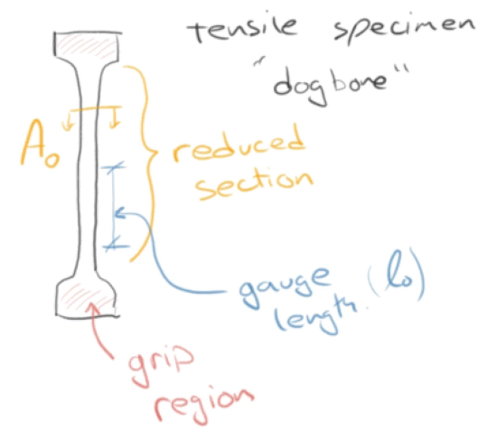

*Simplified stress-strain curve for metal under load:*

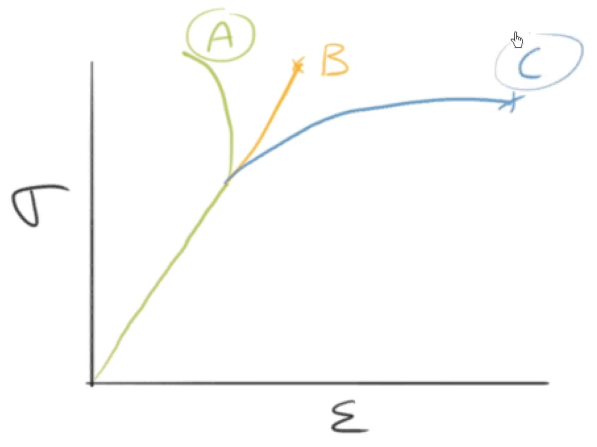

*C* is where the graph continues &mdash; *permanent deformation*

**Parts of Tensile Specimen:**

- **grip region:** place to grip the sample
	- stress is grip regions lower due to larger C.S. area
- **reduced section:** the middle section where cross-sectional (C.S.) area is reduced
	- it's C.S. area $= A_0$
- **gauge length:** the length of the specimen where measurements are made
	- *strain gauge:* pricey electronic that clips on the reduced section to accurately measure strain
	- gauge length $= l_0$

*Picture of apparatus w/ some labels:*

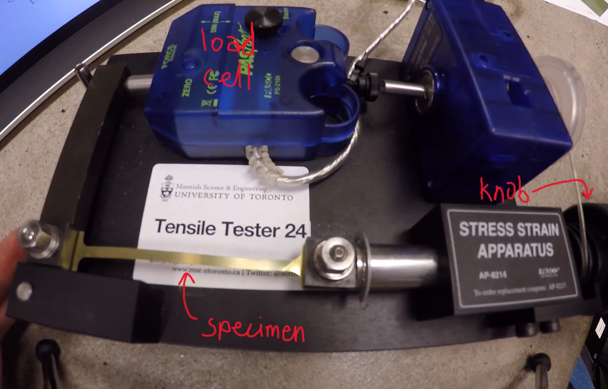

*Stress-strain curve produced by apparatus:*

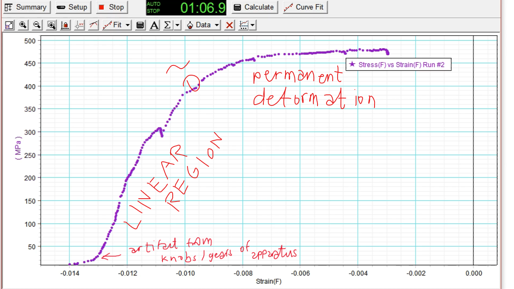

*Long-term loading and unloading curve:*

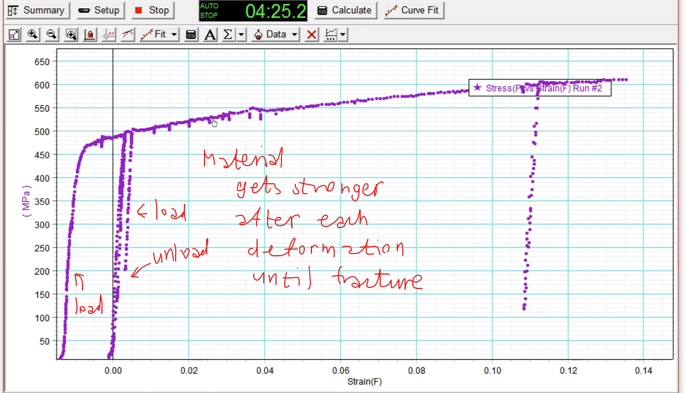

## Sources

- Ramsay, Scott. (2026). *Introductory Chemistry of Solids*. Top Hat.
- Dr. Scott Ramsay's YouTube videos on chemistry