# C3 - Elastic Behaviour

## Permanent Deformation

### Possible Definitions

What is permanent deformation?

1. Upon unloading, sample does not return to original dimensions
2. Strain doesn't return to *zero* upon unloading
3. Atoms must move to new equilibrium positions
4. Near end of linear region

common term used: **plastic deformation**

### Visualizing using Hard-Sphere Model

1. Atoms as hard spheres at equilibrium

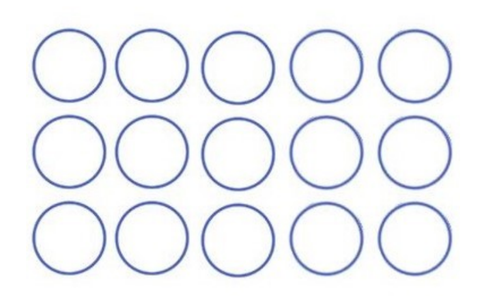

2. Hard spheres under tensile load, experiencing plastic deformation

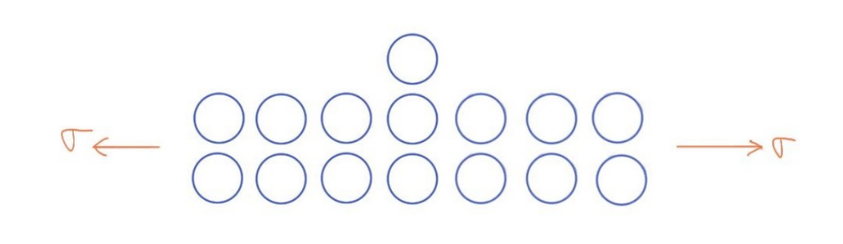

3. After plastic deformation, spheres remain at their new locations

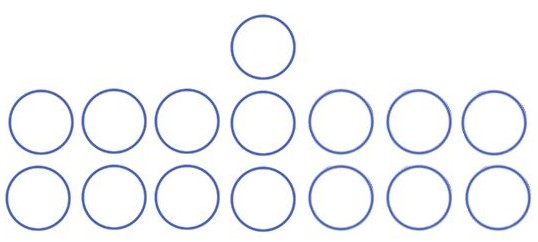

### Plastic Deformation (S.S. Curve)

Stress-strain curve for typical metals:

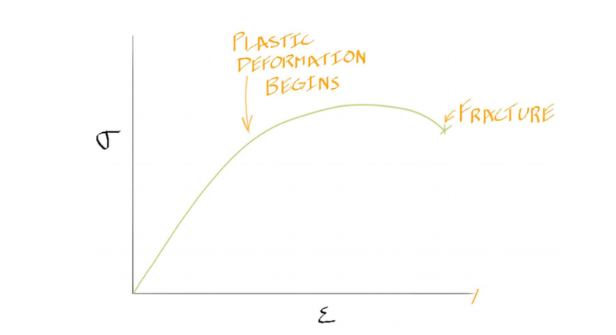

### Etymology of "Plastic"

- "plastic" comes from Greek word "Plastikos" &mdash; to shape or sculpt
- think of sculpting in plastic surgery

## Plastic Deformation of Other Materials

Stress-strain curves for other materials:

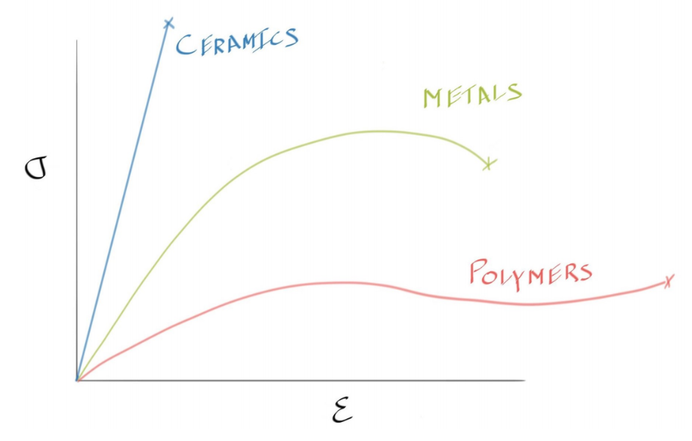

- strength trend: polymers < metals < ceramics
- ceramics strong at compression
	- but weak at tension
- ceramics don't undergo plastic deform. (at least at room temp.)

## Bend-Testing Ceramics

**Why ceramics are not tested in tension:**

1. crumbles in grip
2. difficult to make or machine
3. machine alignment difficult

*More on machine alignment:*

- metals and polymers are ductile
	- high plastic strain to fracture
	- if they are put slightly angled, sample deforms and becomes aligned w/ tensile loading axis
- ceramics fracture at very low strain
	- misalignment causes *shear stresses*

*Diagram of shear stresses due to misalignment:*

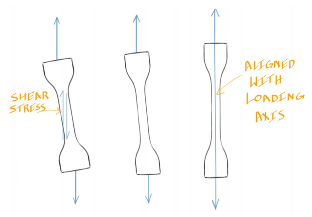

**Solution:** bending

Diagram of 3-point bending (easiest to do):

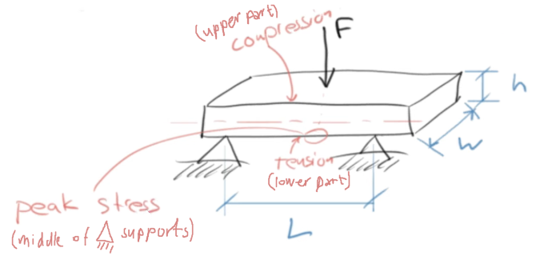

- ceramic is placed on supports as a "beam"
- lower surface in tension
- upper surface in compression
- *neutral axis:* axis where there is zero stress
	- indicated by dotted axis
- beam fractures first on lower surface specifically near middle
	- underneath load
	- at "peak stress"

**Equation for 3-point bending, peak stress ($\sigma_\text{3-pt.}$):**

$$
\sigma_\text{3-pt.} = \frac{3FL}{2wh^2}
$$

- *unit:* Pascal (Pa) = N/m2
- $L, w, h$ &mdash; length, width, and height of beam (m)
- $F$ &mdash; load applied (N)

## Tempered Glass

**About Tempered Glass**

- high strength (stronger than normal glass)
- "safe" when fractures &rarr; creates small pieces

**Formation of Tempered Glass, with Cross-Sections:**

1. Tempered glass is heated before its surfaces are rapidly cooled

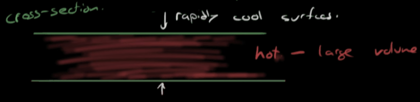

2. When cooled, surfaces cool rapidly, but leaves hot, dense center (cooling more slowly)

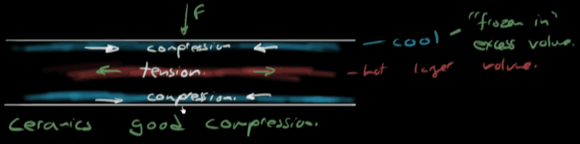

- surfaces are in compression but hot center is in compression
	- *residual stresses*
- rapid cooling causes excess volume to be "frozen in"
- center cools more slowly, while cold surfaces expand
	- causes final volume of center to be *smaller*
- residual stresses &rarr; stored strain energy
- silica glass can form networks of interconnected primary bonds
- on fracture &rarr; stresses liberated as surface energy &rarr; small pieces
- can also use chemical processes
	- ex. Gorilla Glass&reg;

## About the Scientific Model

Scientific models are useful at explaining how processes in our world work

**Hard sphere-spring model:**

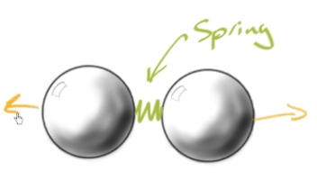

*Interatomic force - separation curve:*

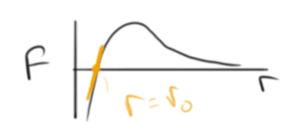

- *Explained:* plastic deformation ✔
- *Did not explain:* permanent deformation ❌

**Model car:**

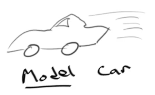

- models car good enough for car to see how car moves
- doesn't model driving experience or how engine works

**Bohr-Rutherford model of atom:**

- *Explained:* energy absorption and emission by electrons as they move from one orbital to the next
- *Did not explain:* quantum mechanical behaviour of atoms

## Sources

- Ramsay, Scott. (2026). *Introductory Chemistry of Solids*. Top Hat.
- Dr. Scott Ramsay's YouTube videos on chemistry