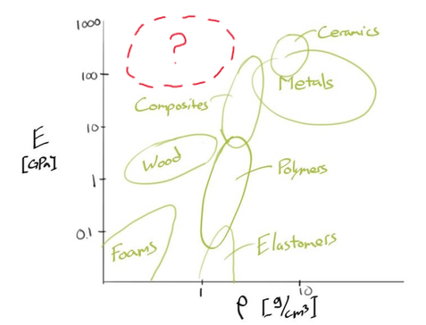
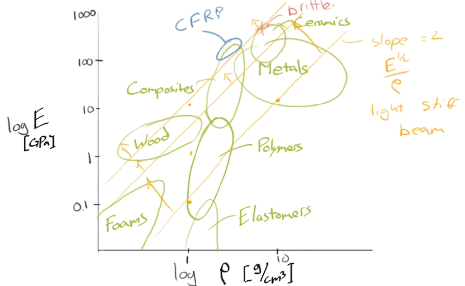
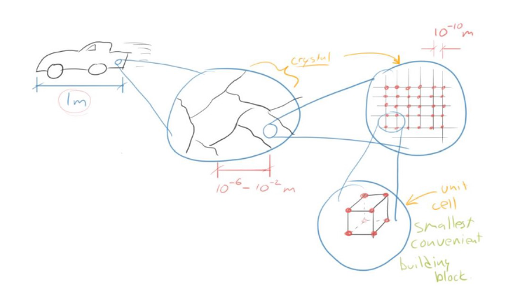
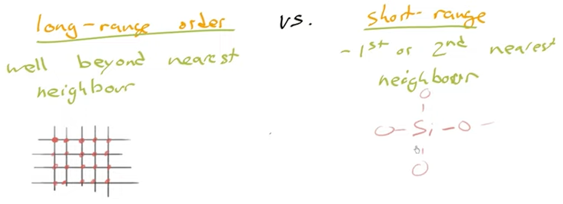
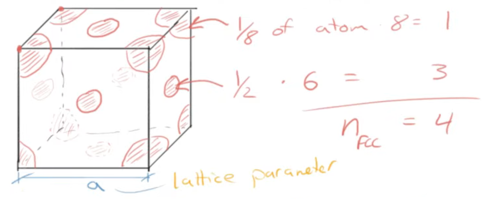
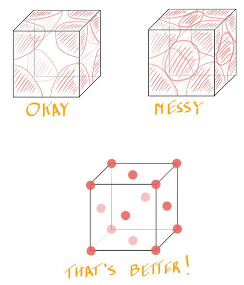
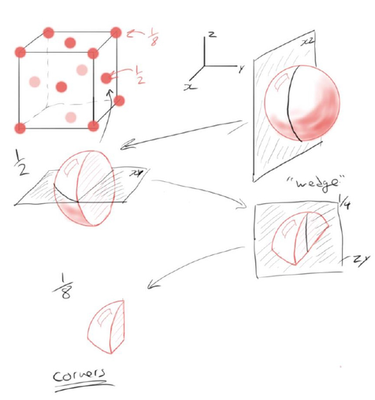
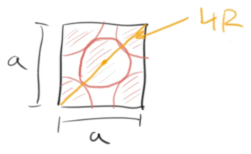
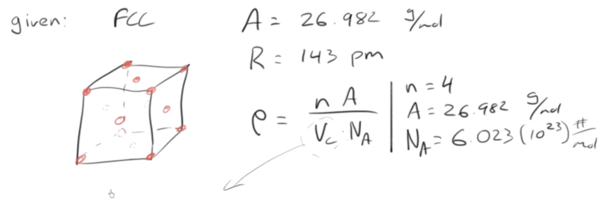
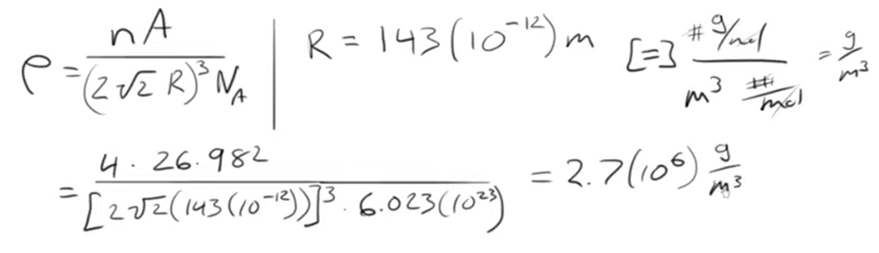

# C4 - Structure-Property Relationship

## Density

- **density ($\rho$):** measure of mass per unit volume
	- formula: $\rho = \dfrac m V = \dfrac{\text{mass}}{\text{volume}}$
	- units: g/cm3 or kg/m3 (base SI)
	- highly unconventional: g/m3

## Young's Modulus v. Density

Chart of Young's Modulus v. Density (w/ different materials):

- typically $\log E$ and $\log \rho$ is used instead
- groups of materials in "envelopes" (roughly ovalish regions)
- no currently known superlight and superstiff materials 
	- upper-left "red" region
	- area of current research

### "Lightweight"

- we want our materials to become lighter
- while still remaining strong

## Lightweight Rotors, Ladders, and Racquets

- *common characteristic:* ladders, tennis racquets, and helicopter rotors loaded in bending
	- they are all "beams"
- **objective function:** something we want to maximize / minimize
- *objective:* minimize mass

*Diagram of helicopter rotor:*

**Objective Equation for Mass:**

$$
m = AL\rho
$$

- $m$ &mdash; mass
- $A$ &mdash; cross-sectional area of...
	- ladder rung, rotor, or handle of racquet
- $\rho$ &mdash; density
	- (keep consistent with mass and area)

**Constraint: Max. Deflection of Beam:**

$$
\delta = \frac{FL^3}{CEA^2}
$$

- $\delta$ &mdash; deflection
- $F$ &mdash; force applied
- $L$ &mdash; span-length of beam
- $C$ &mdash; constant
- $E$ &mdash; Young's modulus
- $A$ &mdash; cross-sectional area

Isolate for $A$

$$
A = \left(\frac{FL^3}{CE\delta}\right)^{1/2}
$$

Sub $A$ into $m = AL\rho$

$$
m = \left(\frac{FL^3}{CE\delta}\right)^{1/2} L\rho
$$

- considering only *material properties*, to min. mass,
	- we min. $\dfrac{\rho}{E^{1/2}}$ or by conv., max. $\dfrac{E^{1/2}}{\rho}$

Define *Materials Performance Index (MPI)*

$$
\text{MPI} = \frac{E^{1/2}}{\rho}
$$

Take the log of both sides to create new relationship:

$$
\begin{align*}
\log\text{MPI} &= \log \frac{E^{1/2}}\rho \\
\log\text{MPI} &= \frac 1 2 \log E - \log \rho \\ \\
\therefore \log E &= 2\log\rho + 2\log\text{MPI}
\end{align*}
$$

- Gives us a line with a slope of 2
- As line moved toward top left, last materials left w/ are composites and ceramics
- Ceramics are too brittle (eliminate)
- Our best light materials are composites
	- *best:* carbon fiber reinforced polymer (CFRP)
	- *natural alt:* wood performs well as stiff light plate
- Analysis of light stiff plate
	- fixed: horizontal area of rotor
	- free variable: thickness
	- $\Rightarrow \text{MPI} = \cfrac{E^{1/3}}\rho$

*Diagram of MPI relationship on E v. density plot:*

## Ordered Solids

Zooming into the metal exterior of a car:

- most metals are **polycrystalline** &mdash; made of crystals
	- typically crystals are at micron scale
	- some ceramics are as well (i.e. sapphire - $\ce{Al2O3}$)
- some materials are **amorphous** &mdash; not organized
	- i.e. window glass
- each crystal made of many atoms positioned in regular rep. positions spaced at ~*atomic scale*
- **atomic scale:** 10-10 m = 1 Angstrom (Å)
- crystal may contain roughly 1019 - 1020 atoms
- **unit cell:** building block that accurately describes a crystal

*Long-range v. short-range order:*

- **long-range order:** when a structure repeats well beyond scale of atom (or tens or thousands of atoms)
- **short-range order:** materials where order is only at 1st or 2nd nearest neighbour (atom)

*Image of grains in a handrail:*

- handrail made of steel and *galvanized* with zinc (on top, protect from corrosion)
- **grain:** crystals that make up polycrystalline materials
- **grain boundary:** borders from one grain to the next

## Face-Centered Cubic (FCC)

- a.k.a. *simple cubic*
	- many metals are FCC (i.e. aluminum)
- there are atoms on each corner on the cube and at the center of each face
- **lattice parameter ($a$):** the length of the cube's edge

*Diagram of structure with atom count:*

*Easier depiction of FCC with dots (light = hidden) compared to hard sphere model:*

**Fractional Scaling of Atoms and Atom Count:**

whole atom &rarr; xz slice &rarr; 1/2 &rarr; xy slice &rarr; 1/4 &rarr; zy slice &rarr; 1/8 (corner)

Count:

- 8 \* 1/8 = 1 atom from corners
- 6 \* 1/2 = 3 atoms from faces
- total, $n_\text{FCC} = 4$

### Density Equation (for all structures)

- recall $\rho = m/V$
- mass = no. of atoms &times; molar mass
- divide by volume and Avogadro's number

**Final unit cell density equation:**

$$
\rho = \frac{nA}{V_C N_A}
$$

- $n$ &mdash; no. of atoms in cell
	- unit: #
- $A$ &mdash; molar mass of material
	- unit: g/mol
- $V_C$ &mdash; volume of cell
	- unit: cubic meter (m3)
- $N_A$ &mdash; Avogadro's number
	- $N_A \doteq 6.022\times 10^{23} \text{ \#/mol}$

### Lattice Parameter of FCC, Derivation

Cross-section of FCC face:

- atoms touch along diagonal, so...
- diagonal length $=2R+2R=4R$
- *Note:* $R$ &mdash; radius of atom

*Derive $a$*

$$
\begin{gather*}
a^2 + a^2 = (4R)^2 \tag{Pyth. theorem} \\
2a^2 = 16R^2 \\
\therefore a = 2\sqrt 2 R
\end{gather*}
$$

### Ex. Theoretical Density of Aluminum

> *Q:* Calculate the theoretical density of Al, given FCC, $A=26.982\text{ g/mol},\ R = 143\text{ pm}$

1. Organize information and write out density equation:

since FCC, $n = 4$ and conv. $R = 143(10^{-12})\text{ m}$

2. Need to determine $V_C = a^3$
3. Derive $a$ (if necessary), or just use $a = 2\sqrt 2 R$
4. Sub $a$ into $V_C$

$$
V_C = (2\sqrt 2 R)^3
$$

5. Sub $V_C$ into density equation

$$
\rho = \frac{nA}{(2\sqrt 2 R)^3 N_A}
$$

*Cancellation of units*

$$
\frac{\cancel{\#} \cdot\text{g}\cancel{\text{/mol}}}{\text{m}^3 \cdot \cancel{\text{\#/mol}}} = \frac{\text g}{\text m^3}
$$

6. Plug numbers in and get answer:

Answer: 2.7(106) g/m3

7. Convert to conventional units

$$
\rho \doteq 2.7(10^6) \frac{\text g}{\cancel{\text m^3}} \cdot \left(\frac{1\cancel{\text{ m}}}{100\text{ cm}}\right)^3 = \textbf{2.7 g/cm}^\textbf 3
$$

$\therefore$ Theoretical density of Al: about 2.7 g/cm3

## Atomic Packing Factor (APF) for FCC

**APF definition:**

$$
\text{APF} = \frac{V_S}{V_C}
$$

- $V_S$ &mdash; volume of atoms / spheres
- $V_C$ &mdash; volume of unit cell
- measures fraction of volume occup. by atoms in particular crystal structure

**Find APF of FCC:**

1. We know that $V_S = n\cdot \cfrac 4 3 \pi R^3$ and $V_C = a^3$

$$
\Rightarrow \text{APF} = \frac{n\cfrac 4 3 \pi R^3}{a^3}
$$

2. For FCC, $n = 4$ and $a = 2\sqrt 2 R$

$$
\Rightarrow \text{APF}_\text{FCC} = \frac{4 \cdot \cfrac 4 3 \pi R^3}{(2\sqrt 2 R)^3}
$$

3. Notice how top and bottom have $R^3$ (cancel out)
4. Simplify the equation (can exclude $R$)

$$
\therefore \text{APF}_\text{FCC} \approx 0.74
$$

- this APF is highest possible for packing w/ single dia. of sphere
- max. % of vol. that can be filled w/ spheres is ~74%

## Sources

- Ramsay, Scott. (2026). *Introductory Chemistry of Solids*. Top Hat.
- Dr. Scott Ramsay's YouTube videos on chemistry