# C5 - More Structures

## Rock Salt: Ceramic Crystal Structure

common structure for ceramics like NaCl (sodium chloride), MgO, FeO, ...

*Structure of rock salt crystal and stoichiometry, diagram:*

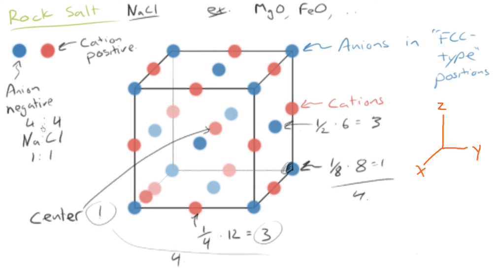

- cations in "FCC-type" positions
- anions along edges and in center

**Stoichiometry:**

- NaCl or other rock salts: stoichiometry of 1 : 1
- no. of cations = 4 (FCC struct.)
- no. of anions = 12 &times; 1/4 (edges) + 1 (center) = 4

**Ions touch along edges:**

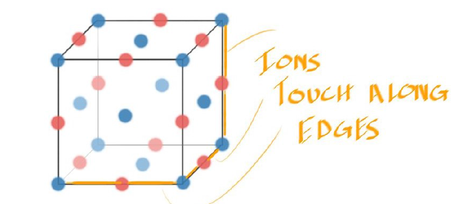

*Note:* Diagram does not show central cation

- due to cations, anions don't touch each other across diagonal
- instead ions touch along edges

### Coordination Number: Rock Salt

**coordination number:** no. of atoms touching a particular atom

Coordination number for rock salt, count:

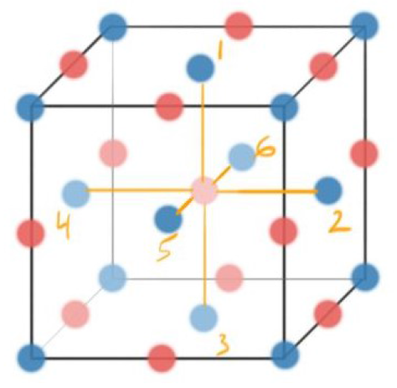

- central cation touches each of the face cations
- thus, *cation coordination number* = 6

### Theoretical Density and Lattice Parameter of Rock Salt Ceramics

- 2 types of ions in structure > 1 type of atom
- density equation must account for that

**Density Equation for Rock Salt:**

$$
\rho = \frac{n_C A_C + n_A A_A}{V_C N_A}
$$

- $\rho$ &mdash; density (yields g/sq. m)
- $n_C$ &mdash; no. of cations in cell
- $n_A$ &mdash; no. of anions in cell
- $A_C$ &mdash; molar mass of cation (g/mol)
- $A_A$ &mdash; molar mass of anion (g/mol)
- $V_C$ &mdash; volume of unit cell (cb. m)
- $N_A$ &mdash; Avogadro's number
	- $N_A \doteq 6.022 \times 10^{23}\text{ mol}^{-1}$

Since ions touch along edges, lattice param. ($a$) is sum of their radii

**Lattice Parameter Equation, Rock Salt:**

$$
\therefore a = 2R_A + 2R_C
$$

- $R_A$ &mdash; radius of anion
- $R_C$ &mdash; radius of cation

## Body-Centered Cubic (BCC)

common structure &mdash; for most steel alloys

*Structure of BCC + atom count:*

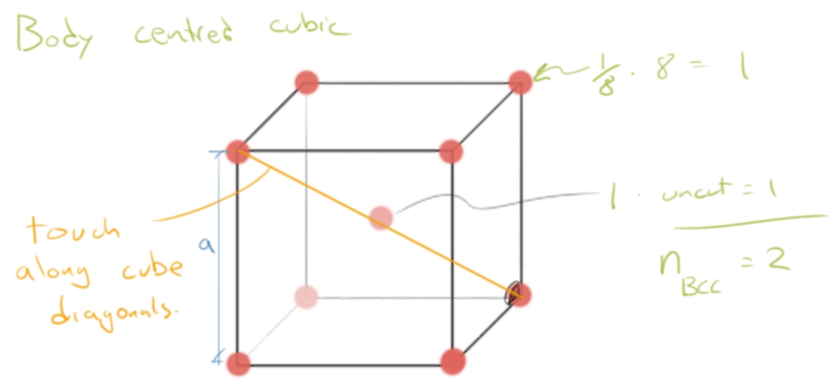

- atom count
	- corners = 1/8 &times 8 = 1
	- central = 1 (uncut)
	- total, $n_\text{BCC} = 2$
- atoms touch along cube diagonals

### Derivation of Lattice Parameter of BCC

- Since atoms touch along cube diagonals
	- cube diagonal length $= R + 2R + R = 4R$
	- $R$ is atomic radius

*Diagram of BCC lattice param. geometry:*

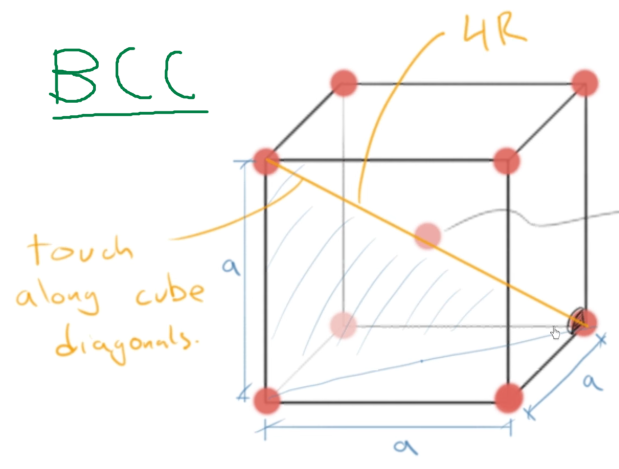

Using 3D Pythagorean theorem

$$
\begin{gather*}
a^2 + a^2 + a^2 = (4R)^2 \\
3a^2 = 16R^2 \\
\therefore a = \frac 4{\sqrt 3} R
\end{gather*}
$$

### Coordination Number for BCC

Diagram, "touching" of "neighbours" (atoms) with each other

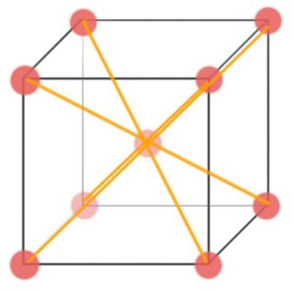

- easy to see that central atom touches with all 8 corner atoms
- $\therefore$ *coordination number of BCC* = 8

### Atomic Packing Factor (APF) for BCC

1. Definition of APF

$$
\text{APF} = \frac{V_S}{V_C} = \frac{n \cfrac 4 3 R^3}{a^3}
$$

2. For BCC, $n = 2$ and $a = \cfrac 4{\sqrt 3} R$

$$
\text{APF}_\text{BCC} = \frac{2 \cdot \cfrac 4 3 \pi R^3}{\left(\cfrac 4{\sqrt 3} R\right)^3}
$$

3. Cancel out $R^3$ and calculate

$$
\therefore \text{APF}_\text{BCC} \approx 0.68
$$

## Coordination Number of FCC

- when looking at coordination no. of FCC, adjacent unit cell also has to be considered
- no atom has all of its nearest neighbour atoms in a single cell

*Visual no. 1 for FCC coord. no.*

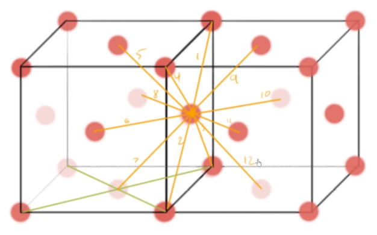

A particular atom touches all neighbouring corner atoms (4) and all neigh. face atoms (8) = 12 touched

*Visual no. 2 for FCC coord. no.*

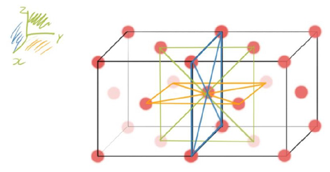

- Atom can be visualized as being the center of 3 intersecting, perpendicular planes
- Each plane consists of the central atom and 4 corner atoms
- *Focus:* central atom
- Thus, 3 planes &times; 4 atoms/plane = 12 atoms touched

$\therefore$ coordination number of FCC = 12

## Interstitial Sites

- **interstitial site:** space between other atoms (where atoms touch)
	- named after shapes they create

**For Rock Salt structure:**

- coordination no. of 6
- site of cations: *octahedral interstitial site*

*Octahedral interstitial site illustration:*

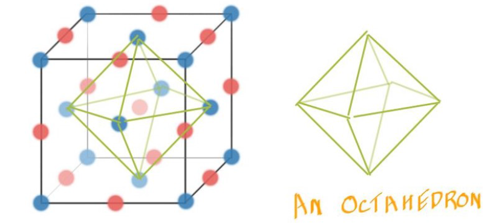

**For BCC:**

- coordination no. of 8
- the whole cell is the interstitial site
- site of atoms: *simple cubic interstitial site*

*Illustration of site:*

### Size of Interstitial Sites: Rock Salt

Use 2D slice of octahedral interstitial site:

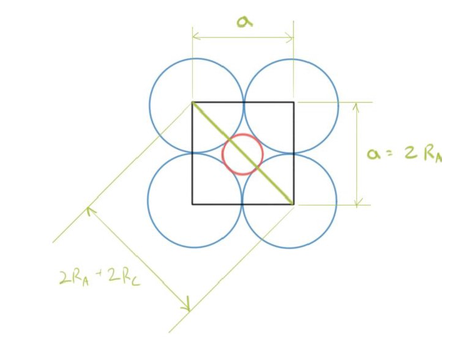

- Draw square connecting centers of each anion
- From diagram, $a = 2R_A$ and diagonal $= 2R_A + 2R_C$
	- A is anion, C is cation, $R$ is radius
- can approx. that $R_C/R_A < 0.5$
- Diagonal of square forms 45-45-90 triangle

*Use trigonometry to find the cation : anion radius ratio*

$$
\begin{align*}
\newcommand{\d}{\degree}
\sin 45\d &= \frac{\cancel 2R_A}{\cancel 2(R_A + R_C)} \\
(R_A + R_C) \sin 45\d &= R_A \\
\cancel{\frac{R_A}{R_A}} \sin 45\d + \frac{R_C}{R_A} \sin 45\d &= \cancelto{1}{\frac{R_A}{R_A}} \\
\frac{R_C}{R_A} &= \frac{1 - \sin 45\d}{\sin 45\d} \\ \\
\therefore \left(\frac{R_C}{R_A}\right)_{CN = 6} &= \sqrt 2 - 1 \\
&\doteq 0.414
\end{align*}
$$

## Hexagonal Close Packed (HCP)

### What is close packed?

**Bit about HCP:**

- *hexagonal close packed (HCP)* is very similar to FCC
	- thus APF for HCP &approx; 0.74 (too)
- FCC sometimes called cubic close-packed

---

> **close-packed plane:** layer of atoms placed together as closely as possible in 2D

*Diagram of close-packed v. not close-packed:*

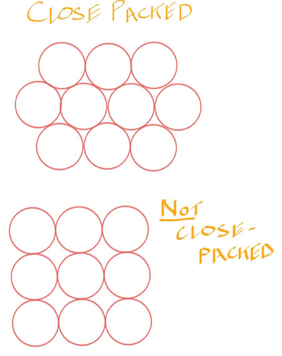

- in close-packed structure like HCP, atoms must be packed as closely as possible in 3D
- must fill volume as efficiently as possible
- to stack another layer on top of first layer
	- second layer sits in low spots of first layer

*Stacking of close-packed layers in 3D, live model:*

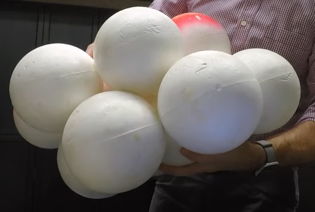

**The HCP structure**

Diagram of HCP structure, and stacking sequence unit cell:

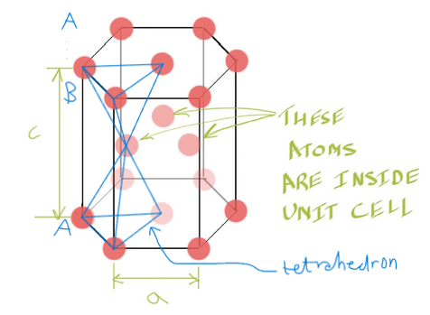

2D cross-section of HCP (hexagonal face):

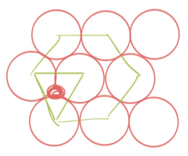

Atoms form a tetrahedral interstitial site

*Atomic count:*

- 12 &times; 1/6 = 2 from corners
- 2 &times; 1/2 = 1 from face
- 3 atoms from interior
- total, $n_\text{HCP} = 6$

### Stacking Sequence (HCP and FCC)

- the atoms' interstitial sites are stacked with 2 unique repeating orientations for HCP
	- as seen in the diagram above
- thus, **stacking sequence for HCP** is *ABABAB...*
- **stacking sequence for FCC** is *ABCABCABC...*

### FCC in Real Life

- In supermarket, first layer of fruit (i.e. apples) put in square lattice
	- front face of FCC unit cell &mdash; (001) plane
- Second layer of fruit placed in low spots
- Third layer of fruit placed in second layer's low spots
	- hovers directly over first layer

### Coordination Number for HCP

Diagram of atom touching in HCP

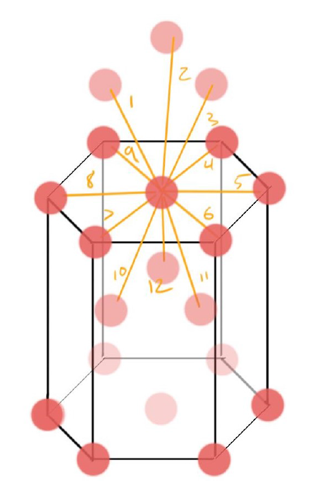

- from diagram, atom touches all corner atoms (6)
- and both interior atoms of 2 neighbouring cells (3 + 3)
- total touches = 12

$\therefore$ coordination number for HCP = 12

### Ratios, Volumes, and Lattice Parameter for HCP

*See diagram above for $c$ and $a$ lengths*

**Fact 1: Ratio of c to a is ~1.633**

$$
\frac c a \doteq 1.633
$$

**Fact 2: Volume of a hexagonal cell:**

$$
V = \frac{3\sqrt 3} 2 a^2 c
$$

**Deriving the Lattice Parameter for HCP:**

Hexagonal base cross-section:

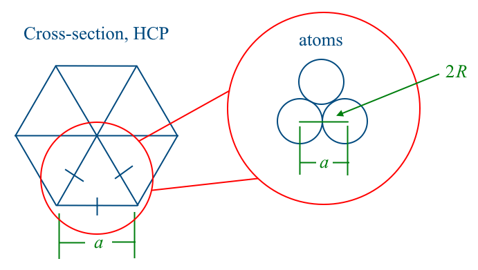

From diagram we can see that lattice parameter extends 2 atomic radii

$$
\therefore a = 2R
$$

## From Crystals to Properties

### FCC Properties

- stacking close packed planes yields FCC
- atoms slide past each other when force is applied
- allows for easy moulding
	- *real-world example:* aluminum can (Al = FCC)

### BCC Properties: Iron

Young's modulus in diagonal is stronger than the edge

*Diagram of BCC cell and interatomic force - separation curve:*

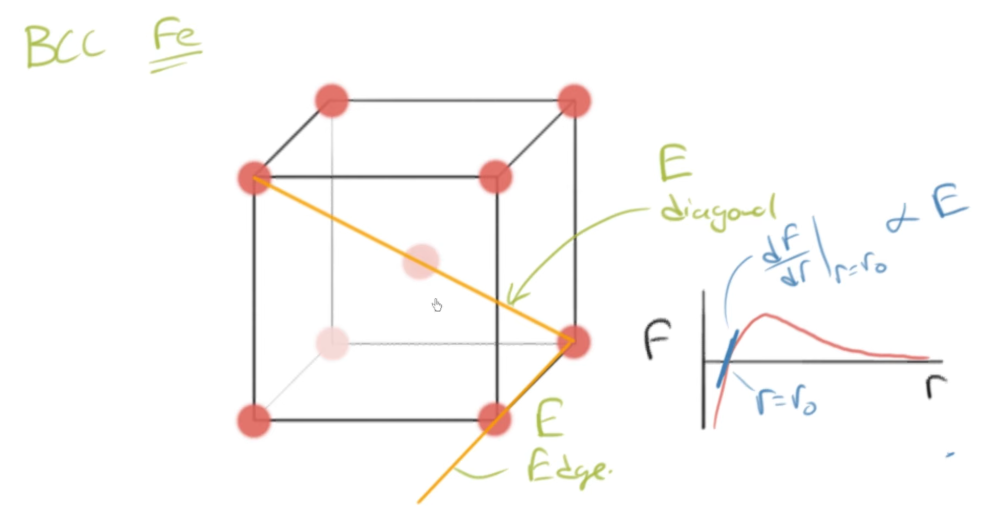

- $E_\text{edge} = 125\text{ GPa}$
- $E_\text{diagonal} = 273\text{ GPa}$

### Semiconductors (Silicon)

- made from silicon single crystal
- seed crystal seated w/ correct crystal graphic orientation
	- in controlled, clean environment
- when withdrawn, large "sausage" is formed from silicon
	- then the "sausage" is sliced

### Metal v. Ceramic Properties

*For Metal:*

- Metal layers slide past each other on load
- Metal atoms seat in new spots
	- allows **plastic deformation**

*v. Ceramic:*

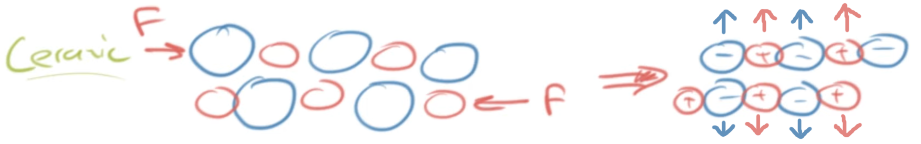

- When load is applied, ceramic layers start to slide past each other
- ... but opposite charges align
	- creates repulsive force
	- layers break apart
	- causes **brittle fracture**
	
## Sources

- Ramsay, Scott. (2026). *Introductory Chemistry of Solids*. Top Hat.
- Dr. Scott Ramsay's YouTube videos on chemistry