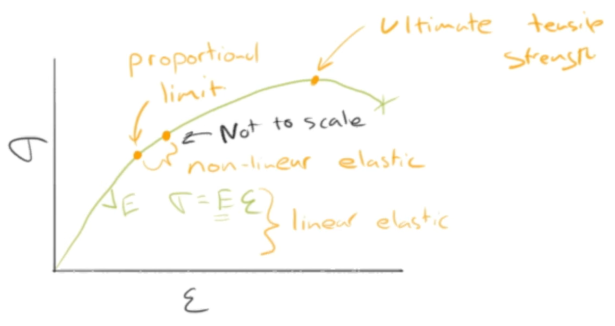
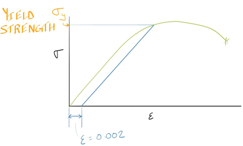
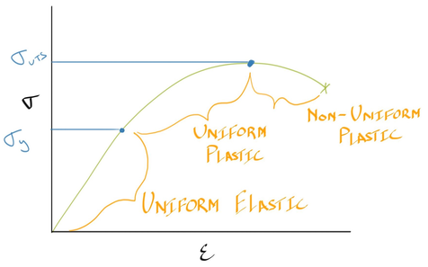
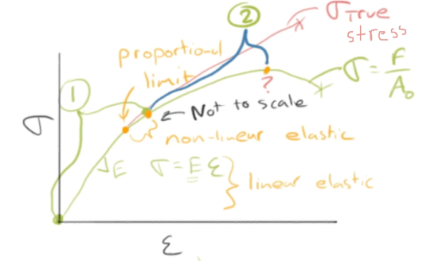
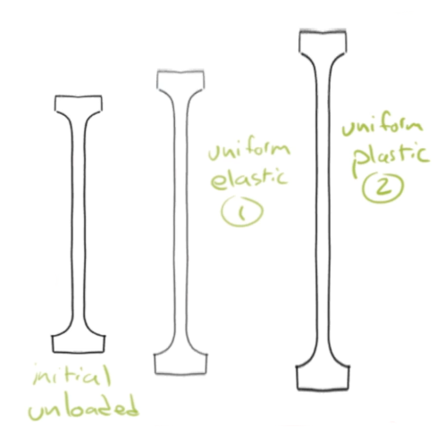
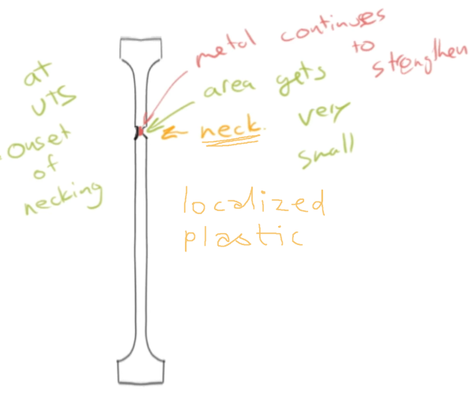
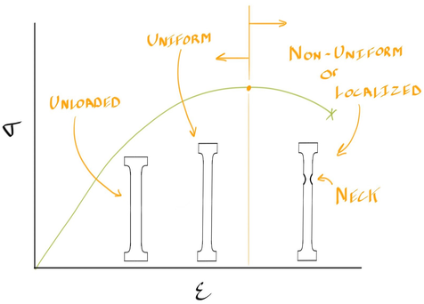

# C6 - Advanced Mechanical Behaviour

## Stress-Strain Behaviour of Metals

Stress-strain behaviour of metals (curve) with key terms:

- **proportional limit:** point where linear region of stress-strain ends
- **ultimate tensile strength (UTS):** the maximum strength (stress metal can handle) of the metal
	- symbols: $\sigma_\text{UTS}$, UTS, or $\sigma_\text{TS}$
- **linear elastic** &mdash; region where stress is linearly prop. to strain, and material elastically deforms
- **non-linear elastic** &mdash; retains elasticity but stress is not linearly prop. to strain

## Start of Plastic Deformation &mdash; Yield Strength

- **yield strength ($\sigma_y$):** point where, in practice, we assume plastic deformation begins
	- also: where stress-strain curve for metals stops being linear (in practice)
- hard to define yield strength w/o adopting some convention
	- even when measuring *infinitesimally* small
- **0.2% offset yield strength:** convention used to define stress close to start of plastic deform. for most metals
	- to determine, begin from *strain = 0.002 (0.2%)*
	- draw line parallel to original linear elastic region
	- POI of new line and o.g. curve is yield strength

*Determining 0.2% offset yield strength from stress-strain curve:*

## Uniform and Non-Uniform Deformation

Graph: Stress-strain curve with region of uniformity and non-uniformity

- uniform deformation until UTS
- **uniform** &mdash; uniformity of the deformation
	- whether deformation is distributed evenly and equally throughout sample (uniform)
- i.e. *non-uniform*
	- deformation isolated to particular region

### Necking

Graph: Stress-strain curve showing stages of tensile test

Tensile specimen stages before necking

At UTS, **onset of necking:**

- in tension, failure (fracture) begins when few bonds break between metal atoms
- *theoretically:* bonds break randomly anywhere in reduced section
- *practically:* bonds likely break around some small defect
	- i.e. scratch on surface, tiny pore, oxide inclusion
- several regions of broken bonds eventually comes together and forms larger crack
	- leads to final fracture (break in two)
- **neck:** a sudden narrowing of cross-sectional area
- **necking:** the process of formation of the neck
- engineering stress decreases since it's over initial C.S. area
	- *reality:* C.S. area decreased and force needed to elongate decreases

Stages of tensile testing under curve:

## Plastic Deformation

### Analogy

> *Q:* How do you make it more difficult for Dr. Ramsay to get to work?

*Common responses:*

- Make big traffic jam!
- ... big snow storm
- Hide your car keys
- Steal your shoes!

*Correct:*

- only 2nd of above would slow down Mr. Ramsay
- *mechanism:* he bikes to school
- *correct action:* steal his cycling shoes (not walking)

### Mechanism for Plastic Deformation

- mechanism involves *rows of bonds* breaking in step-by-step fashion
- crystals are NOT perfect
	- crystals have very good internal symmetry
	- but also have imperfections
	
## Sources

- Ramsay, Scott. (2026). *Introductory Chemistry of Solids*. Top Hat.
- Dr. Scott Ramsay's YouTube videos on chemistry