# C7 - Strengthening Mechanisms

## Dislocations

### "Sliding" of Planes &mdash; Wrong

*Depiction of 2 planes "sliding" over each other for deformation:*

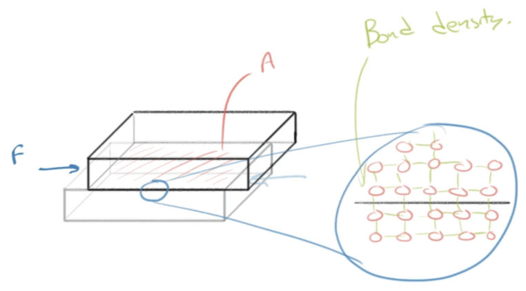

Above is showing *single crystal*

**Results of calculations:** Theoretical strength of model is 5x higher than experimental strength

### Explaining Dislocations (Linear)

**Dislocation:**

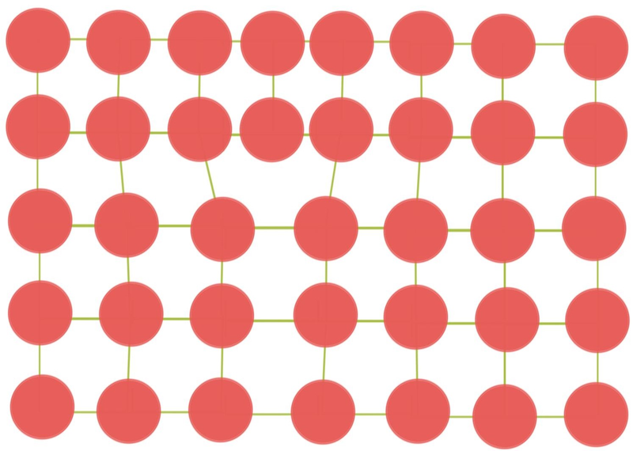

- **dislocation:** a place where bonds between atoms don't exist in an otherwise complete lattice 
	- a.k.a. *crystalline imperfection*
- **dislocation line:** the area (line) where there is a dislocation
- **dislocation density:** "amount" of dislocations in a given space
	- decrease dislocations &rarr; **annealing:** heating the metal
	- increase dislocations &rarr; *plastic deformation*

**Process of dislocation movement and plastic deformation:**

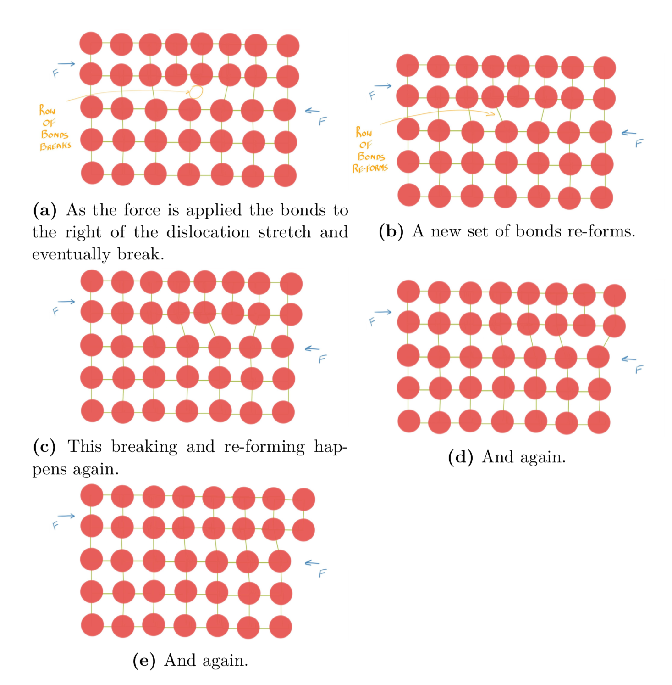

- plastic deformation caused by *step-by-step* breaking and reforming of bonds
- hindering dislocation movement &rarr; strengthens metal

## Intro to Imperfections

**The dimensionality of imperfections:**

1. 0D imperfections &mdash; **point defects**
2. 1D imperfections &mdash; **linear imperfections** or **dislocations**
3. 2D imperfections &mdash; **interfacial imperfections**
	1. i.e. grain boundaries
	2. free surfaces
4. 3D imperfections &mdash; **volume defects**
	1. i.e. pores
	2. 2nd phases (i.e. solids embedded in solids)

*Note:* imperfection = defect, but it isn't bad

## 0D Imperfections: Point Defects

### Interstitial and Substitutional Impurities

- **interstitial impurity:** when another atom is "seated" in between the lattice
- **substitutional impurity:** when another atom replaces the most common atoms in the lattice site

*Diagram of both types of impurities:*

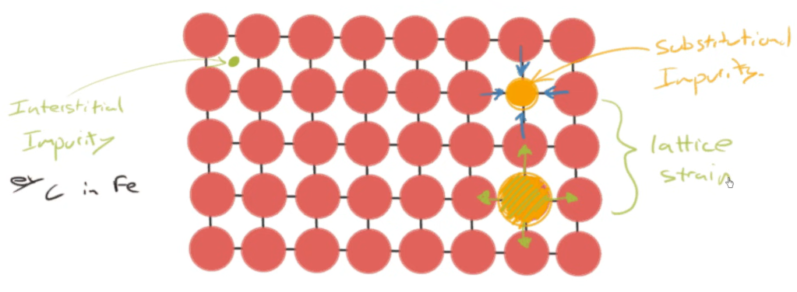

- arrows in diagram show strain as a result of substitution
	- smaller atom subbed in place pulls inwards
	- larger atom subbed in place pushes outwards
	- "pushes and pulls" causes **lattice strain** &mdash; **strain field**
- *strain field* makes it more difficult for dislocation to move through lattice close to impurity
	- small conc. (typically < 1% carbon by weight in steel) makes steel much more stronger than iron

**Key fact:** "Pin" dislocation

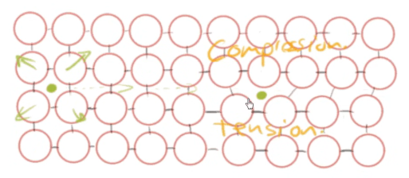

- interstitial impurities "pushing" outwards creates residual stresses
	- in lattice above, upper part in compression
	- lower part in tension
- *causes interstitial impurity to diffuse toward dislocation*

### Vacancies

> **vacancy:** atom that has "jumped out" of regular lattice position, leaving behind an empty site

Diagram of vacancy:

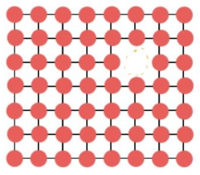

*See the missing spot? That's a vacancy!*

**How vacancies form:**

- atoms desperately vibrating in lattice sites, trying to jump out
	- about 1,013 times / second
- in solid state, they are unsuccessful since *binding energy* stronger than *thermal energy*
	- **binding energy:** energy that "binds" atom to its lattice
	- **thermal energy:** energy of atoms (to escape)

**Equation of Vacancies:**

$$
\frac{N_v} N = e^\cfrac{-Q_v}{kT}
$$

- $N_v$ &mdash; no. of vacancies
- $N$ &mdash; total no. of possible atom sites
- $Q_v$ &mdash; energy required to form vacancy (J or eV)
- $k$ &mdash; Boltzmann constant
	- $k \doteq 1.38 \times 10^{-23} \text{ J/(atom} \cdot \text{K)}$
	- $k \doteq 8.62 \times 10^{-5} \text{ eV/(atom} \cdot \text{K)}$
	- where 1 eV &doteq; 1.602 &times; 10-19 J
- $T$ &mdash; temperature (K &mdash; kelvin)
	- T in K = T in &deg;C + 273.15
- $e$ &mdash; Euler's number

---

Pesky question

"If temperature is raised so that thermal energy wins over binding energy, why doesn't entire crystal just melt? Why does only few atoms successfully jump out?"

Solution: **Distribution of Energies**

Curve of energy level v. no. of atoms at each energy level

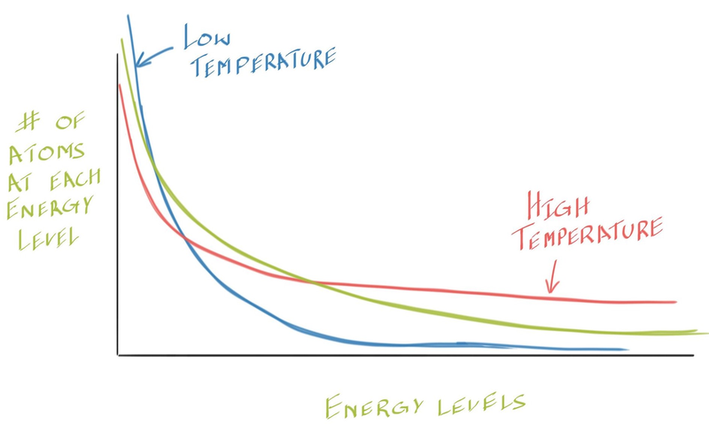

- not all atoms have same energy
- as temp. inc., more atoms populate higher energy states
- as temp. dec., fewer of high energy states populated
- *at abs. zero:* only lowest energy state populated
- *at infinite temp:* atoms distributed evenly across all energy states

## More on 1D Defects: Dislocation

### Stresses around Dislocation

*Note:* Explanation is illustrative only, shows **edge dislocation**:

Consider inserting line of atoms ("half-plane") into a lattice:

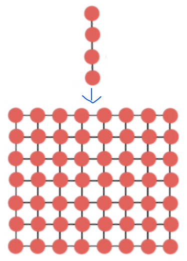

Half-plane takes up place, upper part in compression, lower part in tension, dislocation line forms:

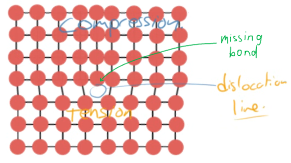

*Analogy:* Chopping wood

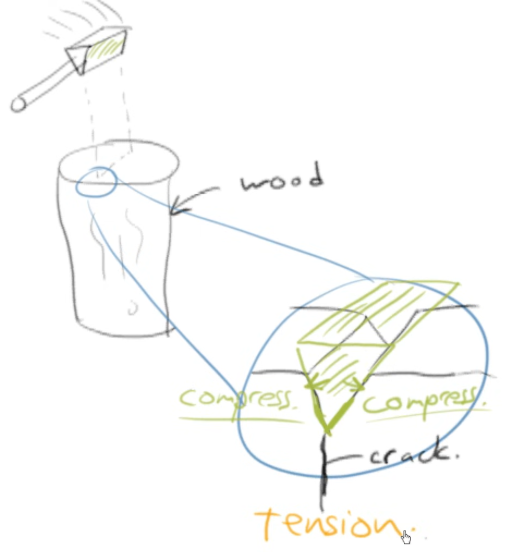

- axe wedges itself in the wood
	- wood w/ axe in compression
	- crack forms underneath, that part in tension
- *Dislocation Density Range:*
	- 104 dislocations / mm2 &rarr; annealed
	- *to* 1010 dislocations / mm2 &rarr; heavily deformed

### Strengthening by Plastic Deformation

- plastic deformation &rarr; creates new dislocations
	- inc. dislocation density
	- dislocations have difficulty moving past one another
- strain fields surrounding dislocations can repel
	- or certain cases, cancel each other out
	- ... leaves small region of perfect crystal
- *in industry:* plastic performed on metal part by rolling, pulling through, or pressing into die
- **cold work:** strengthening metal through plastic at lower temp.
- **warm work:** strengthening metal when part warms up or is heated up
- **forging** &mdash; ref. to plastic deform.
	- terms *cold forging* and *warm forging* used
- **hot work:** strengthening metal when part becomes really hot (enough to burn skin)
	- term *hot forging* also used
- **strain hardening** &mdash; term used for plastic since metal accumulates plastic strain during strengthening

## 2D Imperfections: Surfaces and Interfaces

### Free Surfaces

> **free surface:** a surface arranged in regular crystalline lattice, exposed to exterior

Diagram of free surface, which has surface energy:

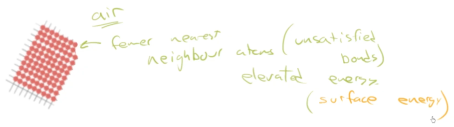

- surface interacts with exterior, like air
- on surface, fewer nearest neighbour atoms (unsatisfied bonds)
	- elevates energy &rarr; *surface energy*

Surface tension works with water droplets:

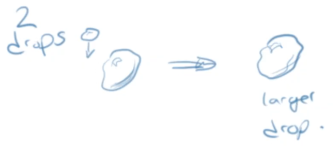

- 2 drops combine to form one larger drop
- ... because in that state
	- lower energy needed
	- lower surface : volume ratio

### Grains and Grain Boundaries

- **grain:** a piece of crystal (regular rep. patterns)
- **grain boundary:** the border from one grain to the next

Drawing of grains and grain boundary:

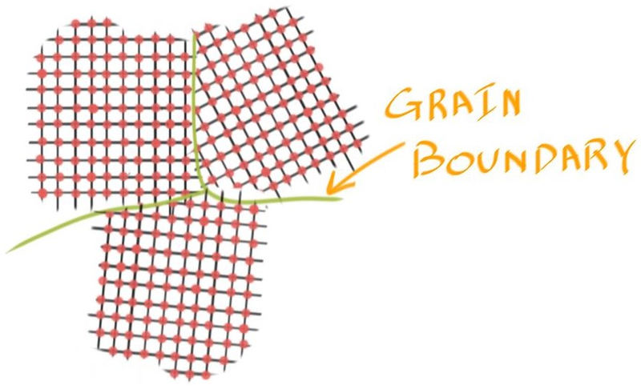

Drawing of grains, grain boundary, and dislocation movement:

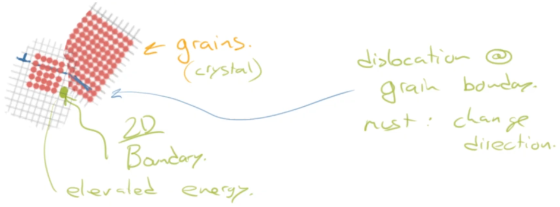

- at grain boundary (2D), elevated energy
- dislocation at grain boundary must:
	- change direction
	- navigate planar mismatch
		- must make small step up or down to get past
	- navigate lattice strain
- *Takeaway:* Grain boundary inhibits dislocation movement

**Method of Strengthening Metal:**

> **grain size reduction** &mdash; reducing the grain size increases the metal's strength

Illustration of grain size reduction and dislocation movement:

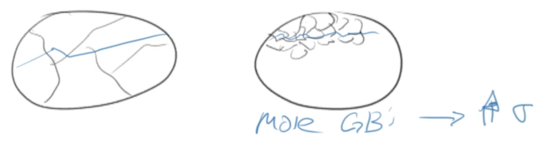

## 3D Imperfections &mdash; 2nd Phase Particles

- *Types of 3D imperfections*
	- **pores:** "bubble" holes in material
	- **second phase:** another phase / material embeded in material
		- i.e. iron carbide ($\ce{Fe3C}$) in steel
- focus on second phase

Drawing of second phase lattice with first phase:

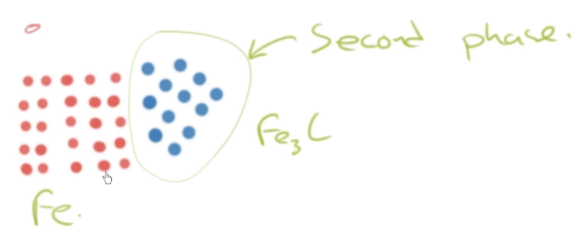

**About 2nd phase particles:**

- often **hard** phases &rarr; high strength
	- makes it extra challenging for dislocation movement
	- they are hard to deform
- i.e. AA6061 aluminum
	- commonly used aluminum alloy
	- heat treated to produce fine distribution of 2nd phase precipitates
	- common treatment: *T6 heat treatment*
	
## Sources

- Ramsay, Scott. (2026). *Introductory Chemistry of Solids*. Top Hat.
- Dr. Scott Ramsay's YouTube videos on chemistry