# C8 - Polymers

## What is a polymer?

- **polymer:** a type of structure that is made of a lot of repeating units
	- "poly" &mdash; many
	- "mer" &mdash; parts
	- repeating unit: **Mer unit**
	- i.e. "plastics", plastic bags, cell phone cases, cell phone cases, yogurt container, etc.
- **string model of polymer:** polymers can be thought of as long strings of connected atoms
	- or "noodles" / chains (technical term)
- **intramolecular bonds:** bonds that hold atoms together within a molecular
	- a.k.a. *primary (1&deg;) bonds*, *"strong" bonds*
- **intermolecular forces / bonds:** forces that attract one molecule (or chain) to another
	- a.k.a. *secondary (2&deg;) bonds*, *"weak" bonds*

String model of a polymer with interior bond view:

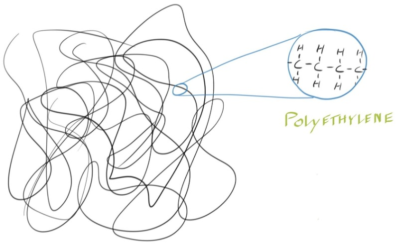

### Analogy: The Molecular Level Hand

"Molecular level hand" and the string model of polymers:

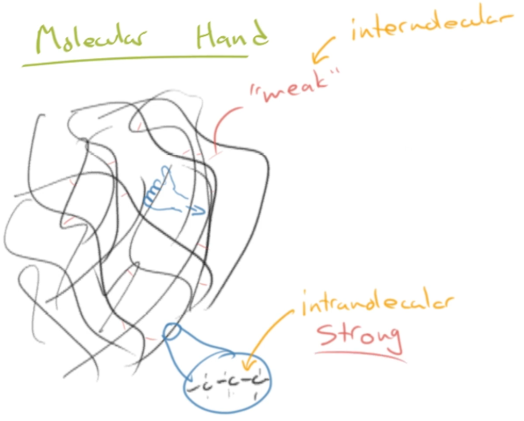

Diagram also shows intermolecular and intramolecular forces

- **Goal:** cause a string of molecules to slide past one another
- *Resistance?* intermolecular ("weak" forces) holding chains together
- The sliding of molecules causes:
	- plastic deformation
	- melting *(adding kinetic energy until sliding)*
	- dissolution
		- *solvent goes btwn. mcls., free up weak bonds*

## Stretching a Plastic Bag

> When plastic bag gets load, why does handle stretch, and then stop stretching?

Diagram of molecules of plastic bag before and after loading:

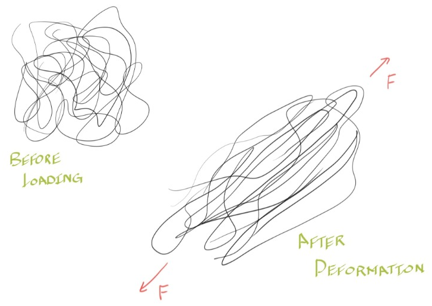

Stretching bag (after loading) across loading axis:

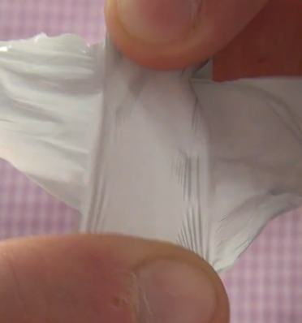

Much easier

1. *Before loading:* Polymer chains randomly oriented
2. *During loading:* Polymer chains align in the direction of loading
3. *After loading:* "Strong" bonds are aligned with *loading axis*
4. *Attempt to deform along loading axis:* "Strong" bonds resist load
5. *Attempt to deform **across** loading axis:* Only weak bonds left to resist load, must easier to do

## Mechanical Behaviour of Typical Polymer

### The Stress-Strain Curve

Stress-strain curve of typical polymer, with yield and tensile strength:

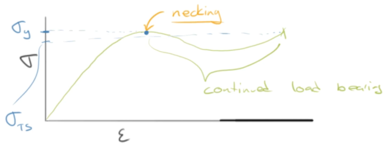

- **yield strength ($\sigma_y$)** defined at peak of curve &mdash; where  **necking** occurs
	- *recall:* necking &mdash; localized deformation
- **tensile strength ($\sigma_\text{TS}$)** defined at stress level of fracture

### Description of Polymers

Polymer is "long string" composed of repeating unit / building block:

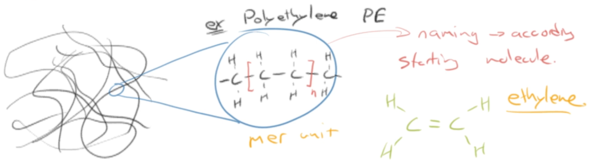

- **mer unit:** repeating unit of polymer
	- named according to starting molecule
- *i.e.* polyethylene (PE) starts from "ethylene" (IUPAC: ethane)

When stretching polymer, strings or "noodles" become ***conditioned*** with loading axis:

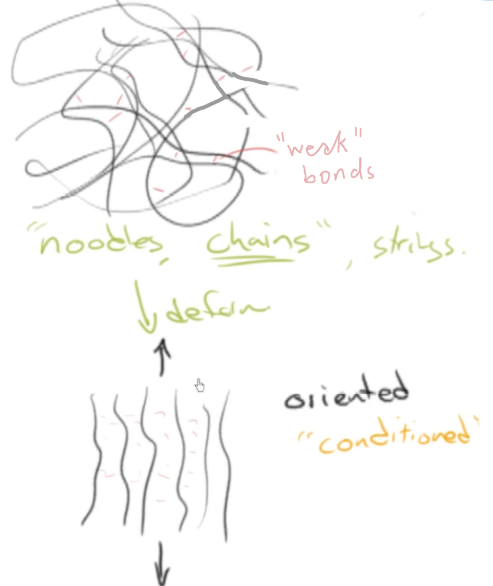

## Polymers other than PE (Mer Units)

### PP and PVC (most common alts.)

*Note:* PE, PP, and PVC are the most produced polymers in the world

**Polypropylene (PP)**

Mer unit for PP

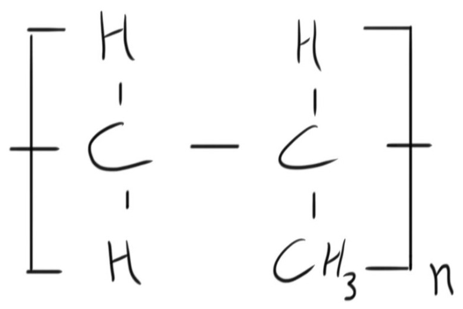

- ex: reusable Starbucks&reg; cups, juice jug
- recycling code: 5
- *Properties:*
	- little stronger
	- higher elastic modulus (E)
	- ... than polyethylene (PE)
- methyl group ($\ce{CH3}$) makes it harder for chains to slide past

**Polyvinylchloride (PVC)**

Mer unit for PVC

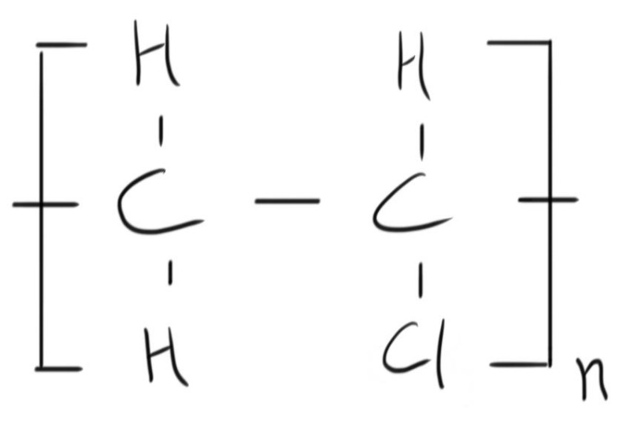

Vinyl group:

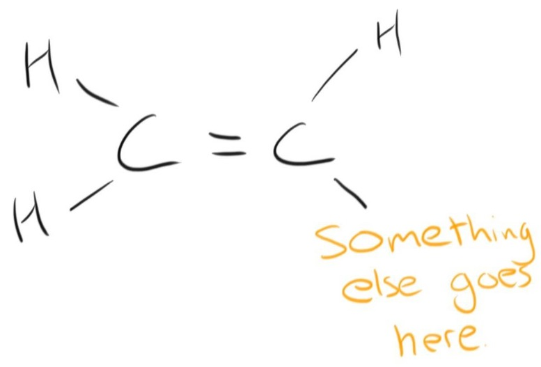

- chlorine atom in mer unit
- *Properties:*
	- wide range
	- strong
	- relatively high elastic modulus
	- chlorine atom *(creates dipole)* makes it harder for sliding
- **vinyl group:** two carbons double bonded and 1 H missing

### Periodic Table and Electronegativity

Periodic table and trends:

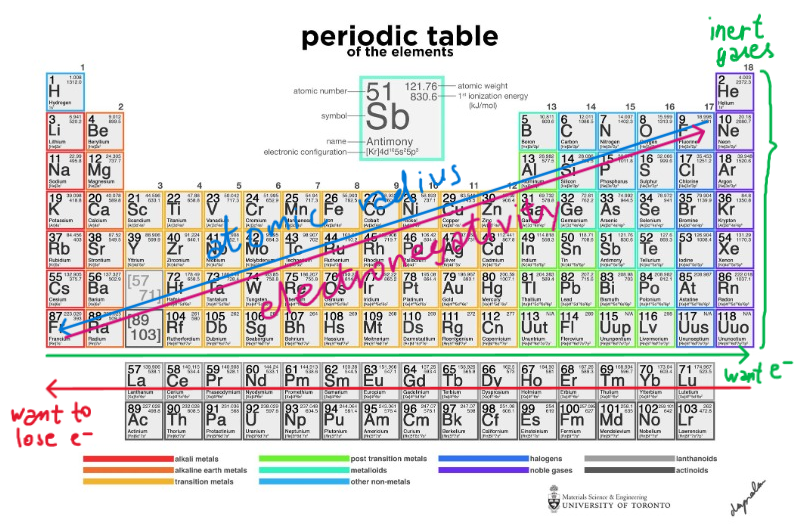

*Credit: Dayna Lau* with additions by me

**Periodic trends recap:**

- rightmost column is inert gases &mdash; gen. no reactions, stable
- *left to right:* elements get closer to very low energy arrangement of electrons
- *top right to bottom left:* atoms get larger
- *left to right:* elements have stronger attraction ("want") for electrons
- *right to left:* elements have stronger "urge" to get rid of electron
- *bottom left to top right:*  electronegativity increases

**Electronegativity:**

- **electronegativity:** a measure of how much an atom can pull bonded electrons towards itself
- when highly electronegative el. mut in molecule
	- i.e. chlorine in PVC
	- it pulls on orbiting electrons 
	- creates imbalance or partially charged regions
- **dipole:** molecule w/ negatively 
- partial charge symbol
	- $\delta^+$ &mdash; partially pos. charged
	- $\delta^-$ &mdash; partially neg. charged

### PTFE and PMMA

**Polytetrafluoroethylene (PTFE)**

Mer unit of PTFE

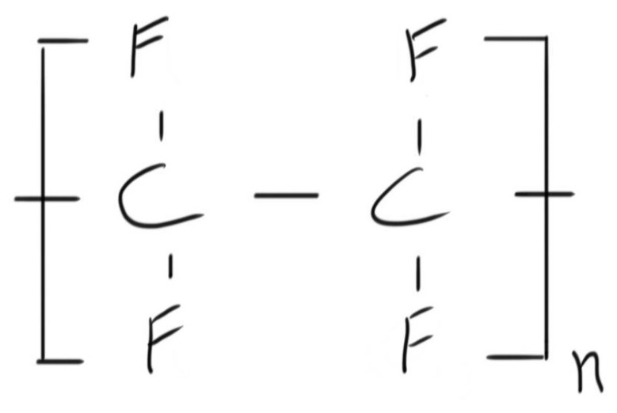

- trade names: Teflon&reg;, Gore-Tex&reg;
- *Uses:*
	- non-stick surfaces
	- i.e. non-stick pans / prevent epoxy from sticking to surfaces
- *The C-F bond:*
	- bond has increased strength from electrostatic attraction
	- fluorine size protects easy breaking
	- PTFE is non-polar since molecule is symmetrical
- *About Gore-Tex&reg;*
	- form of PTFE formed into thin films and stretched
	- stretching introduces fine holes (pores) in film
	- PTFE is *hydrophobic* &mdash; repels water
		- prevents liquid water from entering
	- individual molecules of water (in vapour phase) can freely  diffuse through pores
	- "breathable" textile

**Polymethylmethacrylate (PMMA)**

Mer unit of PMMA

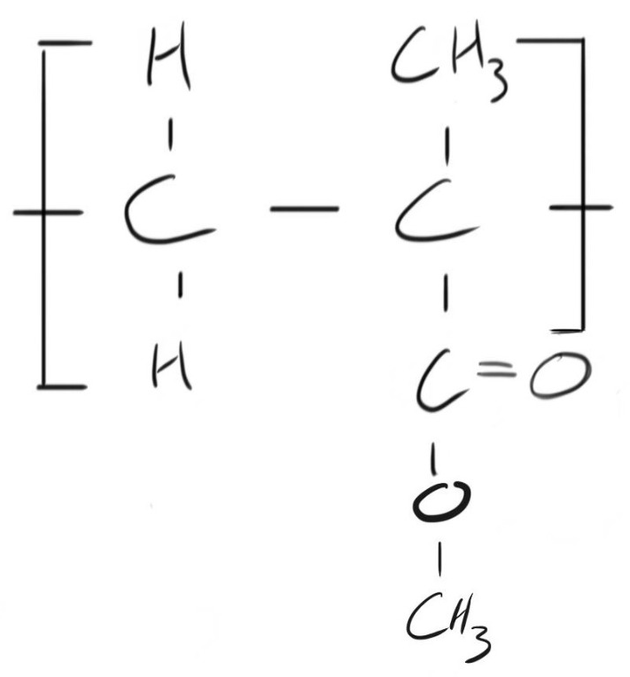

- trade name: Plexiglas&reg;
- *acrylate* &rarr; acrylic
	- acrylics used for windows since
	- they can be made optically transparent
- *uses:* in eyeglasses
- large side group ("bulky" ...) prevents molecules from organizing close to one another
	- ensures polymer is completely *amorphous* &mdash; disorganized
	- due to this, PMMA is transparent
	- *explained more later*

## Molecular Weight &mdash; Length of Molecules

### The "Wooden Box" Game: Get Length of String from Mass

*Situation:* Given a wooden box full of string, a meter of the string, a scale, and mass of box when empty

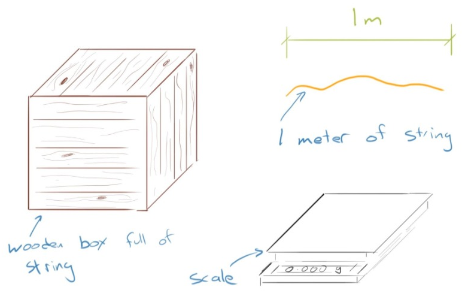

- *Rules:* You cannot open the box
- *Goal:* Find length of string in box

**How to find length of string:**

1. Measure mass of 1 m string sample
	1. *This gives you:* mass per unit length (i.e. g/meter)
2. Measure mass of box and contents
3. Subtract out mass of box, leaving mass of string
4. Divide: mass of string / mass of 1 m sample = length of string (m)

### Distribution of Molecule Lengths

- when synthesizing molecule lengths, different lengths of molecules are formed
	- ranging from very short to very long

*Polymer lengths from hypothetical sample, distribution:*

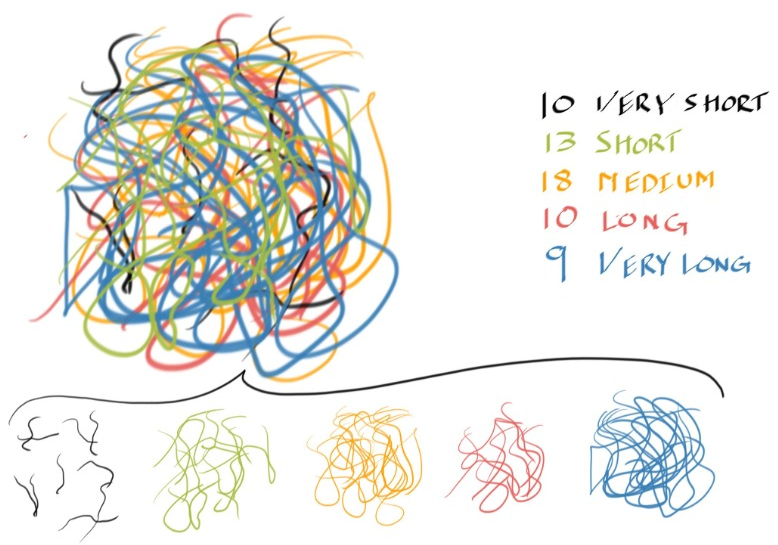

*Distribution of polymer lengths on a bar graph and curve:*

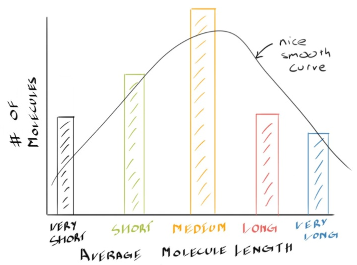

- each bar contains a range of lengths
- **bin:** a value used to contain a range of values

### Number and Weight Averages

**Number Average Molecular Weight ($\overline{M_n}$):**

$$
\overline{M_n} = \sum^i_{n=1} x_n M_n
$$

- *Note:* there is bar on top of $M_n$
- $i$ &mdash; no. of groups or "bins"
- $\sum^i_{n=1}$ &mdash; tells us sum of terms from 1 until *i*
	- $n$ &mdash; group index
- $M_n$ &mdash; avg. molecular weight of *n*th group
- $x_n$ &mdash; number fraction of *n*th group

where...

$$
x_n = \frac{n_n}{n_T} = \frac{\text{no. of molecules in group } n}{\text{total no. of molecules in sample}}
$$

**Weight Average Molecular Weight ($\overline{M_w}$):**

$$
\overline{M_w} = \sum^i_{n=1} w_n M_n
$$

- *Note:* there is bar on top of $M_w$
- common variables retain common meaning
- $w_n$ &mdash; weight fraction of *n*th group

where...

$$
w_n = \frac{m_n}{m_T} = \frac{\text{avg. mass of molecules in group } n}{\text{total mass of sample}}

\newcommand{\Ds}{Đ}
$$

**Dispersity ($\Ds$):**

$$
\Ds = \frac{\overline{M_w}}{\overline{M_n}}
$$

indicates how broad distribution is

### Example Calculation of Averages

*Hypothetical polymer:*

Composed of:

- 5 short (black) &mdash; 5,000 g/mol
- 6 medium (blue) &mdash; 8,000 g/mol
- 9 long (red) &mdash; 11,000 g/mol
- 4 very long (yellow) &mdash; 15,000 g/mal

**Find number molecular weight:**

Total no. of molecules: $n_T = 5 + 6 + 9 + 4 = 24$

*Way 1: the average*

$$
\begin{align*}
\overline{M_n} &= \frac{5(5,000) + 6(8,000) + 9(11,000) + 4(15,000)}{24} \\
&\doteq 9,666\text{ g/mol}
\end{align*}
$$

*Way 2: Using the equation; same as way 1*

$$
\begin{align*}
\overline{M_n} &= \sum^4_{n=1} x_n M_n \\
&= \frac 5{24}(5,000) + \frac 6{24}(8,000) + \frac 9{24}(11,000) + \frac 4{24}(15,000) \\
&\doteq 9,666\text{ g/mol}
\end{align*}
$$

**Find weight average molecular weight:**

Total weight: $m_T = 5(5,000) + 6(8,000) + 9(11,000) + 4(15,000) = 232,000\text{ g/mol}$

$$
\begin{align*}
\overline{M_w} &= \sum^4_{n=1} w_n M_n \\
&= \frac{5(5,000)}{232,000}(5,000) + \frac{6(8,000)}{232,000}(8,000) + {...} + \frac{4(15,000)}{232,000}(15,000) \\
&\doteq 10,767 \text{ g/mol}
\end{align*}
$$

*NOTE:* Weight average mol. weight higher than number average

### Importance of Molecular Weight

- difficult to separate long string of tangled polymer chains
- increase of molecular weight &rarr;
	- increase in strength
	- increase in strain to fracture
- i.e. UHMWPE &mdash; ultra high molecular weight polyethylene
	- used in hip replacement
	- high strength
	- good wear resistance
	- tolerated by body

## Polymer Crystallinity and Tactility

### Intro to Polymer Crystallization

General string structure of *semicrystalline* structure:

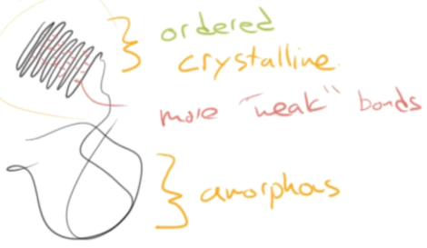

- **crystalline** &mdash; polymer chains fold into repeating patttern
	- crystalline part increases strength...
	- ... and elastic constant ("Young's modulus")
- **semicrystalline:** the property of having both crystalline and amorphous parts

**How to increase crystallinity?**

1. Use simple mer units

*Example, simple v. not simple:*

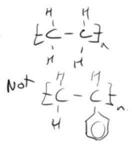

2. Regular repeating structures
	1. description below

### Regular Repeating Structures

*Notes on notation:*

- solid triangle: out of page
- dashed triangle: into to page
- *R* &mdash; describes functional group

i.e. polyethylene (PE) structure

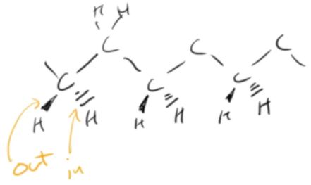

**isotactic structure:** chain where functional groups are on the same side

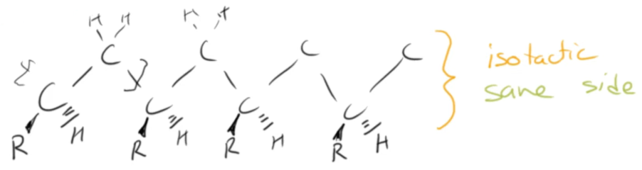

**syndiotactic structure:** chain where functional groups alternate positions

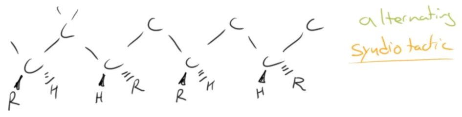

**atactic structure:** chain where functional groups are organized randomly

> Arranged from easiest to hardest to crystallize:
>
> isotactic &rarr; syndiotactic &rarr; atactic

### Models of Polymer Crystallanity

**The Chain folded Model:**

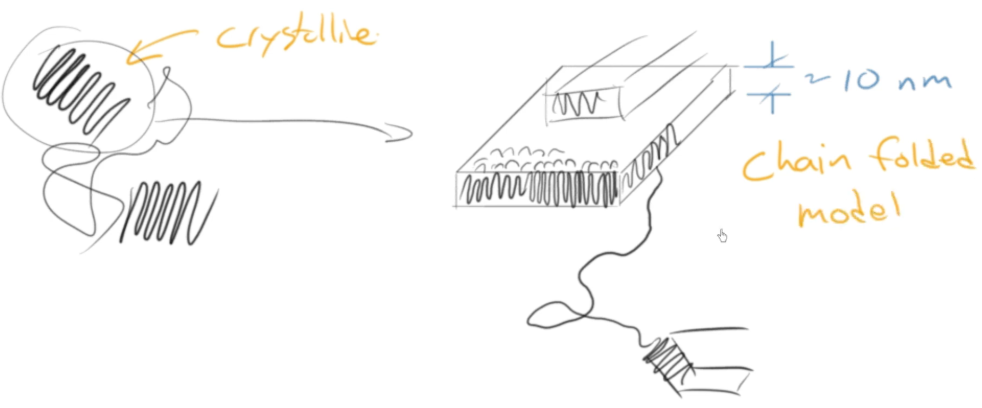

- imagine crystalline parts of polymers folded inside their own plates
- plates have ~10 nm thickness

**Radiating crystalline model** &mdash; crystals radiate out of single point

*Note:* It is not possible for polymer to be 100% crystalline, since we are dealing w/ long "messy strings"

#### HDPE vs. LDPE

Image of HDPE v. LDPE:

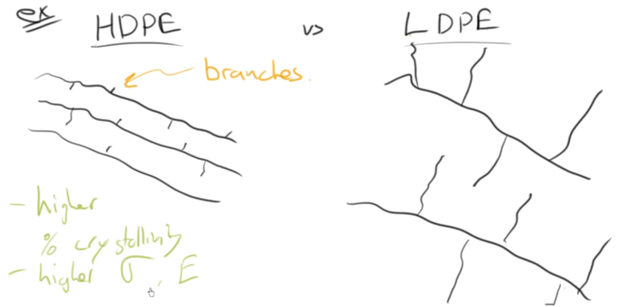

***HDPE* &mdash; high density polyethylene:**

- *Branching:*
	- has short branches
	- allows chains to come closer together
- *Effects:* 
	- higher % of crystallinity
	- higher strength
	- higher elastic modulus
	- more resistant to dissolution

***LDPE* &mdash; low density polyethylene:**

- *Branching:*
	- has long branches
	- chains cannot come as close together as HDPE
- *Effects:*
	- opposite that of HDPE

## Changing IMFs: Mer Chemistry, Dipoles, and the 2&deg; Bond

"Noodle" structure of polymer and PVC mer structure:

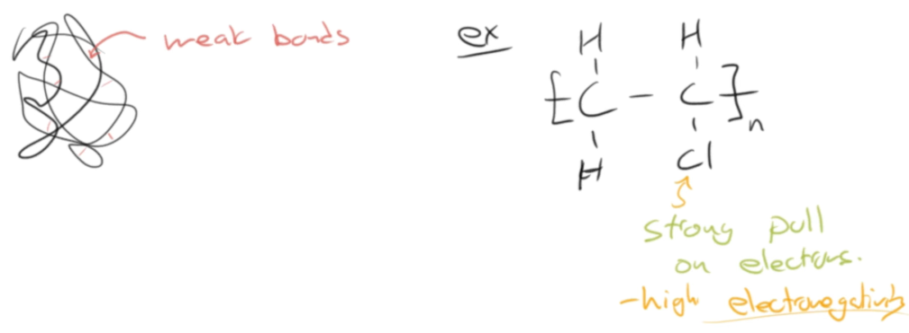

- chlorine in PVC has high electronegativity &rarr; pulls atoms toward it
- chlorine in PVC is partially negatively charged
	- establishes a dipole (in C-Cl or H-Cl)

Partial charge establishes a dipole:

$$
\delta^- \to \text{establishes dipole}
$$

Showing of "weak" bond between molecules &mdash; dipole-dipole force:

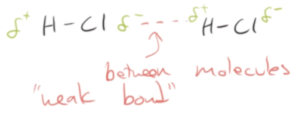

- hydrogen easily loses electrons to electronegativity elements
- **hydrogen bond:** the dipole-dipole force caused when hydrogen is bonded is oxygen (O), nitrogen (N), or fluorine (F)
- i.e. Kevlar&reg; &mdash; has H-N bond (HB) &rarr; inc. strength

## Cross-Linking and Network Polymers

> **cross-linking:** linking polymer chains together with "strong" (covalent) bonds

Cross-link illustration in string model:

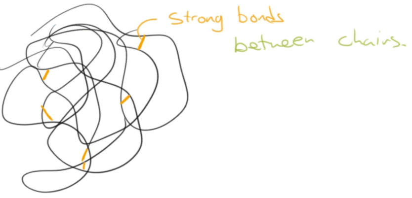

- i.e. vulcanizing rubber &mdash; natural latex rubber
	- latex is normally viscous liquid out of trees
	- latex, after dried, is a very weak solid
	- sulfur is added to latex and heated
	- sulfur creates new strong primary bonds between original molecules
- i.e. PEX (polyethylene crosslinked) tubing
	- used in residential water pipes
	- can withstand strong water pressure
- important in **elastomers**
	- **elastomer:** polymer w/ viscoelasticity and weak IMFs
- too many cross links makes polymer hard and brittle
	- (not good for elastomer)

> **network polymer:** chains link together into a 3D interconnected network

Diagram of network polymer:

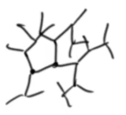

i.e. epoxy &mdash; strong polymer (high elastic modulus)

## Effects of Temp. Changes close to Room Temp.

Stress-strain curve for polymer at temps. -40 &deg;C, -20 &deg;C, 20&deg; C and 40&deg; C

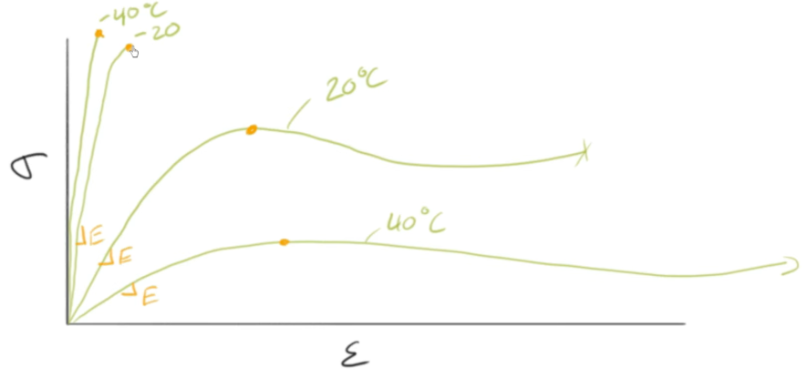

- *think of:* competition between binding energy and thermal energy
- lot of behaviours of polymers from *secondary "weak" bonds*
	- 2&deg; bonds more easily disrupted by thermal energy (even low changes)
- in metals and ceramics...
	- most properties det. by strong 1&deg; bonds
	- bonds have much higher bond energies than thermal energy around room temp.

## Relaxation Modulus and Transition Temperatures ($T_g, T_m$)

- when load applied ($\sigma_0$) &rarr; observed strain changing
- *experimentally:* apply fixed strain $\epsilon_0$
	- then observe stress relaxing w/ time &rarr; $\sigma(t)$
- i.e. nylon strings on guitar
	- "relax" over time

**Relaxation Modulus ($E_R$):**

$$
E_R = \frac{\sigma(t)}{\epsilon_0} = \frac{\text{stress over time}}{\text{init. fixed strain}}
$$

Plot of log: relaxation modulus v. time w/ varying temps, $T_1 < T_2 < T_3 < T_4$:

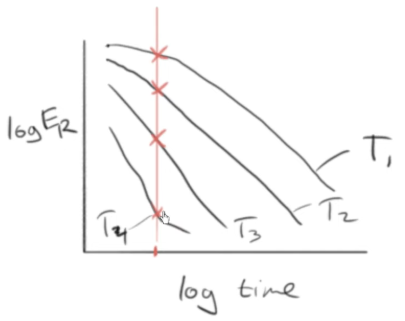

At fixed time, plot of $\log E_R$ v. temperature (ind. by red bar above):

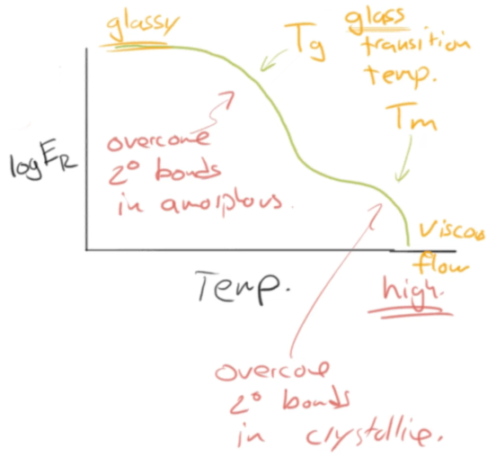

*Key variables from plot:*

- **glass transition temperature ($T_g$):** temperature (at pt. in time) where we can overcome secondary bonds in amorphous regions
	- hard and brittle like glass &rarr; elastic and flexible
- **melting temperature ($T_m$):** temperature where we can overcome 2&deg; bonds in crystalline regions
- always: $T_g < T_m$
	- logic: easier to overcome bonds in amorphous than crystalline
	- see sketch below

Sketch of crystalline (ordered squigglies) and amorphous (messy) parts of a polymer:

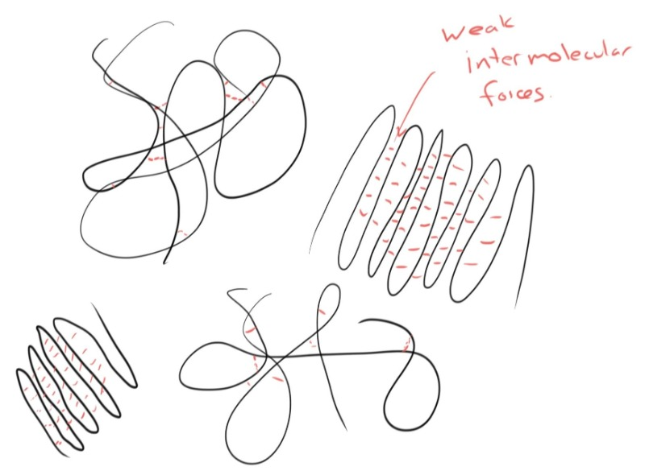

### Thermosets and Thermoplastics

$\log E_R$ v. $T$ (temp.) plots of semicrystalline, highly crystalline, and network polymers:

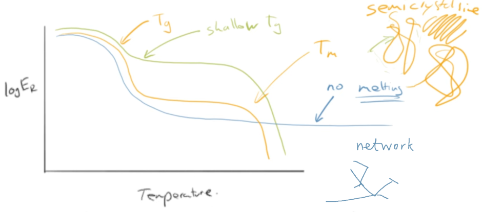

*Legend:*

- yellow: semicrystalline
- green: highly crystalline &mdash; has shallow $T_g$
- blue: network (or highly crosslinked) &mdash; does not melt

Molecular-level hand in network polymer:

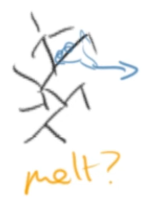

- networks *do not* melt &mdash; molecular level hand can't pull out one strand in 3D covalent network
- **thermoset:** a polymer that does not melt
- **thermoplastic:** a polymer that does melt

## Intro to Viscoelasticity (Time Dependency)

**Silly-Putty&reg; and Key Point**

- *viscoelasticity* best shown in Silly-Putty&reg;
	- putty-like mat. made from polydimethylsiloxane
	- when stretched slowly, stretches like thick gooey liquid (lots of plastic deform.)
	- when rolled into ball, bounces like rubber ball (no perm. deform.)
	- when rolled into cylinder and pulled apart very quickly
		- snaps like brittle material
	- due to rel. short molecules in the putty
- *KEY POINT:* sensitive to strain rate

**Heavy Desk and Carpet Example**

Diagram of time dependent deformation using heavy desk and carpet:

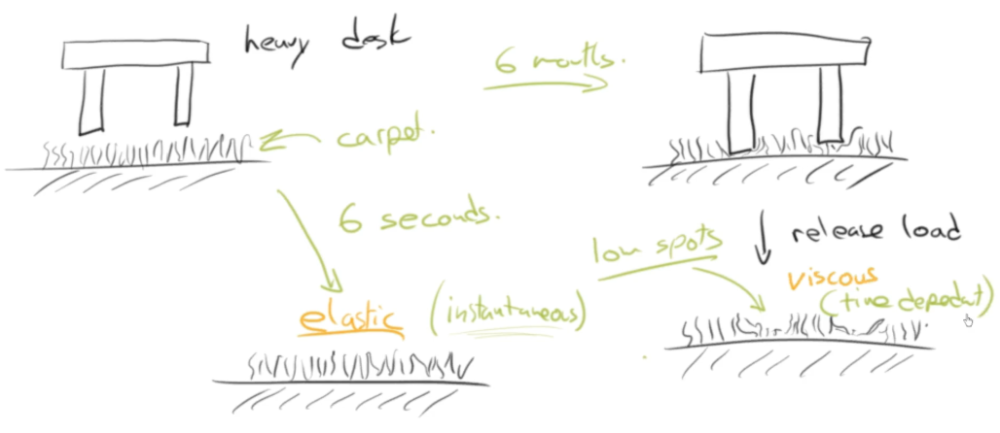

- carpet made of many polymer fibers oriented roughly vertically
- if desk left on it for several months, low spots in carpet forms
	- *viscous* &mdash; time-dependent
- if only left on it for couple seconds, polymers spring back
	- *elastic* &mdash; instantaneous
- **viscous deformation:** long time-scale deformation
	- ref. to flow of liquid
- **viscoelastic deformation:** property of being able to elastically and viscously deform
	- *Ranges:* high strength epoxy (close to elastic) &rarr; Silly-Putty&reg; (close to viscous)

## Optical Transparency: Limits of String Model

Crystalline and amorphous regions of polymers have different indices of refraction, diagram:

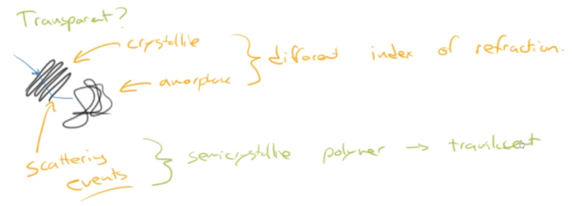

- **scattering events** of light occurs in crystalline structure
	- *semicrystalline* mats. appear translucent / opaque
- for transparency, polymer can't be semicrystalline
	- polymer *never* 100% crystalline
	- *remaining option:* 100% amorphous polymer

**Solution of Plexiglas&reg;** &mdash; polymethylmethacrylate (PMMA)

Mer unit of PMMA, and large side group:

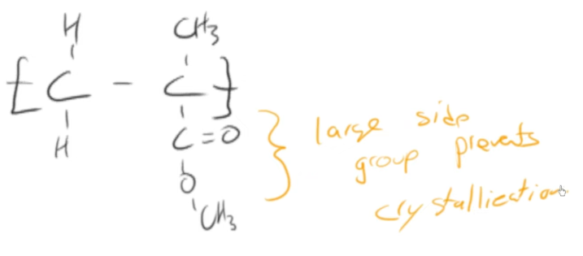

- large side group prevents crystallization
- scattering events don't occur as often &rarr; transparency

**The catch, other examples:**

- sapphire ($\ce{Al2O3}$) &mdash; *crystalline* &mdash; clear and transparent
- window glass &mdash; amorphous &mdash; clear and transparent
- polycrystalline metal &mdash; opaque
- glassy (amorphous) metals &mdash; opaque

**Limitations:**

- need to know what visible light is
- string model cannot describe interaction of light w/ molecule
- visible light interacts w/ electrons in matter

## Sources

- Ramsay, Scott. (2026). *Introductory Chemistry of Solids*. Top Hat.
- Dr. Scott Ramsay's YouTube videos on chemistry