# C9 - Atomic Properties, etc.

## Electromagnetic Spectrum and Light

- optical transparency requires absence of **scattering events**
- **electromagnetic spectrum:** the full range of types of light
	- *visible light* (we can see) only from about 400 - 700 nm

*Electromagnetic spectrum:*

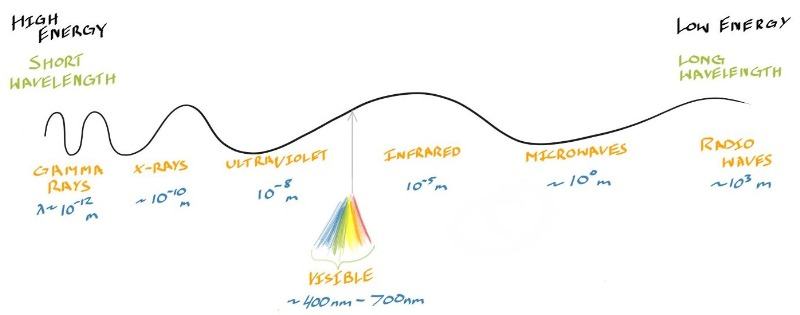

In order of energy (highest to lowest): gamma > x-ray > UV > visible > IR > microwaves > radio waves

- energy within EM spectrum exists as **photons:** chunks of energy
- **quantized:** the property of existing only as individual, non-divisible units

**Energy of photon compared to wavelength:**

$$
E = \frac{hc}\lambda
$$

- $E$ &mdash; photon energy (J)
- $h$ &mdash; Planck's constant
	- $h \doteq 6.626 \times 10^{-34}\ \text J \cdot \text s$
- $c$ &mdash; speed of light in vacuum
	- $c \doteq 3 \times 10^8 \text{ m/s}$
- $\lambda$ &mdash; wavelength of light (m)

**Energy of photon compared to frequency:**

$$
E = h\nu = hf
$$

- all variables retain meaning from prev.
- $\nu = f$ &mdash; frequency of light (Hz = 1/s)

### Einstein's Nobel Prize

- Albert Einstein won 1921 Nobel Prize in Physics for photoelectric effect
- special relativity was considered &rarr; too controversial
- photoelectric effect &rarr; explained ejection of electrons by light

## Electron-Volt Unit

- **electron-volt (eV):** energy used when accelerating electron through 1 volt (V)
	- used to describe small changes in energy

*Mathematical definition*

$$
1\text{ eV} = 1.602 \times 10^{-19} \text{ J}
$$

derived from elementary charge &times; J/C (coulomb)

*Planck's constant in eV*

$$
h \doteq 4.136 \times 10^{-15}\text{ eV} \cdot \text s
$$

*Example:*

Energy of a quanta of red light; 650 nm (in joules, J)

$$
\newcommand{\e}[1]{\times 10^{#1}}
E = \frac{hc}\lambda = \frac{(6.626\e{-34})(3\e8)}{(650\e{-9})} = 3.06\e{-19} \text{ J}
$$

in electron volts:

$$
E = \frac{3.06\e{-19}\ \text J}{1.602\e{-19}\ \text{J/eV}} \doteq 1.91\text{ eV}
$$

## The Atom

Cartoon depiction of atom:

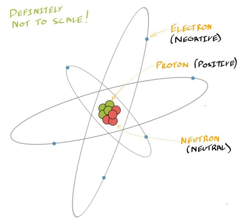

- atom contains central *nucleus* with positive *protons* and neutral *neutrons*
- negative *electrons* orbit the nucleus

*Key measurements:*

- mass of proton ($m_p$) &approx; mass of neutron ($m_n$)
	- $m_p \approx m_n \doteq 1.67\e{-27}\text{ kg}$
- mass of electron, $m_e \doteq 9.1\e{-31}\text{ kg}$
- **atomic number ($Z$):** counts no. of protons in atom
	- defines the element
- **isotopes:** same elements (same *Z*) with diff. no. of neutrals
	- i.e. carbon-12 ($\ce{^12C}$) &mdash; stable
	- and carbon-14 ($\ce{^14C}$) &mdash; unstable, decays at known rate

## Bohr Model of Atom

Rough depiction of Bohr model with electron excitement and relaxation:

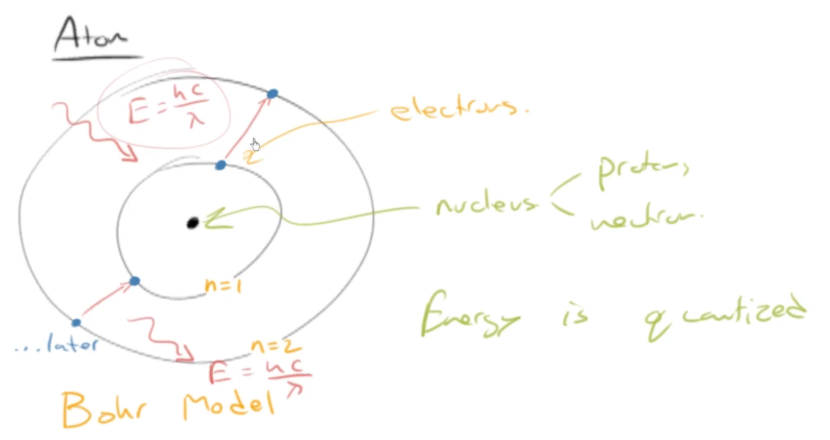

- Bohr model has central nucleus w/ orbiting electrons
- energy is quantized into discrete levels
- **excitement:** electrons absorb photons and gain energy
	- can jump from one level (shell) to the next if it has enough energy
- **relaxation:** electrons release energy (as photon) jump to lower shell
- during excitement and relaxation (same photon absorbed and emitted)

**Limitations:**

- only allows calc. for atoms w/ one electron
	- i.e. hydrogen, helium ion ($\ce{He+}$), or $\ce{Li^2+}$
- cannot predict line splitting experiments
	- closely spaced energy level were revealed within orbits...
	- ... further away from nucleus than 1st orbit

## Quantum (Wave)-Mechanical Model of Atom

- **quantum-mechanical model:** more accurate model of atom that can fully describe energy state of electron
	- a.k.a. *wave-mechanical model*

**The Four Quantum Numbers (QN):**

### Principal QN, $n$

- **principal quantum number ($n$)** &mdash; describes **size** of electron orbit
- range: $n = 1, 2, 3, 4, ...$ or $n \in \mathbb N$
- describes the "shell" in Bohr model
- alt names:
	- K shell &mdash; $n = 1$
	- L shell &mdash; $n = 2$
	- M shell &mdash; $n = 3$
	- continues alphabetically

### Angular Momentum QN, $\ell$

- **angular momentum QN ($\ell$)** &mdash; desc. **shape** of electron orbital
- range: $n = 0, 1, 2, ... n - 1$ where $n\in\mathbb Z$
- describes a "sub-shell"	
- alt names (more common):
	- $s$ sub-shell &mdash; $\ell = 0$
	- $p$ sub-shell &mdash; $\ell = 1$
	- $d$ sub-shell &mdash; $\ell = 2$
	- $f$ sub-shell &mdash; $\ell = 3$

Shape of $s$ subshell, sphere:

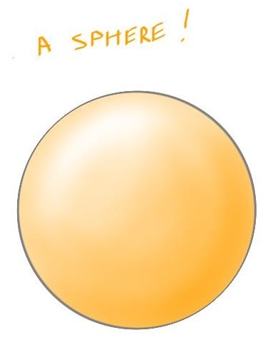

Shape of $p$ subshell, dumbbell:

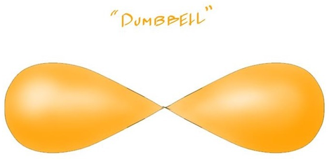

### Magnetic QN, $m_l$

- **magnetic QN ($m_l$)** &mdash; desc. **spatial orientation** of each subshell
- range: $-\ell \le m_l \le \ell,\ m_l \in\mathbb Z$
- each unique orientation is an *orbital*
- subshell remarks
	- $s$ subshell has 1 orbital
	- $p$ subshell has 3 orbitals
	- $d$ subshell has 5 orbitals
	- $f$ subshell has 7 orbitals

*Example of subshell orientations of dumbbell, $p$ subshell*

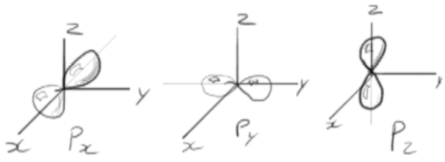

### Spin Quantum Number, $m_s$

- **spin QN ($m_s$)** &mdash; desc. **spin** of electron
- constraints: $m_s = -\cfrac 1 2,\ \cfrac 12$
- doesn't have intuitive meaning
- each orbital can hold 2 electrons
- remarks
	- $s$ subshell holds 2 electrons
	- $p$ subshell holds 6 electrons
	- $d$ subshell holds 10 electrons
	- $f$ subshell holds 14 electrons

### Recall: Orbital Diagrams

**Recall:** Orbital diagrams

$$
\begin{array}{c @\ @\ c}
\boxed{\uparrow\downarrow} & \boxed{\uparrow\ }
\boxed{\phantom\uparrow\ \ } &  
\boxed{\phantom\uparrow\ \ }
\boxed{\phantom\uparrow\ \ }
\boxed{\phantom\uparrow\ \ } \\
1s & 2s & 2p
\end{array}
$$

- where each arrow is an electron
- each box is an orbital
- recall *Pauli exclusion principle*, *Hund's rule*, etc.
	- no two electrons w/ same spin can occupy orbital
	- electrons fill orbitals spin up first before filling spin down

## Electronic Configurations

### The Aufbau Principle

Energy-level diagram of orbitals:

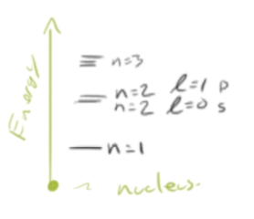

Order of filling chart, the *Aufbau principle:*

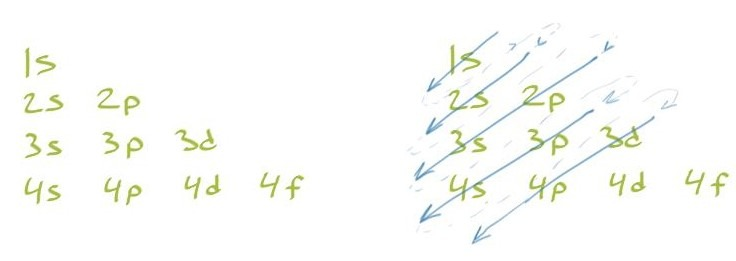

Direction of arrows (go from arrows top to bottom) indicate subshell filling order

### Applying the Aufbau Principle

Carbon electronic configuration, *at ground state*, $Z = 6$

$$
1s^2\ 2s^2\ 2p^2
$$

Iron electronic configuration, *trick!*, $Z = 26$

$$
\text{filling order: } 1s^2\ 2s^2\ 2p^6\ 3s^2\ 3p^6\ 4s^2\ 3d^6
$$

- ... but $4s^2$ and $3d^6$ should switch places
- since at the end, $3d^6 < 4s^2$ has lower energy

$$
\text{correct: } 1s^2\ 2s^2\ {...}\ 3d^6\ 4s^2
$$

Iron (II) ion electronic configuration:

$$
\begin{gather*}
\text{logic: } 1s^2\ 2s^2\ {...}\ 3d^6\ \cancel{4s^2} \\
\therefore \ce{Fe^2+} \to 1s^2\ 2s^2\ 2p^6\ 3s^2\ 3p^6\ 3d^6
\end{gather*}
$$

Abbreviated form example, *use nearest noble gas* that incl. all of its e. config.:

$$
\ce{Fe} \to \ce{[Ar]}\ 3d^6\ 4s^2
$$

### Exceptions (rel. to filling)

Chromium, expected: $\ce{[Ar]}\ 3d^4\ 4s^2$

*Reality:*

$$
\ce{Cr} \to 1s^2\ 2s^2\ 2p^6\ 3s^2\ 3p^6\ 3d^5\ 4s^1
$$

**Why?** $3d^5$ reaches a half-filled state, lower energy than $3d^4\ 4s^2$

- Copper &mdash; e. config: $\ce{[Ar]}\ 3d^{10}\ 4s^1$
	- reason: $3d^10$ reaches filled state, lower energy...

## Octet Stability

Electron configs. of inert gases:

- $\ce{He} \to Z = 2 \to 1s^2$
- $\ce{Ne} \to Z = 10 \to 1s^2\ 2s^2\ 2p^6$
- $\ce{Ar} \to Z = 18 \to 1s^2\ 2s^2\ 2p^6\ 3s^2\ 3p^6$

Inert gases generally *don't react* since their e. config. very stable:

**Octet Stability / Rule:**

$$
ns^2np^6
$$

- 8 electrons in outer shell
- *excl.* hydrogen, stable w/ 2 electrons &mdash; duet stability

## Atomic Bonding: 3 Primary Bonds

### 1) Ionic Bonding

- **ionic bonding:** bonding of atoms by 2 subsequent steps:
	1. achieving low energy (stable octet) via *transfer* of electrons
	2. charge attraction from now ion

 i.e. sodium chloride ($\ce{NaCl}$)

- sodium atom has one extra atom it wants to get rid of:
	- *Na*, e. config: $\ce{[Ne]}\ 3s^1$
- chlorine atom needs one extra atom:
	- *Cl*, e. config: $\ce{[Ne]}\ 3s^2\ 3p^5$
- when brought together, *Na* transfers its electron to *Cl*

Cross-section of *NaCl* crystal, with charge attractions:

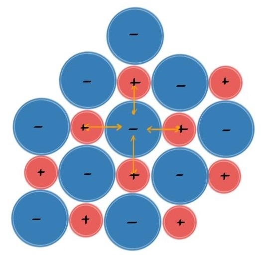

since $\ce{Na+ -> <- Cl-}$

- ionic bonding is **non-directional**
	- $\because$ in general, an ion is attracted by all of the oppositely charged ions
	- not between specific nuclei
- *non-conductive*
	- ions are very stable, tightly bound
	- no free electrons

### 2) Covalent Bonding

> **covalent bonding:** bonding of atoms by *sharing* of electrons

i.e. methane ($\ce{CH4}$)

- e. config of carbon, $Z = 6: 1s^2\ 2s^2\ 2p^2$
- e. config of hydrogen, $Z = 1: 1s^1$
- if carbon gets 4 electrons and hydrogen gets 1, they bec. stable

Lewis structure depicting carbon and hydrogen making methane:

... covalent bonds also drawn as straight lines (methane below):

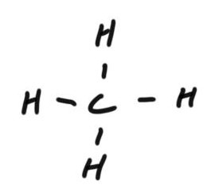

- covalent bonds only occur between specific atoms
	- thus, *covalent bonding* is **directional**
	- but can occur between like atoms, i.e. $\ce{H2}$
- any other interactions are *secondary*

**How are all 4 of methane's bonds the same?**

Answer: through $sp^3$ orbital hybridization in carbon (discussed later):

### 3) Metallic Bonding

- *Main models:* **sea-of-electrons** (here) and band theory of solids
- **sea of electrons model**
	- valence electrons not bound to specific nucleus
	- instead, they're free to move around
	- nuclei locked in lattice positions
- **sea-of-electrons:** the *delocalized* electrons surrounding the metal nuclei
	- **delocalized:** electron isn't bound by specific atom
- **ion core:** the metal ions with its core electrons

Sea-of-electrons model diagram:

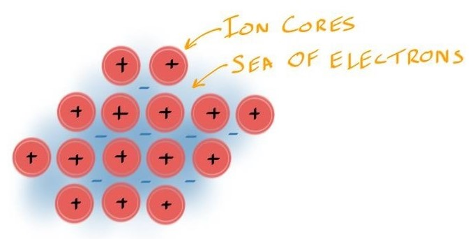

### Properties of Metals and Ceramics thru Bonding

Diagram of load applied to metallic and ceramic (ionic) model:

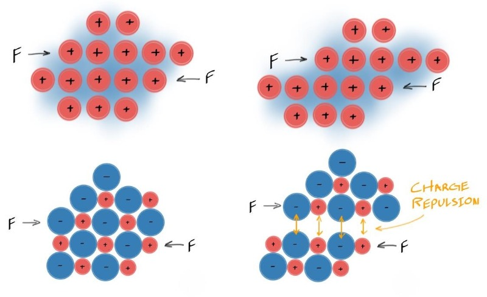

- in sea-of-electrons, planes are free to move past each other
	- electrons are also in free flow
	- explains *ductility*, *malleability* and *electrical conductivity* of metals
- in ionic bonding (ceramics), planes cannot move past each other
	- similarly charged ions encounter each other
	- *charge repulsion* occurs, planes break apart
	- explains why ceramics are *brittle*

## Why Does Salt Form a Crystal?

- *in short:* forming a crystal is *energetically favourable*
	- meaning: goes from high &rarr; low energy
- *Reading the steps*
	- (+) energy or heat &rarr; add energy to system
	- (-) energy &rarr; energy released from system
	- dot on top (i.e. $\ce{Cl^.})$ means *free radical*

ex. formation of *NaCl* step by step

**General equation:**

$$
\ce{Na(s) + 1/2Cl2(g) -> NaCl(s)} \tag 1
$$

**Formation of sodium ion, step by step:**

1. Sodium solid turns into gas directly (*sublimation*)

$$
\ce{Na(s) -> Na(g)},\ \Delta H_\text{sublimation} = +109\text{ kJ/mol} \tag A
$$

*variable:* sublimation enthalpy

2. Vapour sodium turns into ion

$$
\ce{Na(g) -> Na+(g) + e-},\ \text{IE}_\ce{Na} = +497\text{ kJ/mol} \tag B
$$

*variable:* ionization energy of sodium

**Formation of chlorine ion, step by step:**

1. Bonds between chlorine gas breaks to create individual atoms

$$
\ce{1/2 Cl2(g) -> Cl^.(g)},\ \text{BDE}_\ce{Cl2} = +121\text{ kJ/mol} \tag a
$$

*variable:* bond dissociation energy

2. Individual chlorine atom turns into ion

$$
\ce{Cl^.(g) + e- -> Cl-(g)},\ \text{EA}_\ce{Cl} = -364\text{ kJ/mol} \tag b
$$

*variable:* electron affinity of chlorine

**Final step, forming the ionic crystal:**

$$
\ce{Na+(g) + Cl-(g) -> NaCl(s)},\ E_\text{crystallization} = -777\text{ kJ/mol} \tag 2
$$

- Total energy change: $\Delta E = -414\text{ kJ/mol}$
- Overall, *making crystal **reduces energy** *

## Bonding in Solids: The Band Theory

### Intro to Band Theory

Energy of electrons v. no. of atoms:

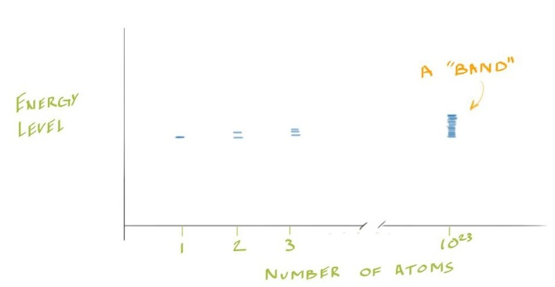

- 1 atom &mdash; *isolated atom*
- **degeneracy:** electrons in each atom have same energy level
	- *does NOT* happen
- as atoms approach one another, energy levels begin to spread out slightly so that
	- ... for given level in isolated atom
	- *n* corresponding energy levels for *n* atoms
	- difference in energy between levels dec. as no. of atoms inc.
- at ~a mole (1023), **effectively continuous range of energy levels**

Energy of electrons v. interatomic spacing, and band structure:

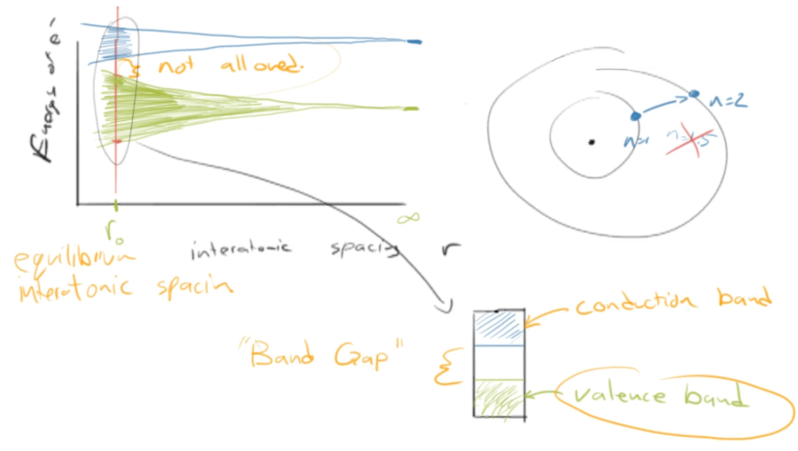

- **band structure:** a depiction of an element's electron positions at $r_0$
- **valence band:** the "band" which consists of the atom's valence electrons
- **conduction band:** the band where electrons are set free to conduct
- **band gap:** the gap in which an electron cannot posses energy
	- electron needs to "jump" from one band to the next

### Applying Band Theory

**Ex: Metals like Potassium (or copper):**

Electron energy v. interatomic spacing and band structure of potassium:

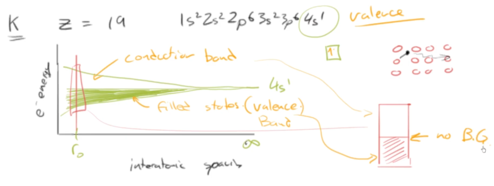

Band structure (only) of potassium or copper:

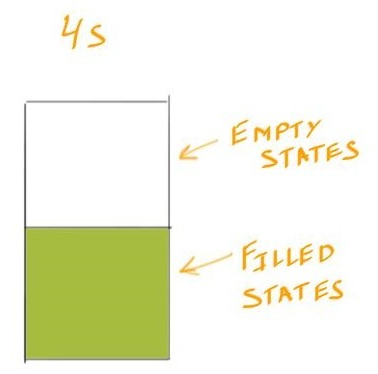

E. config of potassium:

$$
1s^2\ 2s^2\ 2p^6\ 3s^2\ 3p^6\ 4s^1
$$

- metals like potassium, copper, or aluminium have half-filled shell
- *partially-filled band*
- easy to promote electron up within band structure into one of empty states
- **no band gap**

**Ex: Metals like Magnesium**

Electron energy v. interatomic spacing and band structure of potassium:

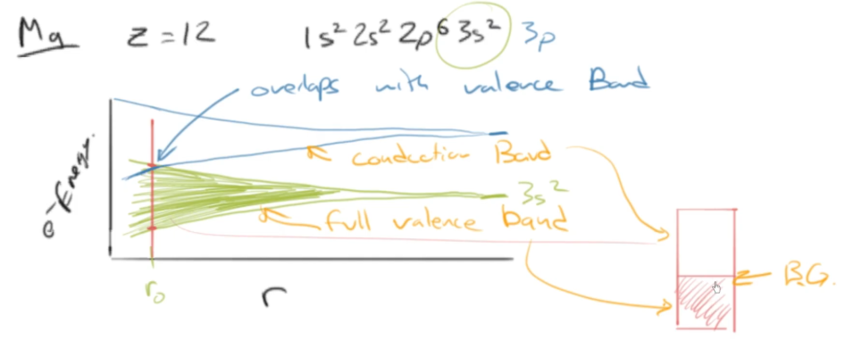

Band structure of magnesium (in different way):

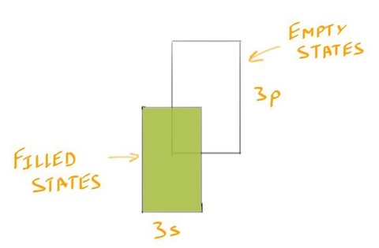

E. config of magnesium:

$$
1s^2\ 2s^2\ 2p^6\ 3s^2
$$

- metals like Mg have full valence shell
- however, next shell is empty, so it acts like *conduction band*
- in graph, conduction band **overlaps** with full valence band
- due to that, Mg still behaves like metal
- **no band gap**

**Ex: Ceramics and Polymers**

Band structure of insulators (ceramics, polymers):

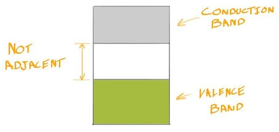

- has a **large band gap**
- electron needs enough energy to "jump" from valence band to conduction band
	- "jump" also called *promotion*
- i.e. carbon as diamond
	- has band gap of 5.5 eV

**Ex: Semiconductors like Silicon**

Band structure of silicon:

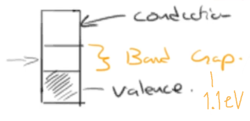

- has a **moderately-sized band gap**
- means we can control flow of electrons
- if band gap < 4 eV, semiconductor else insulator
- Si has band gap of 1.1 eV

### Defining Conductors, Semiconductors, and Insulators

Band structures for 3 types of materials:

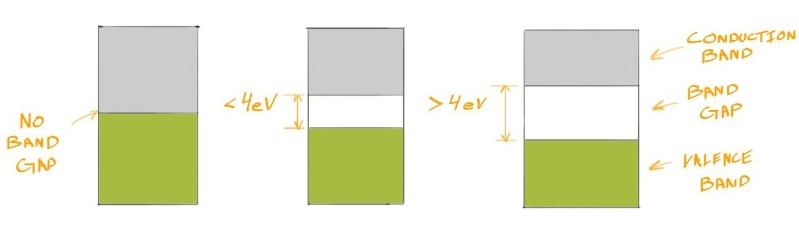

*From left to right:* conductors, semiconductors, insulators

- **conductors:** materials w/ no band gap
- **semiconductors:** materials w/ band gap &le; 4 eV
- **insulators:** materials w/ band gap > 4 eV
- some textbooks draw line at diff. energies (i.e. 2 eV)

### How Bands affect Light

- **in essence:** higher band gap, photons of higher ranges can pass through
- *visible light* have energies btwn. 2 - 3 eV

Determining optical transparency

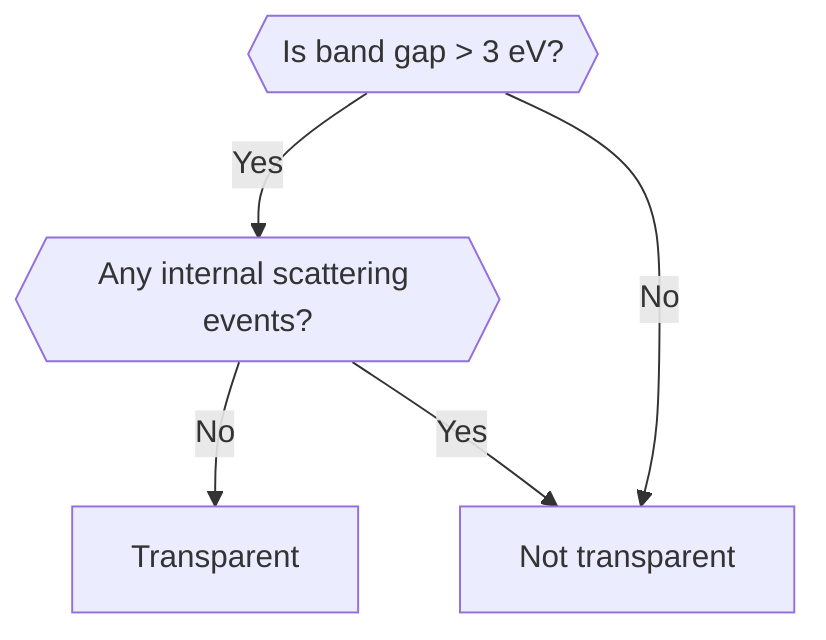

- i.e. window glass (silica &mdash; $\ce{SiO2}$)
	- forms 3D network of covalent bonds
	- high band gap
	- optically transparent
- *Saving costs in window glass*
	- reduce solar heating from sunlight passing thru windows
	- windows coated w/ thin metallic layer
	- if layer thin enough, it transmits much of visible light
	- since no band gap, it absorbs photons, especially in UV region
- metals are *opaque*
	- no band gap &rarr; easy electron promotions
	- electrons get demoted &rarr; emit photon &rarr; shiny

## Structure of Silicon

### E. Config. and $sp^3$ Hybridization

E. config of Si: $1s^2\ 2s^2\ 2p^6\ 3s^2\ 3p^2$

- 4 valence electrons from $3s$ and $3p$
- *Problem:* silicon bonds are equal, but current model suggests they should be different
- *Solution:* hybridization
- **hybridization:** combine the orbitals and form one new, larger orbital
	- for silicon, combine 1 $s$ and 3 $p$ orbitals into one hybrid
	- resulting orbitals called: **$sp^3$ hybridized orbitals**

**Formation of hybridized orbitals, image:**

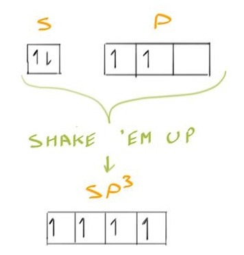

### Diamond Cubic (Crystal Struct.)

Diamond cubic crystal structure (of silicon):

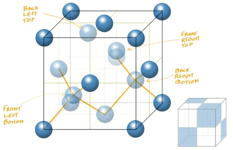

*NOTE:* The blue shades in corner cube show **occupied interstitial sites**

**Making the structure:**

1. Divide a cube into 8 "sub-cubes"
2. Place atoms in FCC type positions
3. Note the positions of the *special sub-cubes*:
	1. front left bottom
	2. back right bottom
	3. front right top
	4. back left top
4. Place atoms in the center of each special sub-cube &mdash; *special atoms*
5. The special atoms make 4 "touches" (3 faces and 1 corner)

*Tetrahedral interstitial site of a special sub-cube*

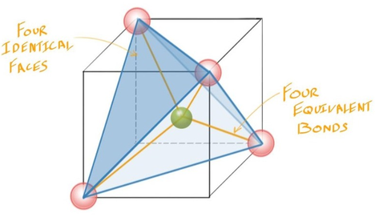

**Atomic count and coordination number:**

- 4 atoms in "FCC"-type positions
- 4 atoms occupying tetrahedral sites
	- 1 atom in ea. occupied site
- *8 atoms* in D.C.
- coordination no. of D.C. = 4
	- since 4 "touches"

## Semiconductors

### Intrinsic Semiconductors

> **intrinsic semiconductor:** pure material with semiconductor behaviour coming from itself

Lattice of neighbour silicon atoms + promoted electron + band structure:

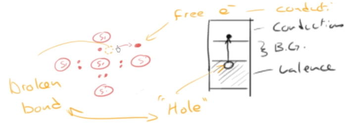

- photon can promote an electron to the conduction band, freeing it
- **hole:** a spot left behind by an electron when it is promoted
	- hole is neutral in world of negativity
	- thus, *hole is positive*

**Conductivity ($\sigma$) of Intrinsic Semiconductor:**

$$
\sigma = nq\mu_n + pq\mu_p
$$

- $\sigma$ in &Omega;/m or ohms/meter
- $q$ &mdash; fundamental charge
	- $q \doteq 1.603\e{-19}\ \text C$
- *Electrons:*
	- $n$ &mdash; no. of electrons (#/m2)
	- $\mu_n$ &mdash; electron mobility [m2 / (V &middot; s)]
- *Holes:*
	- $p$ &mdash; no. of holes (#/m2)
	- $\mu_p$ &mdash; hole mobility [m2 / (V &middot; s)]

*Equation 2* since $n = p$ (one hole per promoted electron)

$$
\therefore \sigma = nq(\mu_n + \mu_p)
$$

Remarks: $n$ &mdash; negative and $p$ &mdash; positive

### *On the side:* Getting Excited

Intrinsic carrier concentration plotted against reciprocal temperature for Si, Ge, and GaAs (Jun Nogami):

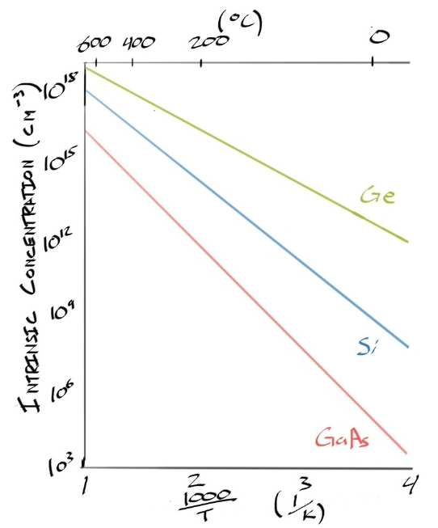

- conductivity v. 1/temp. follows Arrhenius dependance
- slope is func. of band gap of semiconductor

$$
\sigma \propto e^\cfrac{-E_g}{2kT}
$$

- $\sigma$ &mdash; conductivity
- $E_g$ &mdash; gap energy?
- $k$ &mdash; Boltzmann constant
- $T$ &mdash; temp. (Kelvin)

*Continued:*

- band gap of Si: 1.1 eV / Ge: 0.6 eV
- excite electrons by inc. temp. or absorbing photon energy
- Si absorbs visible light, *E* = 3.1 - 1.8 eV
	- in absorbing light, excites electron-hole pair
	- put electric field, electrons make current
	- build Si photo detector or solar cell
- diamond band gap: 5.47 eV

### Extrinsic Semiconductors, Intro

- impurities added to semiconductors to carefully control conductivity
- **dopant:** impurity purposefully added to semiconductor
	- process of adding *dopants* called **doping**
	- they overpower semiconductor's intrinsic semiconduction
- **extrinsic semiconductor:** semiconductor whose conductivity is primarily influenced by dopants
	- **n-type semiconductor** &mdash; adding extra electrons, negative
	- **p-type semiconductor** &mdash; adding extra holes, positive

### Extrinsic Semiconductors, *n*-type

*Goal:* add extra electrons to semiconductor

- Si has 4 valence e.
- *Solution:* substitute some silicon with el. with more valence electrons, like phosphorus
	- *point defect*
	- P: *Z* = 15
	- phosphorus is **pentavalent** &mdash; 5 valence e.
	- P e. config: $1s^2\ 2s^2\ 2p^6\ 3s^2\ 3p^3$

n-type silicon w/ phosphorus, lattice:

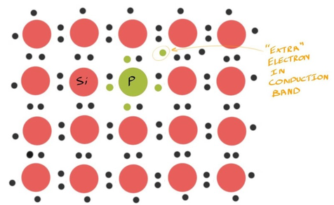

n-type silicon band structure:

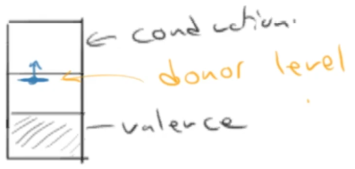

where middle is *band gap*

- P gives *weakly bonded extra electron*
	- P *donated* it into conduction band
- **donor level:** level in the band structure where donor electron sits, before promotion
- extra electrons from *dopant* are **primary charge carriers**

**Conductivity of n-type semiconductor, $\sigma_\text{n-type}$:**

$$
\sigma_\text{n-type} = nq\mu_n
$$

- $\sigma$ in &Omega;/m
- $n$ &mdash; no. of electrons (#/m2)
- $q$ &mdash; fundamental charge (C)
- $\mu_n$ &mdash; mobility of electrons [m2/(V &middot; s)]

### Extrinsic Semiconductors, *p*-type

*Goal:* add "holes" to / remove e. from semiconductor

- sub. Si w/ el. w/ less valence e. like boron (B)
	- boron is **trivalent** &mdash; 3 valence e.
	- B: *Z* = 5
	- e. config of boron: $1s^2\ 2s^2\ 2p^1$

p-type silicon w/ boron, lattice:

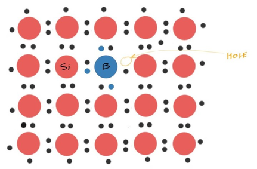

p-type silicon, band structure:

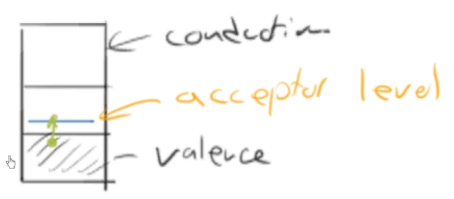

where middle is *band gap*

- hole becomes place where electron can be promoted into
- **acceptor level:** level where electron in valence band can "fill in"
- *holes* are the **majority charge carrier**

**Conductivity of p-type semiconductor, $\sigma_\text{p-type}$:**

$$
\sigma_\text{p-type} = pq\mu_p
$$

- $\sigma$ in &Omega;/m
- $p$ &mdash; no. of holes (#/m2)
- $q$ &mdash; fundamental charge (C)
- $\mu_p$ &mdash; mobility of holes [m2/(V &middot; s)]

## End: Solid Ionic Conductivity

- possible for electrical conductivity to occur via movement of ions in ionic solid
- *not just* movement of electrons and holes

## Sources

- Ramsay, Scott. (2026). *Introductory Chemistry of Solids*. Top Hat.
- Dr. Scott Ramsay's YouTube videos on chemistry